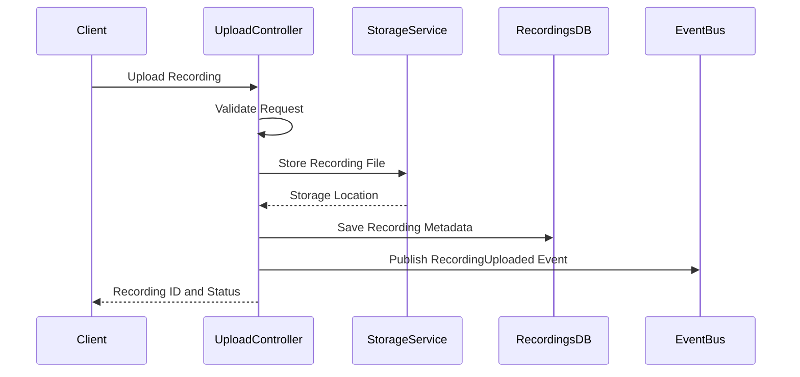
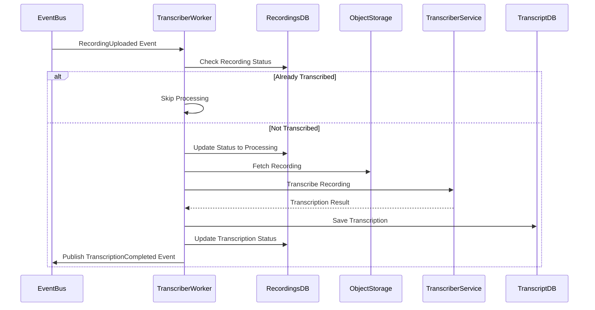
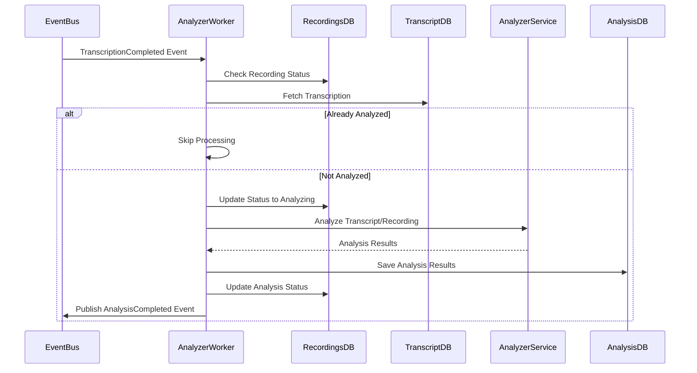

# Untitled

# Technical Design Document: Call Recording Processing System

## 1. System Overview

The Call Recording Processing System is designed to ingest, store, transcribe, and analyze call recordings at scale. The system follows a microservices architecture to ensure modularity, scalability, and maintainability.

## 2. Detailed Service Architecture

### 2.1 Ingestion Service

### Components

1. **Upload Controller**
    - Handles HTTP uploads of call recordings
    - Validates input files and metadata
    - Initiates storage and processing workflow
2. **S3 Integration Module**
    - Manages direct integrations with S3 storage
    - Handles signed URLs for direct uploads
    - Processes S3 event notifications
3. **Bulk Download Manager**
    - Schedules and manages batch download jobs
    - Handles large volume transfers efficiently
    - Provides download job status tracking
4. **Ingestion Repository**
    - Stores recording metadata
    - Tracks ingestion status
    - Provides query capabilities for monitoring
5. Dedupe Manager
    - Checks the upload file name for the existing files names
    - Send callback with error “File already exist”

### Data Models

```
Recording {
  id: UUID
  externalId: String (client reference)
  filename: String
  mimeType: String
  fileSize: Long
  duration: Integer (seconds)
  source: String (enum: UPLOAD, BULK, S3)
  status: String (enum: UPLOADED, PROCESSING, COMPLETE, ERROR)
  storageLocation: String
  createdAt: Timestamp
  updatedAt: Timestamp
  metadata: JSON
}

```

### APIs

1. **Upload API**
    - `POST /recordings`
        - Multipart form upload for recording file
        - JSON metadata
        - Returns recording ID and status
        - Return Error is File name exists
2. **Bulk Operations API**
    - `POST /recordings/bulk`
        - Batch job creation
        - Configuration options (source, filters)
        - Returns job ID
        - Return Error is File name exists in batch handling allow others
3. **Status API**
    - `GET /recordings/{id}`
        - Recording metadata
        - Processing status
        - Links to associated resources

### 3.2 Storage Service

### Components

1. **Object Storage Manager**
    - Abstracts object storage operations
    - Implements retention policies
    - Handles object lifecycle management
2. **Database Service**
    - Manages PostgreSQL connections
    - Implements connection pooling
    - Provides transaction management
3. **Cache Service**
    - Redis-based caching
    - Frequently accessed metadata
    - Cache invalidation patterns

### Data Models

```
StorageMetadata {
  objectKey: String
  bucket: String
  region: String (if applicable)
  contentType: String
  contentLength: Long
  eTag: String
  createdAt: Timestamp
  lastAccessed: Timestamp
}

```

### APIs

1. **Object API**
    - `GET /storage/objects/{key}`
        - Object metadata
        - Presigned download URLs
    - `DELETE /storage/objects/{key}`
        - Mark for deletion or immediate removal
2. **Bucket Operations API**
    - `GET /storage/buckets/{name}/stats`
        - Storage statistics
        - Object counts
        - Access patterns

### 3.3 Transcription Service

### Components

1. **Transcriber Controller**
    - Manages transcription job queue
    - Tracks transcription status
    - Handles service configuration
2. **Transcriber Worker**
    - Processes transcription jobs
    - Integrates with ASR services
    - Handles error recovery
3. **Transcription Repository**
    - Stores transcription results
    - Manages transcription metadata
    - Provides query capabilities

### Data Models

```
Transcription {
  id: UUID
  recordingId: UUID (foreign key to Recording)
  status: String (enum: PENDING, IN_PROGRESS, COMPLETED, FAILED)
  transcript: Text
  confidence: Float
  language: String
  diarized: Boolean
  speakers: Integer
  segments: Array<TranscriptionSegment>
  metadata: JSON
  createdAt: Timestamp
  completedAt: Timestamp
}

TranscriptionSegment {
  startTime: Float (seconds)
  endTime: Float (seconds)
  text: String
  speakerId: String (if diarized)
  confidence: Float
}

```

### APIs

1. **Transcription Job API**
    - `POST /transcriptions`
        - Create a new transcription job
        - Configure transcription parameters
    - `GET /transcriptions/{id}`
        - Transcription status and results
2. **Batch Operations API**
    - `POST /transcriptions/batch`
        - Create multiple transcription jobs
        - Batch configuration options
3. **Configuration API**
    - `GET /transcriptions/config`
        - Service capabilities
        - Supported languages
        - Model options

### 3.4 Analysis Service

### Components

1. **Analyzer Controller**
    - Manages analysis job queue
    - Tracks analysis status
    - Handles service configuration
2. **Analyzer Worker**
    - Processes analysis jobs
    - Integrates with AI services
    - Extracts insights from recordings/transcripts
3. **Analysis Repository**
    - Stores analysis results
    - Manages analysis metadata
    - Provides query capabilities

### Data Models

```
Analysis {
  id: UUID
  recordingId: UUID (foreign key to Recording)
  transcriptionId: UUID (foreign key to Transcription)
  status: String (enum: PENDING, IN_PROGRESS, COMPLETED, FAILED)
  analysisType: String (enum: SENTIMENT, TOPICS, COMPLIANCE, CUSTOM)
  results: JSON
  createdAt: Timestamp
  completedAt: Timestamp
}

AnalysisResult {
  type: String
  score: Float
  details: JSON
  segments: Array<AnalysisSegment>
}

AnalysisSegment {
  startTime: Float (seconds)
  endTime: Float (seconds)
  score: Float
  category: String
  confidence: Float
}

```

### APIs

1. **Analysis Job API**
    - `POST /analyses`
        - Create new analysis job
        - Configure analysis parameters
    - `GET /analyses/{id}`
        - Analysis status and results
2. **Batch Operations API**
    - `POST /analyses/batch`
        - Create multiple analysis jobs
        - Batch configuration options
3. **Insights API**
    - `GET /recordings/{id}/insights`
        - Aggregated insights
        - Cross-analysis correlation
        - Trend identification

## 4. Workflow Specifications

### 4.1 Recording Ingestion Workflow



**Detailed Steps:**

1. Client uploads recording via API
2. Upload controller validates file format and metadata
3. Recording file is stored in object storage
4. Metadata is saved to recordings database
5. "RecordingUploaded" event is published
6. Client receives recording ID and initial status

**Error Handling:**

- Storage failures: Abort operation, return error
- Duplicate detection: Check by external ID or hash
- Database failures: Implement retry mechanism
- Event publishing failures: Use store-and-forward pattern

### 4.2 Transcription Workflow



**Detailed Steps:**

1. Worker receives "RecordingUploaded" event
2. Check if recording is already transcribed
3. Update recording status to "Processing"
4. Retrieve recording from storage
5. Send to transcription service
6. Process and format transcription results
7. Save results to transcription database
8. Update recording status to "Transcribed"
9. Publish "TranscriptionCompleted" event

**Error Handling:**

- Transcription service failures: Retry with exponential backoff
- Database failures: Transaction with rollback
- Storage access failures: Circuit breaker pattern
- Irrecoverable errors: Update status to "Failed", notify admin

### 4.3 Analysis Workflow



**Detailed Steps:**

1. Worker receives "TranscriptionCompleted" event
2. Check if recording is already analyzed
3. Fetch transcription data
4. Update recording status to "Analyzing"
5. Send data to analysis service
6. Process and format analysis results
7. Save results to analysis database
8. Update recording status to "Analyzed"
9. Publish "AnalysisCompleted" event

**Error Handling:**

- Analysis service failures: Retry with exponential backoff
- Partial results handling: Save what succeeded
- Service degradation: Prioritize critical analyses
- Timeout handling: Cancel long-running analyses

## 5. API Specifications

### 5.1 RESTful API Endpoints

### Recording Management API

| Endpoint | Method | Description | Request Body | Response |
| --- | --- | --- | --- | --- |
| `/api/v1/recordings` | POST | Upload new recording | Multipart form with file and metadata | 201 Created with recording ID |
| `/api/v1/recordings/{id}` | GET | Get recording details | - | 200 OK with recording details |
| `/api/v1/recordings/{id}` | DELETE | Mark recording for deletion | - | 204 No Content |
| `/api/v1/recordings/bulk` | POST | Create bulk import job | JSON with source details | 202 Accepted with job ID |
| `/api/v1/recordings/search` | GET | Search recordings | Query parameters | 200 OK with paginated results |

### Transcription API

| Endpoint | Method | Description | Request Body | Response |
| --- | --- | --- | --- | --- |
| `/api/v1/transcriptions` | POST | Create transcription job | JSON with recording ID and options | 202 Accepted with job ID |
| `/api/v1/transcriptions/{id}` | GET | Get transcription | - | 200 OK with transcription |
| `/api/v1/recordings/{id}/transcription` | GET | Get transcription for recording | - | 200 OK with transcription |
| `/api/v1/transcriptions/batch` | POST | Create batch transcription jobs | JSON with recording IDs | 202 Accepted with job IDs |

### Analysis API

| Endpoint | Method | Description | Request Body | Response |
| --- | --- | --- | --- | --- |
| `/api/v1/analyses` | POST | Create analysis job | JSON with recording ID and options | 202 Accepted with job ID |
| `/api/v1/analyses/{id}` | GET | Get analysis results | - | 200 OK with analysis |
| `/api/v1/recordings/{id}/analyses` | GET | Get all analyses for recording | - | 200 OK with analyses |
| `/api/v1/analyses/batch` | POST | Create batch analysis jobs | JSON with recording IDs | 202 Accepted with job IDs |

### Admin API

| Endpoint | Method | Description | Request Body | Response |
| --- | --- | --- | --- | --- |
| `/api/v1/admin/jobs` | GET | List all jobs | Query parameters | 200 OK with job list |
| `/api/v1/admin/jobs/{id}` | GET | Get job details | - | 200 OK with job details |
| `/api/v1/admin/jobs/{id}/cancel` | POST | Cancel job | - | 200 OK with status |
| `/api/v1/admin/system/health` | GET | System health check | - | 200 OK with health status |
| `/api/v1/admin/system/metrics` | GET | System metrics | - | 200 OK with metrics |

### 5.2 Event Specifications

| Event Type | Description | Payload | Producers | Consumers |
| --- | --- | --- | --- | --- |
| `recording.uploaded` | New recording uploaded | Recording ID, metadata | Ingestion Service | Transcriber Service |
| `recording.transcription.requested` | Transcription manually requested | Recording ID, options | API | Transcriber Service |
| `recording.transcription.completed` | Transcription finished | Recording ID, Transcription ID | Transcriber Service | Analyzer Service |
| `recording.transcription.failed` | Transcription failed | Recording ID, error details | Transcriber Service | Notification Service |
| `recording.analysis.requested` | Analysis manually requested | Recording ID, analysis type | API | Analyzer Service |
| `recording.analysis.completed` | Analysis finished | Recording ID, Analysis ID | Analyzer Service | Notification Service |
| `recording.analysis.failed` | Analysis failed | Recording ID, error details | Analyzer Service | Notification Service |

## 6. Database Schema Design

### 6.1 PostgreSQL Schema

### Recordings Table

```sql
CREATE TABLE recordings (
    id UUID PRIMARY KEY,
    external_id VARCHAR(255) UNIQUE,
    filename VARCHAR(255) NOT NULL,
    mime_type VARCHAR(100) NOT NULL,
    file_size BIGINT NOT NULL,
    duration INTEGER,
    source VARCHAR(50) NOT NULL,
    status VARCHAR(50) NOT NULL,
    storage_location VARCHAR(255) NOT NULL,
    transcription_status VARCHAR(50) DEFAULT 'PENDING',
    analysis_status VARCHAR(50) DEFAULT 'PENDING',
    metadata JSONB,
    created_at TIMESTAMP WITH TIME ZONE DEFAULT NOW(),
    updated_at TIMESTAMP WITH TIME ZONE DEFAULT NOW()
);

CREATE INDEX idx_recordings_status ON recordings(status);
CREATE INDEX idx_recordings_external_id ON recordings(external_id);
CREATE INDEX idx_recordings_created_at ON recordings(created_at);

```

### Transcriptions Table

```sql
CREATE TABLE transcriptions (
    id UUID PRIMARY KEY,
    recording_id UUID NOT NULL REFERENCES recordings(id),
    status VARCHAR(50) NOT NULL,
    transcript TEXT,
    confidence FLOAT,
    language VARCHAR(10),
    diarized BOOLEAN DEFAULT FALSE,
    speakers INTEGER,
    metadata JSONB,
    created_at TIMESTAMP WITH TIME ZONE DEFAULT NOW(),
    completed_at TIMESTAMP WITH TIME ZONE,
    CONSTRAINT unique_recording_transcription UNIQUE(recording_id)
);

CREATE INDEX idx_transcriptions_recording_id ON transcriptions(recording_id);
CREATE INDEX idx_transcriptions_status ON transcriptions(status);

```

### Transcription Segments Table

```sql
CREATE TABLE transcription_segments (
    id UUID PRIMARY KEY,
    transcription_id UUID NOT NULL REFERENCES transcriptions(id),
    start_time FLOAT NOT NULL,
    end_time FLOAT NOT NULL,
    text TEXT NOT NULL,
    speaker_id VARCHAR(50),
    confidence FLOAT,
    CONSTRAINT unique_segment_time_range UNIQUE(transcription_id, start_time, end_time)
);

CREATE INDEX idx_segments_transcription_id ON transcription_segments(transcription_id);
CREATE INDEX idx_segments_start_time ON transcription_segments(start_time);

```

### Analyses Table

```sql
CREATE TABLE analyses (
    id UUID PRIMARY KEY,
    recording_id UUID NOT NULL REFERENCES recordings(id),
    transcription_id UUID REFERENCES transcriptions(id),
    analysis_type VARCHAR(50) NOT NULL,
    status VARCHAR(50) NOT NULL,
    results JSONB,
    created_at TIMESTAMP WITH TIME ZONE DEFAULT NOW(),
    completed_at TIMESTAMP WITH TIME ZONE,
    CONSTRAINT unique_recording_analysis_type UNIQUE(recording_id, analysis_type)
);

CREATE INDEX idx_analyses_recording_id ON analyses(recording_id);
CREATE INDEX idx_analyses_status ON analyses(status);
CREATE INDEX idx_analyses_type ON analyses(analysis_type);

```

### Jobs Table

```sql
CREATE TABLE jobs (
    id UUID PRIMARY KEY,
    job_type VARCHAR(50) NOT NULL,
    status VARCHAR(50) NOT NULL,
    progress FLOAT DEFAULT 0,
    total_items INTEGER,
    processed_items INTEGER DEFAULT 0,
    failed_items INTEGER DEFAULT 0,
    parameters JSONB,
    created_at TIMESTAMP WITH TIME ZONE DEFAULT NOW(),
    updated_at TIMESTAMP WITH TIME ZONE DEFAULT NOW(),
    completed_at TIMESTAMP WITH TIME ZONE
);

CREATE INDEX idx_jobs_status ON jobs(status);
CREATE INDEX idx_jobs_type ON jobs(job_type);

```

### 6.2 Object Storage Organization

```
s3://recordings-bucket/
├── raw/
│   ├── YYYY-MM-DD/
│   │   ├── {recording_id}.wav
│   │   └── ...
├── processed/
│   ├── YYYY-MM-DD/
│   │   ├── {recording_id}.mp3
│   │   └── ...
└── archive/
    ├── YYYY-MM/
    │   ├── {recording_id}.wav.gz
    │   └── ...

```

## 7. Security Design

### 7.1 Authentication & Authorization

1. **API Gateway Security**
    - JWT-based authentication
    - Role-based access control
    - IP whitelisting for admin APIs
2. **Service-to-Service Authentication**
    - Mutual TLS authentication
    - Service account tokens
    - Short-lived credentials
3. **Data Access Controls**
    - Row-level security in PostgreSQL
    - Object-level ACLs in S3
    - Principle of least privilege

### 7.2 Data Protection

1. **Data at Rest**
    - Storage encryption (AES-256)
    - Key management system
    - Regular key rotation
2. **Data in Transit**
    - TLS 1.3 for all communications
    - Strong cipher suites
    - Certificate validation
3. **Personally Identifiable Information (PII)**
    - Detection and redaction capabilities
    - Configurable retention policies
    - Audit logging for all access

## 8. Scalability & Performance Design

### 8.1 Horizontal Scaling

1. **Stateless Services**
    - Container-based deployment
    - Auto-scaling based on metrics
    - Load-balanced API endpoints
2. **Data Tier Scaling**
    - Database read replicas
    - Connection pooling
    - Sharding strategy for large datasets
3. **Processing Capacity**
    - Worker pool scaling
    - Job prioritization
    - Resource allocation based on job type

### 8.2 Performance Optimizations

1. **Caching Strategy**
    - Multi-level caching (application, database, distributed)
    - Cache invalidation patterns
    - Hot path optimization
2. **Efficient Storage Access**
    - Connection pooling
    - Batch operations
    - Asynchronous I/O
3. **Query Optimization**
    - Indexed fields
    - Query plan analysis
    - Materialized views for reports

## 9. Monitoring & Observability

### 9.1 Logging Strategy

1. **Structured Logging**
    - JSON format
    - Consistent field naming
    - Context propagation
2. **Log Aggregation**
    - Centralized logging system
    - Retention policies
    - Search capabilities
3. **Audit Logging**
    - User actions
    - System events
    - Compliance requirements

### 9.2 Metrics Collection

1. **Service Metrics**
    - Request rates
    - Error rates
    - Response times
2. **System Metrics**
    - CPU/Memory utilization
    - Disk I/O
    - Network throughput
3. **Business Metrics**
    - Processing volumes
    - Success rates
    - Feature usage

### 9.3 Alerting

1. **Threshold-based Alerts**
    - Critical service availability
    - Error rate spikes
    - Resource exhaustion
2. **Anomaly Detection**
    - Unusual traffic patterns
    - Unexpected error types
    - Performance degradation
3. **Alert Routing**
    - Severity-based routing
    - On-call rotation
    - Escalation paths

## 10. Deployment & DevOps

### 10.1 CI/CD Pipeline

1. **Build Process**
    - Source control integration
    - Automated testing
    - Artifact versioning
2. **Deployment Process**
    - Blue/green deployments
    - Canary releases
    - Rollback capabilities
3. **Infrastructure as Code**
    - Terraform for infrastructure
    - Kubernetes manifests for services
    - Configuration management

### 10.2 Environment Strategy

1. **Development Environment**
    - Local development setup
    - Shared development services
    - Mock integrations
2. **Staging Environment**
    - Production-like configuration
    - Integration testing
    - Performance testing
3. **Production Environment**
    - Multi-region deployment
    - High availability configuration
    - Disaster recovery capabilities

## 11. Extensibility & Maintenance

### 11.1 Plugin Architecture

1. **Transcription Providers**
    - Interface for multiple ASR services
    - Configuration-driven selection
    - Quality-based routing
2. **Analysis Capabilities**
    - Pluggable analysis modules
    - Custom analysis registration
    - Model versioning
3. **Storage Backends**
    - Abstract storage interface
    - Multiple provider support
    - Migration capabilities

### 11.2 Feature Flagging

1. **Phased Rollouts**
    - Percentage-based activation
    - A/B testing capability
    - User segment targeting
2. **Operational Controls**
    - Circuit breakers
    - Throttling controls
    - Maintenance mode
3. **Feature Management**
    - UI-based configuration
    - Runtime updates
    - Audit trail for changes