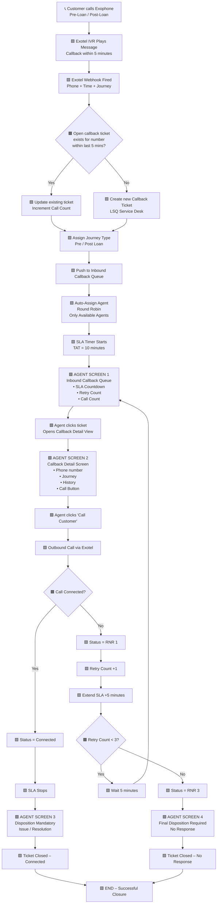

# Callback Management System – Inbound Call Optimisation

: Vijay Kumar S
Created time: February 2, 2026 6:38 PM
Status: In progress
Last edited: February 10, 2026 3:13 PM

## 1. Document Overview

---

**Product Name:** Callback Management System

**Owner:** Product 

**Stakeholders:** Debesh, Tushar, Vivek

**Systems Involved:** Exotel, LSQ Service Desk (Marvin)\

Reference BRD: [https://docs.google.com/document/d/144kWIA_KxfnZIej1Jp-F6_YInsMxaK2KR3hufMTqrIE/edit?tab=t.0](https://docs.google.com/document/d/144kWIA_KxfnZIej1Jp-F6_YInsMxaK2KR3hufMTqrIE/edit?tab=t.0)

## 2. Problem Statement

A significant percentage of inbound support calls (pre-loan and post-loan) are currently missed due to:

- Peak-hour call spikes
- Round-robin routing limitations
- Static agent capacity

Missed calls negatively impact:

- Customer experience and CSAT
- Repeat call volume
- Conversion and servicing efficiency

Adding headcount is **not cost-effective** due to uneven call distribution across the month.

## 3. Objective & Success Criteria

### Primary Objective

Eliminate inbound missed calls by converting **every inbound attempt** into a **guaranteed callback**, with defined SLAs and retry logic.

### Success Metrics

- Reduce missed call rate from ~36% → **<5% within 7 days**
- Peak-hour missed calls → **near zero**
- Callback connection rate > **80%**
- SLA adherence > **95%**

## 4. Scope Definition

### In Scope (Phase 1)

- Inbound calls on pre-loan & post-loan Exophones
- Auto-creation of callback tickets in LSQ
- SLA-driven agent callbacks
- Retry logic (RNR 1–3)
- Operational & performance reporting

### Out of Scope (Phase 1)

- Customer-selected callback slots
- Outbound campaign integration - Direct re- routing to the Sales agent

## 5. Key Assumptions

- All inbound calls are treated as callback requests
- Agents will only call customers via system-tracked outbound calls
- LSQ Service Desk is the source of truth for SLA and status
- Exotel IVR and webhooks are available for integration

## 6. Core Entities & Data Model

### Callback Ticket (LSQ Service Desk)

| Field | Description | Comments |
| --- | --- | --- |
| Phone Number | Primary identifier |  |
| Journey Type | Pre-Loan / Post-Loan |  |
| Ticket Status | Open |  |
| Total Missed Calls | 2 | To confirm with lsq |
| Callback Attempt Count | Outbound attempts made |  |
| Assigned Agent | Auto-assigned | Round robin |
| Queue | Inbound Callback Queue |  |
| SLA Deadline | Dynamic based on attempt | SLA |
| Disposition | Final outcome | To be defined |
| Sub Disposition |  | To be defined |

## 7. Detailed End-to-End Process Flow

### Step 1: Inbound Call Handling

1. Customer calls pre-loan or post-loan Exophone
2. IVR plays:
    
    > “Thank you for calling. You will receive a callback within 5 minutes. Your request has been registered.”
    > 
3. Exotel triggers webhook to LSQ with:
    - Phone number
    - Timestamp
    - Call type (pre/post)

### Step 2: Ticket Creation & De-duplication

- If a ticket exists for the same phone number **within last 5 minutes**:
    - Update call count
- Else:
    - Create a new callback ticket
    - Assign journey type

### Step 3: Queueing & Assignment

- Ticket enters **Inbound Callback Queue**
- Auto-assignment:
    - Round-robin
    - Only to available agents
- Initial SLA:
    - **10 minutes to first callback attempt**

### Step 4: First Callback Attempt

- Agent initiates outbound call
- System tracks outcome

### If Connected

- Status → `Connected`
- SLA stops
- Agent captures disposition
- Ticket closed

### If Not Connected

- Status → `RNR 1`
- SLA extended to **+5 minutes**
- Retry scheduled automatically

### Step 5: Retry Logic (RNR Flow)

| Attempt | Status | SLA |
| --- | --- | --- |
| 1st Fail | RNR 1 | +5 mins |
| 2nd Fail | RNR 2 | +5 mins |
| 3rd Fail | RNR 3 | Final |
- Max attempts: **3**
- Interval between retries: **5 minutes**

### Step 6: Final Closure

- If connected on retry → normal closure
- If not connected after RNR 3:
    - Status → `RNR 3`
    - Disposition captured
    - Ticket closed

### **Screen 1: Agent Queues**

Agent sees:

- Customer number
- SLA timer (live countdown)
- Retry count (0–3)
- Call count
- Journey type

🔒 Agent **cannot ignore** SLA tickets.

### 🟩 **Screen 2: Callback Detail Screen**

Agent sees:

- Full call history
- Previous attempts
- Notes (if any)
- Single CTA: **Call Customer**

🚫 No manual status editing allowed.

### 🟩 **Screen 3: Disposition Screen (Connected)**

Mandatory before closure:

- Issue category
- Resolution type
- Remarks (optional)

❌ Cannot close without a disposition.

### 🟩 **Screen 4: Final Disposition (RNR 3)**

Mandatory:

- “Customer not reachable”
- Optional follow-up flag

## 8. SLA & Escalation Rules

### SLA Governance

- SLA runs only when ticket is **open**
- SLA pauses on:
    - Connected
    - Agent actively calling

### Escalation

- SLA < 2 minutes remaining:
    - Ticket flagged as “At Risk”
- Auto-reassignment if:
    - Agent inactive
    - Agent exceeds idle threshold

> Manual “buddy monitoring” is replaced by system-driven escalation
> 

## 9. Agent Experience (Non-Negotiables)

- Clear callback queue view
- Retry count visible
- SLA countdown visible
- Disposition mandatory before closure
- No manual status skipping

## 10. Customer Communication (Phase 1 – Minimal)

- IVR confirmation on inbound call
- Optional (recommended):
    - SMS on ticket creation
    - SMS on closure after RNR 3

## 11. Reporting & Dashboards

### Operational Metrics

- Callback tickets created
- Callback connected rate
- Average time to first attempt
- Average retries per ticket

### SLA Metrics

- SLA adherence %
- Breached tickets
- Time-to-connect

### Agent Metrics

- Connect rate per agent
- Retry success %
- Average handling time

### Business Impact

- Missed call % (pre vs post)
- Repeat call reduction
- CSAT correlation

## 12. Risks & Mitigations

| Risk | Mitigation |
| --- | --- |
| Peak overload | Dynamic reassignment |
| Agent misuse | Mandatory dispositions |
| SLA gaming | Auto-calculated SLAs |
| Duplicate tickets | 5-min dedupe rule |

## 13. Phase 2 Enhancements (Future)

- Customer-selected callback slots
- Priority routing ( High-value users)
- WhatsApp callback confirmations - Rerouting to whatsapp

## 14. Final Notes (Process Clarity)

- This system **does not increase call volume**
- It **redistributes demand across time**
- Success depends on **automation, not manual vigilance**
- SLA ownership lies with **system + ops**, not individual agents