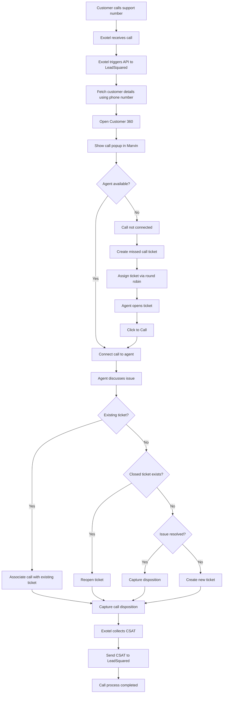

# Calling Support Workflow – Exotel + LeadSquared Integration

: Vijay Kumar S
Created time: March 17, 2026 6:56 PM
Status: Not started
Last edited: March 17, 2026 7:00 PM

```mermaid
flowchart TD

A[Customer calls support number] --> B[Exotel receives call]

B --> C[Exotel triggers API to LeadSquared]

C --> D[Fetch customer details using phone number]

D --> E[Open Customer 360]

E --> F[Show call popup in Marvin]

F --> G{Agent available?}

G -- Yes --> H[Connect call to agent]

H --> I[Agent discusses issue]

I --> J{Existing ticket?}

J -- Yes --> K[Associate call with existing ticket]

J -- No --> L{Closed ticket exists?}

L -- Yes --> M[Reopen ticket]

L -- No --> N{Issue resolved?}

N -- Yes --> O[Capture disposition]

N -- No --> P[Create new ticket]

K --> Q[Capture call disposition]
M --> Q
O --> Q
P --> Q

Q --> R[Exotel collects CSAT]

R --> S[Send CSAT to LeadSquared]

S --> T[Call process completed]

%% MISSED CALL FLOW
G -- No --> U[Call not connected]

U --> V[Create missed call ticket]

V --> W[Assign ticket via round robin]

W --> X[Agent opens ticket]

X --> Y[Click to Call]

Y --> H
```