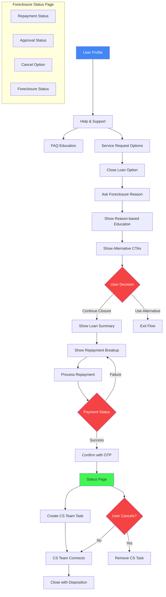
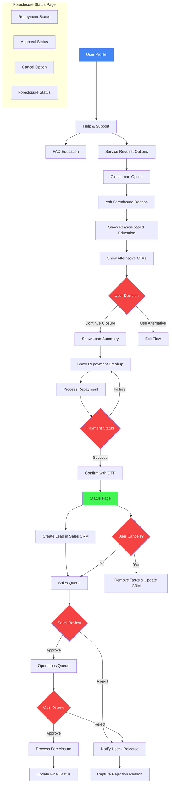

# Capture foreclosure reasons from customer

: Ranjan kumar Singh
Created time: January 3, 2025 11:40 AM
Status: In progress
Last edited: February 19, 2026 7:12 PM
Owner: Lalit Bihani

# **What problem are we solving?**

We experiencing an increasing trend in loan foreclosures, which negatively impacts AUM and retention. 

Here are the reason for foreclosure we have identified so far based on the user calling and collecting the feedback from the sales and support team:

**PRODUCT POSITIONING e(Priority 0)**

- We position ourselves as a **short term requirement**, so when the user's requirement is fulfilled the user looks to close the loan.

**LIEN REMOVAL CONFUSION (Priority 0)**

- Users don't understand how to release their collateral and hence assume that account closure is the only way to do so.
- Since users cannot find the option to release collateral they choose to foreclose the loan afraid that their collaterals are locked with volt until they foreclose.
- Support team suggest to foreclose the loan when customer ask how to remove lien

**PRODUCT KNOWLEDGE GAPS (Priority 0)**

- Users intend to clear their dues which leads them to foreclosing since we don't have any other alternative to clearing **all dues**. They go through with it unaware of the fact that foreclosing the loan will also close their loan account.
- Users aren't not aware that they have to pay processing fees again if they have a requirement for the credit line if they foreclose their loan.

**INTERFACE & FLOW ISSUES (Priority 0)**

- The foreclosure option is too easily accessible, diminishing the perceived significance of this serious financial decision
- The system doesn't present alternative options before allowing foreclosure
- Users aren't given sufficient warning about the consequences

**PRICING & FEES ISSUES (Priority 2)**

- Users are surprised to see extra charges like line enhancement charges, pf, renewal fees etc and lose trust on the application which leads to foreclosures.
- When users read the agreement he is afraid of the renewal fees as it is communicated as annual maintenance fees, After short term requirement is fulfilled users chooses to foreclose as they don't want to pay renewal fees annually.

**USER EXPERIENCE (Priority 2)**

- Users had a bad experience with withdrawal, repayment, line enhancement etc. Any bad experience within the application can lead to foreclosure.
- We are positioning our product as a way to get instant disbursals, When users are in urgent need of cash and users are unable to get that cash in expected time they look towards other avenues as they are in an emergency.
- Difference in expected credit limit and what they received. System limitations and bugs cause a bad experience during requirement of the user which can lead to foreclosure.
- Users struggle to find answers to basic product questions hence it leads to foreclosure:
    - How does repayment work?
    - How does interest work?
    - How does withdrawal work?
    - Can I withdraw all together or in chunks?
    - What will be the withdrawal TAT?
    - How do I remove lien?
    - How do I increase limit?

User call sheet:

 https://docs.google.com/spreadsheets/d/10m5ec_jVACcNN8esfoiUMGPR4wiFCCXmVQgaMfVYaN4/edit?usp=sharing

[[https://docs.google.com/spreadsheets/d/1I7gZxd2rmN9rJ8y5ZK5dWSW5U5lgUGI5rcFDAIgz2s8/edit?usp=sharing](https://docs.google.com/spreadsheets/d/1I7gZxd2rmN9rJ8y5ZK5dWSW5U5lgUGI5rcFDAIgz2s8/edit?usp=sharing)](https://docs.google.com/spreadsheets/d/1I7gZxd2rmN9rJ8y5ZK5dWSW5U5lgUGI5rcFDAIgz2s8/preview?usp=sharing)

---

Platform wise foreclosure count:

[https://docs.google.com/spreadsheets/d/1CAKkCLQLvhlPtZ23W7yzFX7gJNFURllB2zHFttXG8AA/edit?usp=sharing](https://docs.google.com/spreadsheets/d/1CAKkCLQLvhlPtZ23W7yzFX7gJNFURllB2zHFttXG8AA/edit?usp=sharing)

Foreclosure data:

[https://docs.google.com/spreadsheets/d/1mkKgLu8eTVoFZvHi6fF68QyHURaEAwmX5XWeuTP_VFM/edit?usp=sharing](https://docs.google.com/spreadsheets/d/1mkKgLu8eTVoFZvHi6fF68QyHURaEAwmX5XWeuTP_VFM/edit?usp=sharing)

# **How do we measure success?**

**Current State Analysis:**

Monthly foreclosure

1. Highest foreclosure rate: 27.09% (Nov 2024)
2. Lowest foreclosure rate: 2.48% (Dec 2023)
3. Recent trend: 15.71% (Jan 2025)

Foreclosure based on aging

- Average loan tenure at  foreclosure: ~5 months
- Peak foreclosure period: Month 1-2 (1,237 cases, 25.5%)
- Sharp drop after 6 months

**Success Metrics & Targets:**

1. Near-term Goals (1 month)
    1. Capture the reasons for foreclosure for all attempts
2. **Short-term Goals (3 months)**
    - Reduce foreclosure rate from current 15.71% to under 12%
    - Target monthly foreclosure count under 500
3. **Mid-term Goals (6 months)**
    - Bring foreclosure rate under 8%
    - Maintain foreclosure count under 300
    - Increase average tenure from 5 to 7 months
4. **Long-term Goals (12 months)**
    - Achieve and maintain foreclosure rate under 5%
    - Keep monthly foreclosure count under 200
    - Increase average tenure from 5 to 10 months

---

# **How are others solving this problem?**

Indian fintech apps 

[https://embed.figma.com/design/x1rDpxstHSGXbMjQTtGvtR/Loan-foreclosure?node-id=118-1139&t=QogKz67G1SAOIGLX-11&embed-host=notion&footer=false&theme=system](https://embed.figma.com/design/x1rDpxstHSGXbMjQTtGvtR/Loan-foreclosure?node-id=118-1139&t=QogKz67G1SAOIGLX-11&embed-host=notion&footer=false&theme=system)

UI selection references

[https://www.figma.com/design/x1rDpxstHSGXbMjQTtGvtR/Loan-foreclosure?node-id=76-781&t=JOLQcXxlfMUy4DCq-4](https://www.figma.com/design/x1rDpxstHSGXbMjQTtGvtR/Loan-foreclosure?node-id=76-781&t=JOLQcXxlfMUy4DCq-4)

# **What is the solution?**

- **Product Education Through FAQs - Phase 2**
    - Create categorized FAQs to address basic product queries and prevent foreclosures caused by product understanding gaps
    - Resources:
        - FAQ Management System: [[Link](FAQ%20Management%20System%20189e8d3af13a8003a2a5ff6abd88b33f.md)]
        - FAQ Content Document: [[Link](https://docs.google.com/document/d/1ojvtyjkUJdytxImRudTC5hqS6BpokB3HF8LjXxxa1W0/edit?usp=sharing)]
- **Targeted Intervention for Foreclosure Requests - Phase 1**
    - Collect specific reasons for foreclosure request
    - Present contextual benefits and alternatives based on selected reasons
    - Guide users to better solutions than foreclosure
- **Operations Team Review Process - Phase 1**
    
    A. Initial Review
    
    - Operations/Customer Success team reviews foreclosure reasons
    - Team connects with customer to understand intent
    - Team presents alternatives based on customer's situation
        - Sales pitch documentation (Pending)
    
    B. Request Processing
    
    - If customer withdraws request:
        - Cancel foreclosure request
        - Add disposition notes
        - Send confirmation communication (Content pending)
    - If customer proceeds with foreclosure:
        - Complete validation checklist:
            - Credit details
            - Repayment history
            - Collateral status
        - Add disposition notes
        - Send approval communication
        - Submit lien removal request to lenders
        - Update foreclosure MIS

## Requirements overview (optional)

## User stories / User flow

**Foreclosure user journey:**

User profile > Help and support > Educate user through FAQ > Provide other service request options > Option to close loan account > ask reason of foreclosure > educate user based on selected reasons and CTA to redirect user to specific flow > If user choose to close loan > show loan summary > show repayment break-up > ask user to repay > handle repayment success and failure > confirm loan closure with OTP [Send comms to customer & mention they can cancel request till] > Show status page to user [Repayment status, foreclosure approval status, option to cancel request, foreclosure status] > assign task to customer success team [Remove task and cancel the foreclosure request if user cancelled foreclosure request] > ops to connect with customer > close task with disposition



# Requirements

### FAQ’s and intervention based on foreclosure reason

- Show categorised FAQ under the Help and support section
- Data Collection:
    - FAQ click data
    - FAQ search keywords [Not in Scope of phase 1]
- If customer choose to close the loan account, take user to the loan closure flow
- Foreclosure Reasons:
    - I want to release my collateral
    - I want to prepay my loan
    - I want to sell my mutual funds
    - I don’t need a loan anymore
    - I had a poor experience with Volt
    - Other
- Data Collection:
    - Foreclosure reason(s) selected
    - Engagement with interventions (e.g. clicks, views)
- Interventions:
    - In-app message acknowledging reason and offering relevant alternative
        
        
        | **Selected reason** | **What we will recommend** | **Priority** | **Ordering** | Comment |
        | --- | --- | --- | --- | --- |
        | I want to release my collateral | - Reassurance that the collaterals are in the user’s name | P0 | 2 |  |
        |  | - You can verify the returns are still in your name from your CAS statements | P1 |  |  |
        |  | - Your collaterals are safe with us + Safety symbols that we are regulated by RBI and so.  | P0 | 1 |  |
        |  | - You have access to {credit line amount} which is available to use for the next 3 years  | P0 |  |  |
        |  | - You can release any collateral you have pledged with us in just 3 steps, on demand | P1 | 3 |  |
        |  | - If you keep your collaterals with us you will not loose out on anything but actually gain access to this credit line. | P0 |  |  |
        |  | You can keep your loan account active as an emergency fund and use it for Medical emergencies, Education, Marriage, Travel, Vehicle, Business needs  | P2 |  |  |
        |  | Nudge to partially un-pledge | P0 |  |  |
        |  | - Disclaimer : You may not get the same interest rate of 10.49% again
        
        You will have to go through the loan application journey again and pay processing fee of ₹899 again | P1 |  |  |
        |  |  |  |  |  |
        | I want to sell my mutual funds | - Mutual funds are invested for long term returns, Stay invested to reach your goals | P0 |  |  |
        |  | - Your collateral value will multiple 3x/4x if you stay invested for the next {tenure of your loan} years and use this cash for your liquidity needs | P0 |  |  |
        |  | - Comparison with interest rate and returns  | P1 |  |  |
        |  | - Your collaterals are safe with us + Safety symbols that we are regulated by RBI and so.  | P1 |  |  |
        |  | - If you keep your collaterals with us you will not loose out on anything but actually gain access to this credit line. | P1 |  |  |
        |  | - You can release any collateral you have pledged with us in just 3 steps | P1 |  |  |
        |  | - Nudge to partially un-pledge | P0 |  |  |
        |  | -Your collaterals are safe with us + Safety symbols that we are regulated by RBI and so.  | P0 |  |  |
        |  | - Disclaimer : You may not get the same interest rate of 10.49% again
        
        You will have to go through the loan application journey again and pay processing fee of ₹899 again | P1 |  |  |
        |  |  |  |  |  |
        | I want to prepay my loan | - Current dues are {Outstanding amount} Pay 0 interest once you repay all dues until you withdraw further | P0 |  |  |
        |  | - How to use a credit line, You can use this credit line facility like a credit card. Repay principal at your connivence.  | P1 |  |  |
        |  | - You can keep your loan account active as an emergency fund and use it for Medical emergencies, Education, Marriage, Travel, Vehicle, Business needs  | P0 |  |  |
        |  | - Disclaimer : You may not get the same interest rate of 10.49% again
        
        You will have to go through the loan application journey again and pay processing fee of ₹899 again | P1 |  |  |
        |  | - Repay all dues button | P0 |  |  |
        |  |  |  |  |  |
        |  |  |  |  |  |
        | I need a higher credit limit | -You will loose out of your current credit limit of {Current credit limit}  | P0 |  |  |
        |  | - You can get higher limit if you pledge more funds | P0 |  |  |
        |  | - You can keep your loan account active as an emergency fund and use it for Medical emergencies, Education, Marriage, Travel, Vehicle, Business needs  | P1 |  |  |
        |  | - Your collaterals are safe with us + Safety symbols that we are regulated by RBI and so.  | P0 |  |  |
        |  | - Disclaimer : You may not get the same interest rate of 10.49% again
        
        You will have to go through the loan application journey again and pay processing fee of ₹899 again | P1 |  |  |
        |  | - Nudge to pledge more | P0 |  |  |
        |  |  |  |  |  |
        |  |  |  |  |  |
        | I don’t need a loan anymore | - You can keep your loan account active as an emergency fund and use it for Medical emergencies, Education, Marriage, Travel, Vehicle, Business needs  | P0 |  |  |
        |  | - Disclaimer : You may not get the same interest rate of 10.49% again
        
        You will have to go through the loan application journey again and pay processing fee of ₹899 again | P0 |  |  |
        |  | - This will have no impact on CIBIL | P2 |  |  |
        |  | - Current dues are {Outstanding amount} Pay 0 interest once you repay all dues until you withdraw further | P1 |  |  |
        |  | - Your collaterals are safe with us + Safety symbols that we are regulated by RBI and so.  | P0 |  |  |
        |  | - How to use a credit line, You can use this credit line facility like a credit card. Repay principal at your connivence.  | P0 |  |  |
        |  | - Nudge to partially un-pledge or Nudge to repay all dues if any | P0 |  |  |
        |  |  |  |  |  |
        |  |  |  |  |  |
        | I had a poor experience with Volt | Priority support |  |  |  |

Handling of repayment when user select to clear their dues

| Lender  | Mandate registered | Mandate not registered |  |
| --- | --- | --- | --- |
| BAJAJ | - If repayment is initiated b/w 8th to month end and mandate is registered then collect *Net payable

- If repayment is initiated b/w 1st to 7th of the month and mandate is registered then collect [Net payable - interest due] | Repayment is initiated any time of the month then collect Net payable |  |
| DSP | - If repayment is initiated b/w 8th to month end and mandate is registered then collect Net payable

- If repayment is initiated b/w 1st to 7th of the month and mandate is registered then collect [Net payable - interest due] | Repayment is initiated any time of the month then collect Net payable |  |
| TCL | - If repayment is initiated b/w 4th to month end and mandate is registered then collect *Net payable

- If repayment is initiated b/w 1st to 3rd of the month and mandate is registered then collect [Net payable - interest due] | Repayment is initiated any time of the month then collect Net payable |  |

**Net payable = POS + accrued interest  + penal charges + outstanding charges + outstanding interest - Receivables*

*Foreclosure raised after 6 PM - collect next day interest amount as well for all lenders*

Repayment summary page break-downs [Used in foreclosure flow or prepay flow]

| **Elements on UI** | **Mapping** |
| --- | --- |
| Outstanding amount | Principal amount |
| Interest due:
- Interest outstanding
- Interest accrued not due | - Outstanding interest
- Accrued interest |
| Charges due:
- Charges outstanding
- Penal charges
- Penal charges accrued not due
- Total Demat and bounce charges | - Outstanding charges
- Penal interest or Penal charges
- Penal interest/charged accrued not due
 |

For clear all dues:

POS + Interest outstanding + charges + outstanding - Advance intetest

### Ops Approval Workflow

- Foreclosure raised by customer will be assigned to ops or customer success team as a task.
- Visibility for ops team
    - Foreclosure requested at
    - Repayment details
    - Collateral details
    - Credit details
- Capture call disposition
    - Ops to capture the call disposition at time of approval or rejection of request.
    - Disposition need to be save in foreclosure request
        - Rejected reason
            - Cleared the understanding gap
            - Raised by mistake
            - Other
                - Enter text
        - Approved reason
            - Do not want to continue with Volt
            - Requirement full-filled
            - Want to sell MF
            - Other
                - Enter text
- Processing of foreclosure request
    - If rejected by ops : cancel the foreclosure
    - If approved by ops : Raise foreclosure to lender
    - Send comms to customer in both the cases

### LSQ requirement

We need to send the activity on the LSQ when customer raises the foreclosure request.

**Activity details:**

Activity name: Foreclosure raised

Activity code: 272

Reason: Reason selected by user

UserRemarks: Remarks added by user if reason selected as Other

Schema:


### Comms requirement

case 1: Customer requested foreclosure request [Already exists]

| WA template | loan_closure_under_process_dl
 |
| --- | --- |
| Email template | d-e0dd6a7c4a9a48c99503837dd982f416 |
|  |  |

Note: Since new status has been introduced we might need to change the trigger logic for above comms

case 2: Ops team or customer cancelled the foreclosure request [New requirement]

<aside>
💡

Dear {customername},

 Your credit line closure request has been cancelled. Your credit line remains fully active and ready for use whenever you need it.

Your account benefits:

- No hidden fees or prepayment penalties
- Access to instant cash while keeping your investment safe
- Repay any time to minimize interest costs

If you have any questions or doubt, please feel free to contact us at {contactnumber}.

Thank you for continuing your relationship with us.

Best regards,
{{brandname}}

| WA template | foreclosure_cancelled |
| --- | --- |
| Email template | d-4195673849964464bab3d38260079655 |
|  |  |
</aside>

Case 3: Ops team approved foreclsoure request and foreclosure request sent to lender [Request status = REQUESTED] - Already exists

| WA template | forclosure_processed |
| --- | --- |
| Email template | d-5cd47b322ea142a59651140e07fde96d |
|  |  |

Case 4: Lender rejected the foreclosure request

| WA template | foreclosure_rejected_v1 |
| --- | --- |
| Email template | d-97074007b55843219c840eebc44d802f  |
|  |  |

### Amplitude requirement

| Journey | User Action | Event name | Event properties | Event properties expected value | User properties |
| --- | --- | --- | --- | --- | --- |
| Loan closer | User click on “Close account” Button on user profile menu | CLOSE_ACCOUNT_BOTTON_CLICKED |  |  |  |
|  | When user lands on loan closer landing page | ACCOUNT_CLOSURE_LANDING_PAGE_VIEWED |  |  |  |
|  | When user click on keep account active | KEEP_ACCOUNT_ACTIVE_BUTTON_CLICKED | source | - account_closure_landing_page

- intervention_modal |  |
|  | When user click on the ‘I still want to close account’ on landing page and the intervention modal | STILL_WANT_TO_CLOSE_ACCOUNT_BUTTON_CLICKED | source | - account_closure_landing_page

- intervention_modal |  |
|  | When user select the account closure reason | ACCOUNT_CLOSURE_REASON_SELECTED | selected_reason | {{selected reason for account closure}} |  |
|  | When user select the reason and click on the ‘Release collateral’ button on the intervention modal | RELEASE_COLLATERAL_BUTTON_CLICKED |  |  |  |
|  | When user click on the clear all dues on the intervention modal after selecting the reason | CLEAR_ALL_DUES_BUTTON_CLICKED |  |  |  |
|  | When user lands on the repayment summary screen | CONFIRM_AND_PAY_PAGE_VIEWED |  |  |  |
|  | When user choose to repay only principal in case of BFL | PAY_ONLY_PRINCIPAL_BUTTON_CLICKED |  |  |  |
|  | When user choose to repay all dues on summary page for BFL | PAY_ALL_DUES_BUTTON_CLICKED |  |  |  |
|  | When user lands on the confirm loan account page | CONFIRM_LOAN_ACCOUNT_PAGE_VIEWED |  |  |  |
|  | When user click on get otp on confirm loan account | CONFIRM_OTP_BUTTON_CLICKED |  |  |  |
|  | When user lands on the account closure status page after placing the foreclosure request | ACCOUNT_CLOSURE_STATUS_PAGE_VIEWED |  |  |  |
|  | When user click on cancel account closure request | ACCOUNT_CLOSURE_CANCEL_BUTTON_CLICKED |  |  |  |
|  | When user click on cancel account closure request and then click confirmation CTA on the modal | ACCOUNT_CLOSURE_CANCEL_CONFIRMATION_BUTTON_CLICKED |  |  |  |
|  |  |  |  |  |  |

TATA new foreclosure API integration:

[https://www.notion.so/volt-money/TCL-foreclosure-API-integration-222e8d3af13a8007bf81f6b777e3c412?source=copy_link](https://www.notion.so/volt-money/TCL-foreclosure-API-integration-222e8d3af13a8007bf81f6b777e3c412?source=copy_link)

---

# **Design**

[https://www.figma.com/design/x1rDpxstHSGXbMjQTtGvtR/Loan-foreclosure?node-id=988-4560&t=ElyICInH1A3fMd78-1](https://www.figma.com/design/x1rDpxstHSGXbMjQTtGvtR/Loan-foreclosure?node-id=988-4560&t=ElyICInH1A3fMd78-1)

---

# **Analytics**

- Reason frequency and correlation with borrower attributes
- Impact of reason-driven interventions on foreclosure reduction rate
- Track which FAQs user viewed before initiating foreclosure
- Number of foreclosure based on
    - Credit aging
    - Lender wise foreclosure count and break
- OPS workflow
    - First Contact Resolution (FCR) rate
    - Time to Resolution
    - Intervention Acceptance Rate
    - Reason-specific resolution rates

## Tushar suggestions

- Opportunity should be created in LSQ for this lead
    - Sales team will call this customer
    - We will track input metrics of sales team via LSQ
    - Keeps the view clean & easy
    - The moment a user applies for foreclosure—> Event should flow into LSQ—> It should create a new opportunity—> Lead owner should change to the person dedicatedly calling for foreclosure
- Sales guy will only call & try to stop this customer to foreclose
- Sales guy should NOT be given access to approve/Reject foreclosure
    - Because incentives are not aligned
        - High chance that a sales representative may intentionally keep the customer waiting for +4 days even after the customer explicitly states they need to foreclose the loan due to an emergency.
        - Sales team can’t do checks & balances to close the loan, like pending overdue or some sudden shortfall which came up.
- If disposition is added that this customer does not agrees to close the loan, After T+1 day this should move to Ops queue—> Then they can approve/reject the case.
- If customer is RNR/not approachable/ no lsq disposition is added , after +4 days of putting request, this should move automatically to Ops queue.
    - Event should pass from LSQ to DB—> Then Ops can reject/approve.
- TAT of closure of loan should be revised & factored in

**Please refer to the flow I made change in below**



---

# **Timeline/Release Planning**

---

# **Go to market**

## Marketing

## Ops & Sales training

- 11 Mar

## Frequently asked questions (FAQs)

---

# **Action items / checklist**

[](data:image/png;base64,iVBORw0KGgoAAAANSUhEUgAAAEgAAABICAYAAABV7bNHAAAA1ElEQVR4Ae3bMQ4BURSFYY2xBuwQ7BIkTGxFRj9Oo9RdkXn5TvL3L19u+2ZmZmZmZhVbpH26pFcaJ9IrndMudb/CWadHGiden1bll9MIzqd79SUd0thY20qga4NA50qgoUGgoRJo/NL/V/N+QIAAAQIECBAgQIAAAQIECBAgQIAAAQIECBAgQIAAAQIECBAgQIAAAQIECBAgQIAAAQIEyFeEZyXQpUGgUyXQrkGgTSVQl/qGcG5pnkq3Sn0jOMv0k3Vpm05pmNjfsGPalFyOmZmZmdkbSS9cKbtzhxMAAAAASUVORK5CYII=)

- [ ]  Product
    - [x]  Alignment with tech and business
    - [ ]  Sales training  about the feature
    - [ ]  Support training about the feature
    - [ ]  Support training, how to handle user query
    - [ ]  OPS training for foreclosure ops approval flow
- [ ]  Business
    - [ ]  -
- [ ]  Design
    - [ ]  -

---

[](data:image/png;base64,iVBORw0KGgoAAAANSUhEUgAAAEgAAABICAYAAABV7bNHAAAA1ElEQVR4Ae3bMQ4BURSFYY2xBuwQ7BIkTGxFRj9Oo9RdkXn5TvL3L19u+2ZmZmZmZhVbpH26pFcaJ9IrndMudb/CWadHGiden1bll9MIzqd79SUd0thY20qga4NA50qgoUGgoRJo/NL/V/N+QIAAAQIECBAgQIAAAQIECBAgQIAAAQIECBAgQIAAAQIECBAgQIAAAQIECBAgQIAAAQIEyFeEZyXQpUGgUyXQrkGgTSVQl/qGcG5pnkq3Sn0jOMv0k3Vpm05pmNjfsGPalFyOmZmZmdkbSS9cKbtzhxMAAAAASUVORK5CYII=)

[](data:image/png;base64,iVBORw0KGgoAAAANSUhEUgAAAEgAAABICAYAAABV7bNHAAAA1ElEQVR4Ae3bMQ4BURSFYY2xBuwQ7BIkTGxFRj9Oo9RdkXn5TvL3L19u+2ZmZmZmZhVbpH26pFcaJ9IrndMudb/CWadHGiden1bll9MIzqd79SUd0thY20qga4NA50qgoUGgoRJo/NL/V/N+QIAAAQIECBAgQIAAAQIECBAgQIAAAQIECBAgQIAAAQIECBAgQIAAAQIECBAgQIAAAQIEyFeEZyXQpUGgUyXQrkGgTSVQl/qGcG5pnkq3Sn0jOMv0k3Vpm05pmNjfsGPalFyOmZmZmdkbSS9cKbtzhxMAAAAASUVORK5CYII=)

[](data:image/png;base64,iVBORw0KGgoAAAANSUhEUgAAAEgAAABICAYAAABV7bNHAAAA1ElEQVR4Ae3bMQ4BURSFYY2xBuwQ7BIkTGxFRj9Oo9RdkXn5TvL3L19u+2ZmZmZmZhVbpH26pFcaJ9IrndMudb/CWadHGiden1bll9MIzqd79SUd0thY20qga4NA50qgoUGgoRJo/NL/V/N+QIAAAQIECBAgQIAAAQIECBAgQIAAAQIECBAgQIAAAQIECBAgQIAAAQIECBAgQIAAAQIEyFeEZyXQpUGgUyXQrkGgTSVQl/qGcG5pnkq3Sn0jOMv0k3Vpm05pmNjfsGPalFyOmZmZmdkbSS9cKbtzhxMAAAAASUVORK5CYII=)

[](data:image/png;base64,iVBORw0KGgoAAAANSUhEUgAAAEgAAABICAYAAABV7bNHAAAA1ElEQVR4Ae3bMQ4BURSFYY2xBuwQ7BIkTGxFRj9Oo9RdkXn5TvL3L19u+2ZmZmZmZhVbpH26pFcaJ9IrndMudb/CWadHGiden1bll9MIzqd79SUd0thY20qga4NA50qgoUGgoRJo/NL/V/N+QIAAAQIECBAgQIAAAQIECBAgQIAAAQIECBAgQIAAAQIECBAgQIAAAQIECBAgQIAAAQIEyFeEZyXQpUGgUyXQrkGgTSVQl/qGcG5pnkq3Sn0jOMv0k3Vpm05pmNjfsGPalFyOmZmZmdkbSS9cKbtzhxMAAAAASUVORK5CYII=)

[](data:image/png;base64,iVBORw0KGgoAAAANSUhEUgAAAEgAAABICAYAAABV7bNHAAAA1ElEQVR4Ae3bMQ4BURSFYY2xBuwQ7BIkTGxFRj9Oo9RdkXn5TvL3L19u+2ZmZmZmZhVbpH26pFcaJ9IrndMudb/CWadHGiden1bll9MIzqd79SUd0thY20qga4NA50qgoUGgoRJo/NL/V/N+QIAAAQIECBAgQIAAAQIECBAgQIAAAQIECBAgQIAAAQIECBAgQIAAAQIECBAgQIAAAQIEyFeEZyXQpUGgUyXQrkGgTSVQl/qGcG5pnkq3Sn0jOMv0k3Vpm05pmNjfsGPalFyOmZmZmdkbSS9cKbtzhxMAAAAASUVORK5CYII=)

# **Feedback**

---

# **Learnings & Next steps**

---

# **Appendix**

## Meeting notes

- Create a segment and understand the foreclosure reasons of each segment : Ans the WHY
- Survey questions should be based on above understanding
- Write why we are doing survey what is the expected outcomes
    - Ans why do we need to do survey, what hypothesis to prove?
- Do not includes who did not renewed the loan

Meeting with Lalit:

- Enable them to remove collateral, partial and full
- Scope what problem we want to solve
- Pain point while closing the loan - What challenges are they facing at time of foreclosure

### Meeting with Swara U

- Requirement full filled
    - Customer do not think about future use case
    - They do not want to continue lien
    - They do not want to continue loan
    - They close loan if they need to take loan another loan, as they need to provide NOC or sanction letter.
- Customer want to keep the loan active but they want to remove lien but lender foreclosure by default if no collateral is their.
- Provided limit is not enough and want to sell MF to fullfill requirement
- MFD close account becase they think that clients can ask any time to remove lien and sell MF, and lien remove tasks time and hence they close account in advance.
- Reason :
    - Want to release collateral, want to sell MF
    - Requirement full-filled
- User are not able to completely unlien the fund and hence they raise foreclosure

### Meeting with Lohit

- Un-pledging buffer , RM ask to pay full amount then you will be able to unlien and hence they suggest to foreclosue [40% out of 100%]
    - Want to switch the funds
- Customer do not want to continiue because requirement is full-filled [20% out of 100]

### Meeting with Amrit

- There is a mindset among people for loan, personal loan or term loan is commonly known loan, knowledge and behaviour of term carries forward and their is a cycology that when required they take the loan and repays to close the loan.
- They do not want to keep the collateral locked after repaying full amount, its a mindset [60% out of 100%]
    - They will take again when required, no problem with paying PF again.
    - RM also push MFD not to foreclosure
        - Pitch: No interest and charges will apply, You can use as emergency funds
        - Will not get same interest rate when reopen
- Want to sell MF in emergency, other type of investment like house, car purchase, marriage etc [20% out of 100%]
    - Limit is not enough to full-fill requirement
- SWP got rejected when lien marked [very less use case]
- Resuffling of entire portfolio due to market fluctuation
- Use human intervention to only collect reason/data to productise the foreclosure in better way

### Meeting with Mahesh (B2C team)

- If customer has idea that they can reuse the account any time, they choose to remove lien
    - Who do not have the idea, they choose to close loan
- Not require loan hence foreclosure loan
- Getting better deal with competitor
    - ZERO PROCESSING FEE
    - Low interest rate
- Switch and sell MF
- Required more then approved limits and want to sell MF to full-fill requirement
- Applying for loan somewhere else and hence want to close existing loan for NOC

### Meeting with B2B MFD platform

- Short-term need full filled [60% out of 100]
- Bad experience [lien removal TAT]
    - 1 MFD foreclosed loan with TATA and BFL and switched to DSP due to this.
- loan amount greater then 50L, they do not care of paying PF again. they do not want to keep the MF pledged.
- Not capable to pay loan → ask for sell-off and close loan

### Meeting with WA chat

Lien removal:

- Lien removal status
- How to remove lien
- How much time it will take

Foreclosure:

- Repaid all amount, now want to remove pledge
    - Chat support team ask whether want to remove lien or foreclosure loan
- Customer thinks that after repaying the full amount, lien will be removed auto magically
    - When they try to sell MF, they get to know that MF is locked.
- Product query by new onboarded customer
    - How to raise withdrawal
        - Ask about the repayment schedule
        - What will be the EMI amount
        - How to repay interest
        - Interest rate
        - Processing
    - Why credited amount is less

### Meeting with B2C inbound team

- Shortfall amount?
- Withdrawal TAT, when delayed
- Limit difference in holding and App
- Bounce charge [amount present in account]
- Foreclosure TAT
- How to remove lien []
- If i foreclosure, mere lien remove lien ho jayega?
    - They ask, ager foreclosure kar dete hai to kya hoga and ager unlien kar dete hai

- Buffer education and repay options on lien removal flow
- Eduction for user for BFL customer if they remove loan completely that loan will be closed completely

User call summary: [Total calls = 15]

| Reasons | count | Intervention will work? |
| --- | --- | --- |
| Requirement full-filled hence closed the loan | 7/15 | Yes |
| Not intended to permanently close the loan | 6/15 | Yes |
| No current requirement and hence do not wanted to keep the fund pledged  | 3/15 | Yes |
| Closed because of limited understanding of product and its benefits | 2/15 | Yes |

| Aging | Closure reason | Total calls |  |
| --- | --- | --- | --- |
| <90 days | - Product understanding gap (70%)
- Short-term need full-filled and do not want to continue (30%) | 10 |  |
| >90 days | - Requirement full-filled (90%)
- Understanding gap (10%) | 5 |  |

Top understanding gaps which leading to foreclosure

| Foreclosure action will close the loan account & will require to reopen again |  |
| --- | --- |
| How un-lien works |  |
| How interest calculation works |  |
| Renewal fee |  |
| Credit limit benefits |  |
| Miscommunication b/w customer and MFD |  |

**Reason**

- **Requirement full-filled**
    - **What we can sell**
    - Loan account opening fee + loan application process
    - 0 interest on keeping account outstanding amount.
- **Release collateral**
    - **What we can sell**
    - Easily remove lien marking on your collaterals
    - Keep loan account open even if you can no collaterals?
- **Renewal fee understanding**
- **Need more credit?**
    - **What we can sell**
    - SIP led increase mutual funds and with that credit limit.

Key Issues Identified:

1. Current messaging positions Volt as a temporary solution rather than a permanent financial tool, limiting customer understanding of its long-term benefits and overdraft capabilities
2. When customer reach and ask how release full collateral, sales and support team suggest customer to raise foreclosure request.
    1. Internal team are not aware that user can unpledge full collateral by repaying full amount
3. Product Understanding & Education:
    - Confusion related to commercials like renewal fee are leading to premature closure.
    - Limited understanding of collateral management options:
        - Misconception that account closure is the only way to **remove liens.**
        - Lack of awareness about available **lien removal options (Discovery issue).**
    - Difficulty in finding answers to basic product queries, like queries related to interest, charges, etc., leading to premature closures.
4. User Behaviour & Intent:
    - Some users are only exploring the product without serious intent, closing the loan thinking they will open it again when required.
        - 1 out of 5 people are okay with going through the process and paying the PF (processing fee) again.
        - 4 out of 5 people are not aware that they **need to do the loan application process again** and pay the PF again.
    - Users closing loans immediately after fulfilling short-term cash needs or when there are no immediate needs.
        - People do not want to keep mutual fund (MF) locked when they have no requirement for cash.
        - People are not aware of the OD/Credit line product and its benefits, and they are **treating the loan as a term loan.**
        - Internal sales and MFD  pitch  product to be used as a short-term product and closed whenever they want.
    - Risk-averse behavior during market volatility, where users want to remove the lien and sell their mutual funds to avoid losses due to market fluctuations.
    - Premature closures due to frustration from:
        - **Unexpected charges** like bounce charges added for only collecting charges.
        - Processing fee surprises.d
        - Service-related issues like delayed fund transfers.

Observations:

People have a traditional understanding of loans, primarily shaped by their experience with personal loans and term loans. This creates certain behavioral patterns:

1. They understand loans as something that:
    - Has a fixed term
    - Needs to be fully repaid
    - Gets closed after repayment
2. This traditional mindset influences their behavior:
    - They borrow when there's a specific need
    - They aim to repay and close the loan
    - They view loan closure as the end goal
3. The psychology behind this is:
    - Taking a loan when needed
    - Repaying it systematically
    - Closing it completely since loan is not good for financial health
    - Repeating this cycle when needed again

---

### What to sell per foreclosure reason @Gautam Mahesh to review

| **Selected reason** | **What we will recommend** | **Priority** | **Ordering** | Comment |
| --- | --- | --- | --- | --- |
| I want to release my collateral | - Reassurance that the collaterals are in the user’s name | P0 | 2 |  |
|  | - You can verify the returns are still in your name from your CAS statements | P1 |  |  |
|  | - Your collaterals are safe with us + Safety symbols that we are regulated by RBI and so.  | P0 | 1 |  |
|  | - You have access to {credit line amount} which is available to use for the next 3 years  | P0 |  |  |
|  | - You can release any collateral you have pledged with us in just 3 steps, on demand | P1 | 3 |  |
|  | - If you keep your collaterals with us you will not loose out on anything but actually gain access to this credit line. | P0 |  |  |
|  | You can keep your loan account active as an emergency fund and use it for Medical emergencies, Education, Marriage, Travel, Vehicle, Business needs  | P2 |  |  |
|  | Nudge to partially un-pledge | P0 |  |  |
|  | - Disclaimer : You may not get the same interest rate of 10.49% again

You will have to go through the loan application journey again and pay processing fee of ₹899 again | P1 |  |  |
|  |  |  |  |  |
| I want to sell my mutual funds | - Mutual funds are invested for long term returns, Stay invested to reach your goals | P0 |  |  |
|  | - Your collateral value will multiple 3x/4x if you stay invested for the next {tenure of your loan} years and use this cash for your liquidity needs | P0 |  |  |
|  | - Comparison with interest rate and returns  | P1 |  |  |
|  | - Your collaterals are safe with us + Safety symbols that we are regulated by RBI and so.  | P1 |  |  |
|  | - If you keep your collaterals with us you will not loose out on anything but actually gain access to this credit line. | P1 |  |  |
|  | - You can release any collateral you have pledged with us in just 3 steps | P1 |  |  |
|  | - Nudge to partially un-pledge | P0 |  |  |
|  | -Your collaterals are safe with us + Safety symbols that we are regulated by RBI and so.  | P0 |  |  |
|  | - Disclaimer : You may not get the same interest rate of 10.49% again

You will have to go through the loan application journey again and pay processing fee of ₹899 again | P1 |  |  |
|  |  |  |  |  |
| I want to clear all my dues | - Current dues are {Outstanding amount} Pay 0 interest once you repay all dues until you withdraw further | P0 |  | **Repayment amount = TOS (Principal + Interest + charges)** |
|  | - How to use a credit line, You can use this credit line facility like a credit card. Repay principal at your connivence.  | P1 |  |  |
|  | - You can keep your loan account active as an emergency fund and use it for Medical emergencies, Education, Marriage, Travel, Vehicle, Business needs  | P0 |  |  |
|  | - Disclaimer : You may not get the same interest rate of 10.49% again

You will have to go through the loan application journey again and pay processing fee of ₹899 again | P1 |  |  |
|  | - Repay all dues button | P0 |  |  |
|  |  |  |  |  |
|  |  |  |  |  |
| I need a higher credit limit | -You will loose out of your current credit limit of {Current credit limit}  | P0 |  |  |
|  | - You can get higher limit if you pledge more funds | P0 |  |  |
|  | - You can keep your loan account active as an emergency fund and use it for Medical emergencies, Education, Marriage, Travel, Vehicle, Business needs  | P1 |  |  |
|  | - Your collaterals are safe with us + Safety symbols that we are regulated by RBI and so.  | P0 |  |  |
|  | - Disclaimer : You may not get the same interest rate of 10.49% again

You will have to go through the loan application journey again and pay processing fee of ₹899 again | P1 |  |  |
|  | - Nudge to pledge more | P0 |  |  |
|  |  |  |  |  |
|  |  |  |  |  |
| My requirement is fulfilled | - You can keep your loan account active as an emergency fund and use it for Medical emergencies, Education, Marriage, Travel, Vehicle, Business needs  | P0 |  |  |
|  | - Disclaimer : You may not get the same interest rate of 10.49% again

You will have to go through the loan application journey again and pay processing fee of ₹899 again | P0 |  |  |
|  | - This will have no impact on CIBIL | P2 |  |  |
|  | - Current dues are {Outstanding amount} Pay 0 interest once you repay all dues until you withdraw further | P1 |  |  |
|  | - Your collaterals are safe with us + Safety symbols that we are regulated by RBI and so.  | P0 |  |  |
|  | - How to use a credit line, You can use this credit line facility like a credit card. Repay principal at your connivence.  | P0 |  |  |
|  | - Nudge to partially un-pledge or Nudge to repay all dues if any | P0 |  |  |
|  |  |  |  |  |
|  |  |  |  |  |

### WA/MAIL broadcast to understand the reason and prove the hypothesis

- We will send broadcast to customer who has foreclosed there loan in last 3 month and has not reopened the account.

 Google form link: https://forms.gle/GrmHkC3SbvZ4RBgJ6

WA message:

```
Hi {{Name}},

We noticed you recently closed Volt Money loan against mutual fund account.

We're committed to improving our services and would value your feedback.

Could you spare a moment to complete our brief 2-question survey? 
https://forms.gle/GrmHkC3SbvZ4RBgJ6

Your insights will help us serve you better.

Thanks,

Team Volt Money
```

Mail content:

```
Subject: Help us improve - 1-minute survey

Hi [Customer Name],

We noticed you recently closed your Volt Money loan. 

We'd appreciate your feedback to enhance our services.

Can you please take 2 minutes to complete this survey? Your insights will directly shape our product improvements.

https://forms.gle/GrmHkC3SbvZ4RBgJ6

Thank you,
Team Volt Money
```

### Proposed solution:

**Option 1:** Send WhatsApp message post-foreclosure to collect feedback and reasons

- Implementation: Set up automated WhatsApp message triggered by foreclosure completion
- Technical Feasibility: High, leverages existing notification system
- Resource Requirements: Low, primarily configuration and content creation

**Option 2: [Recommended]** Collect foreclosure reasons in-app before customer confirms

- Implementation: Integrate reason capture into existing foreclosure flow, between intention and confirmation steps
- Technical Feasibility: Medium, requires UI enhancements and data capture
- Resource Requirements: Medium, design and engineering effort to modify flow, store data, and expose to ops teams

|  | **Pro** | **Cons** |
| --- | --- | --- |
| **Option 1** | - Minimal development cost
- Faster implementation | - Harder to automate follow-up actions
- Unstructured data, manual analysis
- Reactive approach, reasons after the fact
- Might not be able to send survey comms to B2B customer depending on the agreement |
| **Option 2** | - Structured data capture
- Enables proactive interventions
- Opportunity to influence in-process
- Seamless in-app experience
- Reason-specific resolutions
- Introduces friction into foreclosure flow | - Requires design and engineering resources
- Longer implementation timeline
 |

Rationale for recommending Option 2:
While Option 2 requires more upfront investment, it provides significant strategic advantages by enabling proactive interventions, predictive modeling, and a differentiated customer experience. Collecting structured reason data in-app also reduces ongoing operational costs and manual effort compared to an external WhatsApp-based approach.