# DSP: Bank Account Update and Mandate Re-Registration for active loan accounts

: Ranjan kumar Singh
Created time: July 31, 2025 3:21 PM
Status: In progress
Last edited: February 19, 2026 7:12 PM
Owner: Lalit Bihani

# **What problem are we solving?**

 

This document outlines the requirements for enabling both **LSPs** and **internal DSP operations teams** to initiate **bank account updates** and **mandate re-registration** for customers, through streamlined APIs and a user-friendly interface.

### **Current Gaps and Challenges:**

- **LSPs** do not have a way to allow their post loan customers to:
    - Update bank account
    - Re-register mandates
- **Internal DSP Operations Team** is currently dependent on the **DIGIO dashboard** to manually:
    - Create mandate registration links
    - Perform repetitive data entry, which is:
        - Error-prone
        - Time-consuming
        - Not scalable for high-volume operations
- Although **bank account update** is already possible on the Command Center via a **maker-checker flow**, there is:
    - No functionality to generate a **DIGIO mandate link** within the platform
    - No ability to **send mandate registration links** to individual customers or in **bulk**
    - No reporting mechanism to identify customers **whose mandates are unregistered**
    - Internal ops team do not get notified when customer revoke the mandate

---

# **How do we measure success?**

---

# **How are others solving this problem?**

---

# **What is the solution?**

We need to develop the following capabilities:

1. **Wrapper APIs for LSPs**
    - So they can integrate the ability to verify bank, update primary bank accounts and initiate mandate registration directly from their platforms for post loan customers.
2. **Mandate Re-registration Workflow on Command Center**
    - Enable internal DSP Ops teams to:
        - Re-initiate mandates from the Command Center (without DIGIO dashboard dependency)
        - Send mandate registration links via email/SMS to customers
            - Perform both single-customer and bulk actions to generate mandate link
3. **Report Generation and Bulk Communication**
    - Identify customers whose mandates are not registered
    - Export this list with customer details, bank details, sourcing channel and mandate status
    - Trigger **bulk communications** with mandate links directly from CC

## Requirements overview (optional)

## **Scope**

### Wrapper API

- API 1: **Verify bank account** on active loan
- API 1: **Update Bank Account** on active loan
- API 2: **Re-register Mandate (init)** on active loan

### Internal (Command Center)

- Add/Update customer bank account manually. [Already exist]
- Generate mandate registration link for existing added bank and Add new bank account and generate mandate link at account level.
- Generate report of customers with unregistered mandates.
    - This report includes registration link
- Bulk trigger mandate registration communication.

## **Not in Scope**

- Mandate re-registration GTM for other LSPs except Volt

Validations:

- Bank account has to be validated using penny drop before updating new bank account in system
- Bank and mandate update flow should go through maker checker flow
- If mandate is already registered — Bank and mandate update is not allowed b/w 1 -7th of the month and mandate presentation is scheduled.
- Bank and mandate will be allowed on frozen account

## User stories / User flow

Flow for bank and mandate update at individual loan account:

```mermaid
graph TD
    A[CC Login] --> B[Individual Customer Action]
    
    B --> C[Search Customer]
    C --> C1[Enter LAN / Phone Number / PAN]
    C1 --> C2[Fetch Customer Details]
    C2 --> C3{Customer Found?}
    C3 -->|No| C4[Show Error - Customer Not Found]
    C4 --> C1
    C3 -->|Yes| C5[Display Customer Information]
    
    C5 --> C6[Show Current Bank Details]
    C6 --> C7[Show Mandate Status]
    C7 --> C8{Select Action}
    
    %% Three main actions
    C8 --> D[Update Existing Bank Account]
    C8 --> E[Add New Bank Account]
    C8 --> F[Generate Mandate Link for Existing Bank]
    
    %% Update Existing Bank Account Flow
    D --> D1[Enter New Bank Details]
    D1 --> D1a[Account Number, IFSC, Account Holder Name]
    D1a --> D2[Initiate Penny Drop Validation]
    D2 --> D3{Penny Drop Success?}
    D3 -->|No| D4[Show Validation Error]
    D4 --> D5[Allow Retry or Cancel]
    D5 --> D1
    D3 -->|Yes| D6[Maker Entry - Submit for Approval]
    D6 --> D7[Send to Checker Queue]
    D7 --> D8[Checker Reviews Changes]
    D8 --> D9{Checker Approval}
    D9 -->|Rejected| D10[Return to Maker with Comments]
    D10 --> D6
    D9 -->|Approved| D11[Update Bank Account in System]
    D11 --> D12[Bank Account Successfully Updated]
    D12 --> D13{Auto-Generate Mandate Link?}
    D13 -->|Yes| F1
    D13 -->|No| SUCCESS1[Process Complete]
    
    %% Add New Bank Account Flow
    E --> E1[Enter New Bank Details]
    E1 --> E1a[Account Number, IFSC, Account Holder Name]
    E1a --> E2[Initiate Penny Drop Validation]
    E2 --> E3{Penny Drop Success?}
    E3 -->|No| E4[Show Validation Error]
    E4 --> E5[Allow Retry or Cancel]
    E5 --> E1
    E3 -->|Yes| E6[Maker Entry - Submit for Approval]
    E6 --> E7[Send to Checker Queue]
    E7 --> E8[Checker Reviews New Bank]
    E8 --> E9{Checker Approval}
    E9 -->|Rejected| E10[Return to Maker with Comments]
    E10 --> E6
    E9 -->|Approved| E11[Add New Bank Account to System]
    E11 --> E12[Bank Account Successfully Added]
    E12 --> E13{Auto-Generate Mandate Link?}
    E13 -->|Yes| F1
    E13 -->|No| SUCCESS2[Process Complete]
    
    %% Generate Mandate Link Flow
    F --> F1[Validate Current Bank Account]
    F1 --> F2{Valid Bank Account Exists?}
    F2 -->|No| F3[Error - No Valid Bank Account]
    F3 --> SUCCESS3[Cannot Generate Mandate]
    F2 -->|Yes| F4{Check Mandate Status}
    F4 --> F5{Mandate Already Registered?}
    F5 -->|Yes| F6[Error - Mandate Already Active]
    F6 --> SUCCESS3
    F5 -->|No| F7[Check Business Rules]
    F7 --> F8{Date Restriction Check}
    F8 --> F9{1st-7th of Month & Mandate Scheduled?}
    F9 -->|Yes| F10[Block Action - Show Restriction Message]
    F10 --> SUCCESS3
    F9 -->|No| F11[Generate DIGIO Mandate Link]
    F11 --> F12[DIGIO API Call]
    F12 --> F13{Link Generation Success?}
    F13 -->|No| F14[Show API Error]
    F14 --> F15[Allow Retry]
    F15 --> F11
    F13 -->|Yes| F16[Select Communication Method]
    F16 --> F17[SMS]
    F16 --> F18[Email]
    F16 --> F19[Both SMS & Email]
    
    F17 --> F20[Send SMS to Customer]
    F18 --> F20[Send Email to Customer]
    F19 --> F20[Send Both Communications]
    
    F20 --> F21[Log Communication Details]
    F21 --> F22[Update Customer Mandate Status]
    F22 --> F23[Display Success Message with Link]
    F23 --> SUCCESS4[Mandate Link Sent Successfully]
    
    %% External Validations & Business Rules
    subgraph "Validations & Rules"
        VAL1[Penny Drop Validation Required]
        VAL2[Maker-Checker Mandatory for Bank Changes]
        VAL3[Mandate Restriction: 1st-7th Month]
        VAL4[Check Existing Mandate Status]
        VAL5[Valid Bank Account Required]
    end
    
    %% External Systems
    subgraph "External Integrations"
        EXT1[Bank Validation Service]
        EXT2[DIGIO Mandate API]
        EXT3[SMS Gateway]
        EXT4[Email Service]
        EXT5[Customer Database]
        EXT6[Mandate Status System]
    end
    
    %% Styling
    classDef processBox fill:#e1f5fe,stroke:#01579b,stroke-width:2px
    classDef decisionBox fill:#f3e5f5,stroke:#4a148c,stroke-width:2px
    classDef successBox fill:#e8f5e8,stroke:#2e7d32,stroke-width:2px
    classDef errorBox fill:#ffebee,stroke:#c62828,stroke-width:2px
    classDef actionBox fill:#fff8e1,stroke:#f57f17,stroke-width:2px
    classDef externalBox fill:#f3e5f5,stroke:#7b1fa2,stroke-width:2px
    
    class A,B,C,C1,C2,C5,C6,C7,D1,D1a,D2,D6,D7,D8,E1,E1a,E2,E6,E7,E8,F1,F7,F11,F12,F16,F20,F21,F22,F23 processBox
    class C3,C8,D3,D9,D13,E3,E9,E13,F2,F4,F5,F8,F9,F13 decisionBox
    class SUCCESS1,SUCCESS2,SUCCESS4,D11,D12,E11,E12 successBox
    class C4,D4,D10,E4,E10,F3,F6,F10,F14 errorBox
    class D,E,F,F17,F18,F19 actionBox
    class VAL1,VAL2,VAL3,VAL4,VAL5,EXT1,EXT2,EXT3,EXT4,EXT5,EXT6 externalBox
```



## Requirements

### **1. LSP APIs**

### **API 1: Verify Bank Account**

`POST /api/v1/verify-bank-account`

**Input**: loan_account_number, bank_account_number, ifsc_code, account_holder_name
**Output**: verification_status (success/fail), account_holder_match
**Rules**:

- Only for active loans
- Uses penny drop validation

### **API 2: Update Bank Account**

`POST /api/v1/update-bank-account`

**Input**: loan_account_number, new_bank_details, verification_reference_id
**Output**: update_request_id, approval_status
**Rules**:

- Must verify bank account first
- Goes through maker-checker approval
- Blocked during 1st-7th of month if mandate is registered and mandate presentation scheduled

### **API 3: Re-register Mandate**

`POST /api/v1/mandate/re-register`

**Input**: loan_account_number, bank details, mandate amount, mandate type, start date(registration date), end date (loan expiry date + 6 month), mobile number
**Output**: mandate_link, tracking_id
**Rules**:

- Need valid bank account
- Update mandate in system if mandate registration if confirmed
- Blocked during 1st-7th of month if mandate is already registered

### **2. Command Center Features**

### **Customer Search [Already exist]**

- Search by: Loan number, phone, PAN
- Show: Customer info, current bank details, mandate status

### **Individual Customer Actions**

- **Update Bank Account**: Enter new details → Penny drop validation → Maker-checker approval [Already exists]
- **Add New Bank Account**: Same flow as update [Already exists]
- **Generate Mandate Link**: Create DIGIO link → Send SMS/email → Track status [New requirement]

### **Bulk Operations**

- Allow ops team to request report generation for customers with mandate not registered case
- Once report is generated, ops team will review the file
- Ops team will create a task to generate mandate link by **Uploading CSV** of customer list
- **Mandate link will be Generated for given customers**
- Ops will be able to see the progress of task
- Once task is completed, ops should be able to select customer and trigger bulk comms to customers which will includes the mandate link with expiry date, bank details and instruction to register mandate.
- Once comms is scheduled, comms task will be created, and once approved, comms will triggered to customer.

### **3. Reports**

### **Unregistered Mandate Report**

**Columns**:

- Customer Name, Phone, Email, sourcing channel
- Loan Account Number
- Bank Account Details
- Mandate Status
- Auto-generated Mandate Link

Communication:

```
Dear {CUSTOMER_NAME},

Your mandate registration is pending. Complete it now to enable automatic EMI repyaments and avoid any payment delays, dishonor and penal charges.

Loan Details:
- Loan Account Number: {LOAN_ACCOUNT_NUMBER}
- Bank Account: {BANK_ACCOUNT_NUMBER}
- Bank Name: {BANK_NAME}

Why is mandate important?
- Automatic EMI deduction from your bank account
- No need to remember EMI due dates
- Avoid late payment charges
- Maintain good credit score

Complete your registration here: {MANDATE_LINK}

Important:
- This link is valid until {EXPIRY_DATE} at {EXPIRY_TIME}
- The registration process takes only 2-3 minutes
- You will need your debit card or net banking details for authentication

Steps to complete registration:
1. Click on the registration link above
2. Verify your mobile number
3. Enter your debit card details
4. Complete OTP verification
5. Your mandate set-up will be completed

Best regards,
{COMPANY_NAME} Team
```

---

# **Design**

---

# **Analytics**

---

# **Timeline/Release Planning**

---

# **Go to market**

## Marketing

## Ops & Sales training

## Frequently asked questions (FAQs)

---

# **Action items / checklist**

[](data:image/png;base64,iVBORw0KGgoAAAANSUhEUgAAAEgAAABICAYAAABV7bNHAAAA1ElEQVR4Ae3bMQ4BURSFYY2xBuwQ7BIkTGxFRj9Oo9RdkXn5TvL3L19u+2ZmZmZmZhVbpH26pFcaJ9IrndMudb/CWadHGiden1bll9MIzqd79SUd0thY20qga4NA50qgoUGgoRJo/NL/V/N+QIAAAQIECBAgQIAAAQIECBAgQIAAAQIECBAgQIAAAQIECBAgQIAAAQIECBAgQIAAAQIEyFeEZyXQpUGgUyXQrkGgTSVQl/qGcG5pnkq3Sn0jOMv0k3Vpm05pmNjfsGPalFyOmZmZmdkbSS9cKbtzhxMAAAAASUVORK5CYII=)

- [ ]  Product
    - [ ]  -
- [ ]  Business
    - [ ]  -
- [ ]  Design
    - [ ]  -

---

[](data:image/png;base64,iVBORw0KGgoAAAANSUhEUgAAAEgAAABICAYAAABV7bNHAAAA1ElEQVR4Ae3bMQ4BURSFYY2xBuwQ7BIkTGxFRj9Oo9RdkXn5TvL3L19u+2ZmZmZmZhVbpH26pFcaJ9IrndMudb/CWadHGiden1bll9MIzqd79SUd0thY20qga4NA50qgoUGgoRJo/NL/V/N+QIAAAQIECBAgQIAAAQIECBAgQIAAAQIECBAgQIAAAQIECBAgQIAAAQIECBAgQIAAAQIEyFeEZyXQpUGgUyXQrkGgTSVQl/qGcG5pnkq3Sn0jOMv0k3Vpm05pmNjfsGPalFyOmZmZmdkbSS9cKbtzhxMAAAAASUVORK5CYII=)

[](data:image/png;base64,iVBORw0KGgoAAAANSUhEUgAAAEgAAABICAYAAABV7bNHAAAA1ElEQVR4Ae3bMQ4BURSFYY2xBuwQ7BIkTGxFRj9Oo9RdkXn5TvL3L19u+2ZmZmZmZhVbpH26pFcaJ9IrndMudb/CWadHGiden1bll9MIzqd79SUd0thY20qga4NA50qgoUGgoRJo/NL/V/N+QIAAAQIECBAgQIAAAQIECBAgQIAAAQIECBAgQIAAAQIECBAgQIAAAQIECBAgQIAAAQIEyFeEZyXQpUGgUyXQrkGgTSVQl/qGcG5pnkq3Sn0jOMv0k3Vpm05pmNjfsGPalFyOmZmZmdkbSS9cKbtzhxMAAAAASUVORK5CYII=)

[](data:image/png;base64,iVBORw0KGgoAAAANSUhEUgAAAEgAAABICAYAAABV7bNHAAAA1ElEQVR4Ae3bMQ4BURSFYY2xBuwQ7BIkTGxFRj9Oo9RdkXn5TvL3L19u+2ZmZmZmZhVbpH26pFcaJ9IrndMudb/CWadHGiden1bll9MIzqd79SUd0thY20qga4NA50qgoUGgoRJo/NL/V/N+QIAAAQIECBAgQIAAAQIECBAgQIAAAQIECBAgQIAAAQIECBAgQIAAAQIECBAgQIAAAQIEyFeEZyXQpUGgUyXQrkGgTSVQl/qGcG5pnkq3Sn0jOMv0k3Vpm05pmNjfsGPalFyOmZmZmdkbSS9cKbtzhxMAAAAASUVORK5CYII=)

[](data:image/png;base64,iVBORw0KGgoAAAANSUhEUgAAAEgAAABICAYAAABV7bNHAAAA1ElEQVR4Ae3bMQ4BURSFYY2xBuwQ7BIkTGxFRj9Oo9RdkXn5TvL3L19u+2ZmZmZmZhVbpH26pFcaJ9IrndMudb/CWadHGiden1bll9MIzqd79SUd0thY20qga4NA50qgoUGgoRJo/NL/V/N+QIAAAQIECBAgQIAAAQIECBAgQIAAAQIECBAgQIAAAQIECBAgQIAAAQIECBAgQIAAAQIEyFeEZyXQpUGgUyXQrkGgTSVQl/qGcG5pnkq3Sn0jOMv0k3Vpm05pmNjfsGPalFyOmZmZmdkbSS9cKbtzhxMAAAAASUVORK5CYII=)

[](data:image/png;base64,iVBORw0KGgoAAAANSUhEUgAAAEgAAABICAYAAABV7bNHAAAA1ElEQVR4Ae3bMQ4BURSFYY2xBuwQ7BIkTGxFRj9Oo9RdkXn5TvL3L19u+2ZmZmZmZhVbpH26pFcaJ9IrndMudb/CWadHGiden1bll9MIzqd79SUd0thY20qga4NA50qgoUGgoRJo/NL/V/N+QIAAAQIECBAgQIAAAQIECBAgQIAAAQIECBAgQIAAAQIECBAgQIAAAQIECBAgQIAAAQIEyFeEZyXQpUGgUyXQrkGgTSVQl/qGcG5pnkq3Sn0jOMv0k3Vpm05pmNjfsGPalFyOmZmZmdkbSS9cKbtzhxMAAAAASUVORK5CYII=)

# **Feedback**

---

# **Learnings & Next steps**

---

# **Appendix**

## Meeting notes