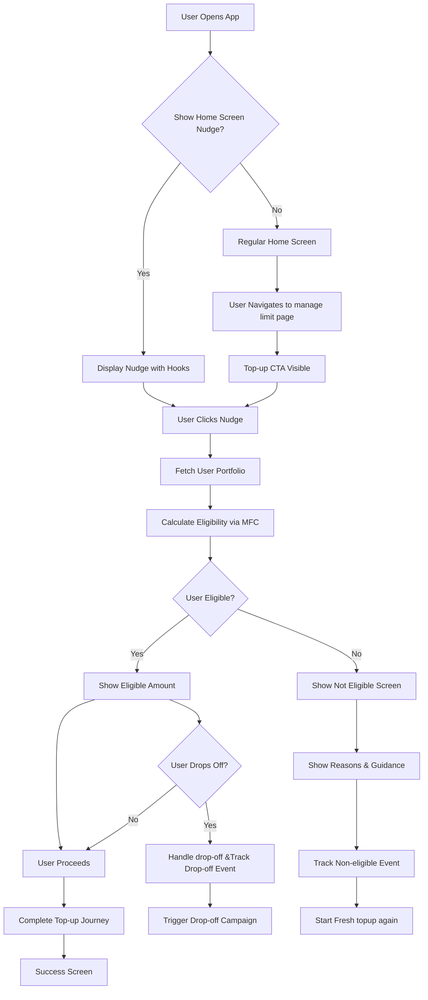
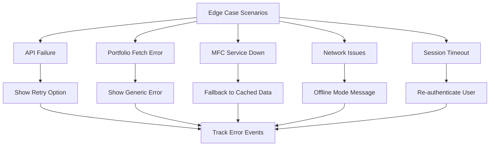

# Increase Top-up TOFU & conversion [TCL & DSP]

: Ranjan kumar Singh
Created time: May 30, 2025 11:33 AM
Status: In progress
Last edited: February 19, 2026 7:12 PM
Owner: Lalit Bihani

# **What problem are we solving?**

The **Line Enhancement (Top-up)** feature allows customers to pledge additional mutual funds to increase their available credit limit. While this is a valuable option for users seeking additional liquidity—such as for emergency needs or after exhausting their approved loan limit—the current adoption of this feature remains significantly low.

### Key Observations:

**Overall:**

- Only **~10K** out of **63K** credit users have availed line enhancement.
- This indicates that **~53K users (84%)** have not utilized the top-up feature.
- Customer who did line enhancement, ~93% of customer did line enhancement for at-least 2 time.

**Cohort analysis of line enhancement from credit creation:**

- We have seen that  9% of the user place line enhancement request within one month of credit creation date, 14% within 3 month, 17% within 6 month and 19% within 12 month.
    
    <aside>
    💡
    
    Although line enhancement number is not great but pattern shows that, customer who is doing the enhancement they are doing only when utilisation limit is getting exhausted or they are only doing the line enhancement when they actually need the funds.
    
    Data also indicates that, customer who has done the enhancement placed the withdrawal immediately, 99% of user placed withdrawal request within the 3 month of line enhancement. 
    
    </aside>
    

Data source: https://docs.google.com/spreadsheets/d/13daz3ehTfzLDfIafpk_e66WF2Tz2oTOiXnzCqsFtfkw/edit?usp=sharing

**Monthly conversions:**


- In January:
    - Out of 18,487 active users, only 960(5.19%) user started line enhancement
    - 706 customer reach at the fetch step
    - 390 customer fetched the funds (Includes eligible and non eligible users)
    - 382 user completed the line enhancement
- 40% of user completed the line enhancement and rest 60% dropped

**Last 3 month(MAR - MAY) cumulative line enhancement request**

**DSP:** 

| **currentstepid** | **total_topup_request** | **%** |
| --- | --- | --- |
| KYC_DOCUMENTS | 4 | 0.03% |
| MF_FETCH_PORTFOLIO | 3540 | 30.02% |
| MF_PLEDGE_PORTFOLIO | 3830 | 32.48% |
| ASSET_PLEDGE | 117 | 0.99% |
| COMPLETED | 4302 | 36.48% |
| Total | **11793** |  |

36% user completed the line enhancement

30% dropped without fetching the funds

33% customer dropped after fetching the funds.

**TATA:**

| **currentstepid** | **total_topup_request** | % |
| --- | --- | --- |
| CREDIT_APPROVAL | 1 | 0.03% |
| CIBIL_CHECK | 8 | 0.24% |
| KYC_SUMMARY | 12 | 0.36% |
| SIGN_DESK_ESIGN | 25 | 0.74% |
| ASSET_PLEDGE | 62 | 1.84% |
| MF_FETCH_PORTFOLIO | 841 | 24.91% |
| MF_PLEDGE_PORTFOLIO | 1328 | 39.34% |
| COMPLETED | 1099 | 32.55% |
| Total | 3376 |  |

32% completed the line enhancement

25% did not fetched the funds

39% fetched the funds and dropped

3% are stuck post the offer page

<aside>
💡

Based on customer calling on drop-off data

1. Customer dropped after fetching the funds said that they were just testing and they will complete when they requires the funds.
2. Few customer said they were not getting the expected limit and they will do the process when they have the sufficient funds.
3. Few customer said that they were just checking how much additional limit they can get but did not shown any intent to complete the process 
</aside>

### Root Causes Identified:

1. **Lack of Awareness:**
    
    A significant portion of users(84%) are unaware that they can increase their credit limit by pledging more mutual fund units.
    
    Reason:
    
    - We do not proactively educate user about the top-up and hence customer are not aware that they can do top-up by pledging the additional funds.
    - Many customers treat credit line account as one time use and chose to close account once requirement is full-filled as they do not understand how product works.
2. **Poor Visibility & Positioning:**
    
    The current placement and communication of the top-up option within the product experience are not intuitive or persuasive enough to drive action.
    

### What to Solve:

1. How might we increase awareness, visibility, and adoption of the Line Enhancement feature among eligible* users to unlock more credit utilization.
    
    *Customer who has completed the loan applications and are active.
    
2. Nudge potential customers who are likely to do the line enhancement.
    
    Who are the potential customer:
    
    1. New customer with Eligible limit and pledge limit ratio difference is >50% and the utilisation is >50%
    2. Credit account aging is ≥1 month and has not done any line enhancement and utilisation is >50%
3. Identify the friction in the current line enhancement journey and improve the drop-off at each step and improve the overall conversion.

Customer calling sheet: https://docs.google.com/spreadsheets/d/1j-eAXem05W0GxkTHPDmCU8dfk-bRy9mhyidTgkxSZXc/edit?usp=sharing

 Metrics: https://docs.google.com/spreadsheets/d/13daz3ehTfzLDfIafpk_e66WF2Tz2oTOiXnzCqsFtfkw/edit?usp=sharing

Funnel: https://docs.google.com/spreadsheets/d/1_x4FRTEMvRt98jev6egfmUKcZY29vysIH-Ip2FT05vw/edit?usp=sharing

[https://docs.google.com/spreadsheets/d/1m6CxSpgcDwgoO2_MRZ4Vr9lZ7QSMSAIzqiAallMOvwM/edit?usp=sharing](https://docs.google.com/spreadsheets/d/1m6CxSpgcDwgoO2_MRZ4Vr9lZ7QSMSAIzqiAallMOvwM/edit?usp=sharing)

---

# **How do we measure success?**

| Type | Metric | Current | Target |
| --- | --- | --- | --- |
| L1 | Monthly Line Enhancement Initiation Rate (as % of Monthly Active Users) | ~9% | ≥20% monthly |
| L1 | Overall Line enhancement Conversion Rate* ( initiated → Pledged/agreement signed) | 30% | ≥50% |
| L1 | Nudge effectivness | NA | NA |

*% of user initiated -> % of user eligible for top-up after fetch -> % of user completed the top-up

# **How are others solving this problem?**

### **1. smallcase – LAMF Top-up Journey**

- **Proactive Nudging on Home Screen:**
    
    smallcase prominently displays a **Top-up CTA** on the home screen to attract user attention.
    
- **Eligibility Check via MFC:**
    - On clicking the CTA, users are asked to verify via OTP.
    - **MFC** is used to assess top-up eligibility in real time.
- **Top-up Flow:**
    - Flow: `Top-up CTA → MFC OTP Verification → Eligibility Check → Edit Limit (Optional) → Confirm → KYC → Mandate Setup → Pledge → Agreement Execution`
- **Drop-off Retargeting:**
    - If a user drops off mid-journey, the CTA changes to **"Resume Top-up"** on the home screen.
    - This encourages users to pick up where they left off.

---

### **2. Insurance Companies**

- **Contextual Nudging Based on Eligibility:**
    - If the user has a **valid insurance policy**, they receive a prompt to initiate a top-up.
    - This leverages customer-specific eligibility criteria to drive relevant engagement.

Refer to benchmark journey here: [https://www.figma.com/design/7jG6NbNx7iwRRZ6MDqJkvW/UI-UX-benchmarking?node-id=707-3192&t=io2FjZiQEOgUETQh-1](https://www.figma.com/design/7jG6NbNx7iwRRZ6MDqJkvW/UI-UX-benchmarking?node-id=707-3192&t=io2FjZiQEOgUETQh-1)

---

# **What is the solution?**

### 1. Improve Visibility & Positioning

- Integrate line enhancement CTA more prominently within the app (e.g., Home page, withdrawal transaction success screen(when >90% utilisation)).
- Add contextual nudges post-withdrawal or low-balance events (e.g., "Your available cash is X amount, you can Top-up your account to get additional limit”)
- When user fetch limit using MFC fetch on website, create line enhancement application and when clicking on continue button take user to the line enhancement flow.

### 2. Nudge

- **Trigger-based nudges** based on:
    - High credit utilization %
    - Availability of Total additional mutual funds for pledging irrespective of utilisation
    - Drop-offs during the top-up journey
- Channels: In-app, push notifications, WhatsApp/SMS.

### 3. **Drop-off Retargeting**

- Track users who initiate, eligible but do not complete the top-up journey.
- Design follow-up nudges with contextual messaging (e.g., "Complete your top-up to unlock ₹X extra limit").

<aside>
💡

This feature is applicable only for DSP and TCL

</aside>

## Requirements overview

Phase 1:

1. Add Increase limit button on home screen
2. Handle drop-off on Home screen, manage limit page and increase limit landing page
3. Drip comms to  nudge user to start increase limit
4. Drip comms to nudge user to complete increase limit application
5. Amplitude events

Phase 2: 

- Nudge on home screen based on user segment and drop-off
- Improve increase limit conversion funnel
- MFC limit check on website landing page to line enhancement flow optimisation

## User stories / User flow

### 1 Primary User Stories

**US001: Home Screen Nudge Discovery**

```

As an active credit line user,
I want to see relevant nudges on my home screen about increasing my credit limit,
So that I can discover the top-up feature and understand its benefits.

```

**US002: Eligibility Check**

```

As a user interested in line enhancement,
I want to quickly check my eligibility and potential additional limit,
So that I can make an informed decision about proceeding with top-up.

```

**US003: Drop-off Recovery**

```

As a user who started but didn't complete the top-up process,
I want to receive contextual reminders and assistance,
So that I can complete the process when convenient.

```

**US004: Proactive Communication**

```

As an eligible user who hasn't used top-up,
I want to receive educational content about the feature benefits,
So that I understand how it can help me manage my finances better and future needs.

```

### 2 Secondary User Stories

**US005: Non-eligible User Guidance**

```

As a user not eligible for line enhancement,
I want to understand why I'm not eligible and what I can do to become eligible,
So that I can take appropriate actions in the future.

```

**US006: High Utilization Alert**

```

As a user approaching my > 90% credit limit utilisation,
I want to be notified about top-up options,
So that I can top-up my account and maintain financial flexibility.

```

 **User Flow Diagram**



**Edge Cases Flow**



## Detailed Feature Requirements

### 1.1 Home Screen Nudge Component

### 1.1.1 Nudge Display Logic

- **Trigger Conditions:**
    - User started increase limit
    - User fetched limit and eligible for increase limit
        - Eligible limit for TATA: 25000
        - Eligible limit for DSP: 10000
    - User started journey and accepted loan offer
    
    Note: refer design for nudge to show based on the condition
    

**1.2 Increase limit landing page [refer design to handle the below cases on landing page]**

Case 1: User has not started the new increase limit application, no line enhancement in-progress

1.1: Utilisation is >80% and additional eligible limit is ≥25k

- Show available eligible limit on landing page and nudge user to check the new limit

1.2 Utilisation is >80% and additional eligible limit is ≤25k

- Show current approved limit(calculated based on total pledged funds) on landing page and nudge user to check the new limit

1.3 Utilisation is <80% and additional eligible limit is ≥25k

- Show available eligible limit on landing page and nudge user to check the new limit

1.4 Utilisation is <80% and additional eligible limit is ≤25k

- Show current approved limit(calculated based on total pledged funds) on landing page and nudge user to check the new limit

<aside>
💡

Additional limit = Total available limit - pledged limit

Example: 

User fetched funds(New application + enhancement) = 1,00,000

User eligible for = 50,000

User pledged for limit = 25,000

 Additional available limit : (50,000 - 25,000)

</aside>

<aside>
💡

How to calculate utilisation%:

- Total Available Limit: 10,000
- Outstanding Amount: 3,500

Utilisation % = (3,500 / 10,000) × 100 = 35%

</aside>

Case 2: User has started the increase limit, fetched the funds and eligible for line enhancement

- Show eligible limit, allow to edit limit, refresh the limit and continue to complete application

Case 3: User has started the increase limit, fetched the funds and ineligible for line enhancement

- Show limit, required limit to get eligible based on lender, refresh the limit and tips to get eligible
- If user drop-off, and come back to increase the limit → show last fetched limit → Non eligibility message with required limit to get eligible and option to refresh along with last fetched date

Case 4: User has started the increase limit, fetched the funds and selected the limit

4.1 User has selected the limit equal to eligible limit

- Do not show total eligible limit as user has already selected all his limit, but user should be able to edit his selected limit

4.2 User has selected the limit less than the  eligible limit

- Show total eligible limit and allow user to edit the limit

### 1.3 Eligibility Calculation

### 1.3.1 Portfolio Fetching

- **Primary source:** MFC fetch → Trigger OTP on registered phone number or phone number using which last time portfolio was pledged → Option to change phone number(User won’t be able to change PAN)
- **Secondary source:**
    - User should be able to change source from MFC to CAMS/KFIN
    - If MFC API returns 4XX, Nudge user to fetch from CAMS/KFIN

### 1.3.2 Eligibility

- **Limit calculation:**
    - Show calculated limit and fetched funds value
    - If user are eligible: Nudge user to proceed and take user to set limit, offer page and then current implemented/live journey continues.
    - If user are not eligible:
        - **No funds found:**
            - Option to change phone number and fetch again (PAN change not allowed)
        - **Calculated limit less then eligibility threshold:**
            - Option to change phone number and fetch again (PAN change not allowed)
            - Suggest user to invest in more in MF  to get eligible
- **Error Handling:**
    - CAMS/KFIN/MFC API downtime: As per current handling
    - CAMS/KFIN/MFC API return success but through user/folio level error: As per current handling
        - Example: Phone not linked with PAN, KYC not verified etc.

### 1.4 Drop-off Handling

### 1.4.1 Drop-off Detection Points

1. **Eligibility Check to offer selection page:** 
    1. User fetched limit and eligible for top-up: Nudge to continue the top-up → Take user to “Unlock limit page”
    2. User fetch limit and not eligible for top-up: Nudge user to check limit at every entry point
2. **Offer accepted:** Nudge user to continue Top-up and take user to Next step of offer selection
3. **Pledge is completed and agreement is required:** Nudge user to continue Top-up and take user to Next step of pledge
4. **Pledge is completed and agreement is not required:** No action required, top-up will be completed after success-full pledge

### 1.4.2 Drop-off Recovery Strategy

- **Immediate:** In-app banner for 24 hours
- **24 Hours:** Push notification
- **48 Hours:** WhatsApp message
- **Every 15 Days:** SMS + Email follow-up

### 1.5 Non-eligible User Handling

### 1.5.1 Common Reasons for Ineligibility

1. Insufficient additional limit (<₹10000 for DSP and <₹25000 for TCL)
2. SL exhaust the threshold (2 CR for DSP and 5 CR for TCL) 

### 1.5.2 Guidance Messaging

- **Insufficient Portfolio:** "Invest ₹X more to unlock top-up"
- **Updated SL > threshold:** "You've maximized your current allowed loan amount"

---

## 2. Communication requirement

### 2.1 Drip Campaign for Potential Users

Trigger overview:

- The job runs once **daily**.
- On each run, evaluate users against the defined criteria for each **case**.
- Drip messaging is sent **only if**:
    - User is eligible **per case rules**

| **Trigger criteria** | **WA** | **PUSH** | **Mail** | **SMS** |
| --- | --- | --- | --- | --- |
| Case 1: Early Engagement (Day 10–30)

**Trigger Frequency:** Once every 7 days

**Trigger on credit aging = 10th, 17th, 24th**

**Max Nudges**: Up to 3 nudges during 10–30 day period

**Eligibility Criteria:**

Credit account creation date is between 10–30 days from today.

User has 0 applications for line enhancement or modification.

Last message for Case 1 (if any) was sent ≥7 days ago.

**Logic:**

FOR each user IN active_accounts:
IF 10 ≤ (today - credit_creation_date) ≤ 30:
IF line_enhancement_app_count == 0:
IF last_comm_for_case_1_sent == NULL OR (today - last_comm_date_case_1) ≥ 7:
TRIGGER message for Case 1 | NA | 🟢 **Need more funds?** 

Your MFs can unlock up to ₹5 Cr instantly!

CTA: Check new limit for FREE | Subject: Unlock Extra Credit with Your Mutual Funds 💰

BODY:
**Hi {{customername}},**

Did you know you can **instantly increase your credit limit** by pledging additional mutual fund units?

This means more funds at your fingertips — with **no paperwork** and zero hassle.

🔓 **Top-up(Line enhancement) Benefits:**

• Get up to ₹5 Cr cash limit
• Takes less than 5 seconds to check new limit
• Use cash only when you need – pay interest only when you withdraw

CTA: **[Check new limit for FREE]**

Maintain liquidity. Stay financially ready.

Want to know more?

- [How does the credit limit work?]

Best,
**Team Volt Money

—————
Template Id: d-13e13a98a84b440bbc53ea2039cce4a6** | **Do you know?**
Your mutual funds can unlock up to ₹5 Cr – don’t miss out!

Check new limit for FREE: [https://voltm.app.link/get_volt_money](https://voltm.app.link/get_volt_money)

Template ID: 1107175203402786743 |
| **Case 2: Mid-Term Follow-Up (Day 40–60)

Trigger Frequency:** Once every 7 days

**Trigger on credit aging = 40th, 47th, 54th**

**Max Nudges:** Up to 3 nudges during 40–60 day period

**Eligibility Criteria:**

Credit account creation date is between 40–60 days from today.

User has 0 applications for line enhancement or modification.

Last message for Case 2 (if any) was sent ≥7 days ago.

**Logic:**
FOR each user IN active_accounts:
IF 40 ≤ (today - credit_creation_date) ≤ 60:
IF line_enhancement_app_count == 0:
IF last_comm_for_case_2_sent == NULL OR (today - last_comm_date_case_2) ≥ 7:
TRIGGER message for Case 2 | NA | Hi [**CustomerName**], did you know you can get upto ₹5 Cr extra credit limit in less than a minute.

CTA: Check new limit for FREE | NA | Hi **{{CustomerName}}**, 
Did you know you can get up to ₹5 Cr extra credit limit in less than a minute.
[https://voltm.app.link/get_volt_money](https://voltm.app.link/get_volt_money)

Template ID:
1107175203428135707 |
| **Case 3: Low balance reminder (>60 days)

Trigger Frequency:** Once every 30 days (monthly)
Max Nudges: No limit (repeats monthly as long as criteria are met)

**Eligibility Criteria:**

Credit account age is more than 60 days.

User’s available cash/limit < ₹10,000.

Account status is active.

No line enhancement in progress.

Last message for Case 3 (if any) was sent ≥30 days ago.

**Logic:**

FOR each user IN active_accounts:
IF (today - credit_creation_date) > 60:
IF available_limit < 10000:
IF account_status == 'active':
IF NOT enhancement_in_progress:
IF last_comm_for_case_3_sent == NULL OR (today - last_comm_date_case_3) ≥ 30:
TRIGGER message for Case 3 | NA | **Your available cash is low!**

Unlock extra funds instantly by pledging more mutual funds—no paperwork, no wait.

CTA: Increase limit now [LINK] | ⚠️ **Low balance alert!**

Need extra funds right now? Just pledge more MFs and get instant access to additional limit.

✅ Quick 
✅ Easy 
✅ No docs
✅ Pay interest only when you withdraw

Check new limit for FREE: [LINK]

——————————————
Template ID: d-e7387746ac004d79a2435f67760f4f92
 | **Low balance? Top up instantly.**

Pledge more MFs to unlock higher limit in seconds. [https://voltm.app.link/get_volt_money](https://voltm.app.link/get_volt_money)

Template ID:
1107175203441656841 |

### 2.2 Drop-off  Campaign

Trigger overview:

- A batch job runs **daily**.
- Each run checks for incomplete top-up applications and evaluates users for:
    - Time since application creation
    - Current application status
    - Last message sent per drip rule
        - Ensures **no duplicate communication** within a defined cooldown window.

| Trigger on	 | WA | PUSH | Mail | SMS |  |
| --- | --- | --- | --- | --- | --- |
| **Case 1:** Users Who Started but Didn’t Complete line enhacement [Pre-fetch]

**Trigger frequency:** Once every 7 days

**Trigger on: 0th day, 7th days, 14th days, 21th day, 27th day**

**Drip duration:** Up to 30 days from the enhancement application creation date

**End condition:** Until credit line modification application status becomes "COMPLETED" or SUSPENDED

Eligibility Criteria:
Application type = "credit line modification"

Application status = "IN-PROGRESS”

Modification Application age is between 0 and 30 days

User has not received a Pre-fetch comm in the last 7 days | Hi {{CustomerName}},

You’ve started your line enhancement process but didn’t finish it.

🔍 Check how much extra credit limit you can unlock in just a few seconds.

💸 Checking limit is quick, FREE, and doesn’t impact your CIBIL.

👉 Tap to continue: [Top-up Link]

———————————————————
Template ID: increase_limit_drop_pre_fetch | 💡 Know your MFs potential

Check how much extra limit you can get—no charges, no CIBIL impact on checking limit!

🔓 Check limit for FREE | Subject: Don’t miss your credit line upgrade 🚀

Body:
Hi {{CustomerName}},

We noticed you started the credit limit enhancement journey but didn’t complete it.

Did you know? You could unlock upto ₹5 Cr additional limit instantly.

✔️ No documentation
✔️ Use cash only when you need – pay interest only when you withdraw
✔️ Takes less than a minute

Tap below to check how much extra limit you can get:
👉 [Check My Limit]

Stay financially prepared for any need
Team [BrandName]

Template ID:
d-87d3fabdbeb348989a39d0775f8799db | Turn your mutual funds into instant credit – up to ₹5 Cr available!

Check limit for FREE: [https://voltm.app.link/get_volt_money](https://voltm.app.link/get_volt_money)

Template ID:
1107175203955167261 |  |
| **Case 1:** Users Who Started but Didn’t Complete line enhacement [Post-fetch]

**Trigger frequency:** Once every 7 days

**Trigger on: 0th day, 7th days, 14th days, 21th day, 27th day**

**Drip duration:** Up to 30 days from the enhancement application creation date

**End condition:** Until credit line modification application status becomes "COMPLETED" or SUSPENDED

Eligibility Criteria:
Application type = "credit line modification"

Application status = "IN-PROGRESS”

Application stage is “MF_PLEDGE_PORTFOLIO” or Beyond

Approved limit is ≥25,000

Modification Application age is between 0 and 30 days

User has not received a Pre-fetch comm in the last 7 days | Hi {{CustomerName}},

Your extra credit is waiting! 💰

Complete your top-up and get instant access to ₹{{additional_limit}} in cash.

No paperwork. No delays. No CIBIL impact.

Perfect for emergencies, travel, or anytime you need liquidity.

👉 Finish in under a minute: [Top-up Link]

—————————————————
Template ID: increase_limit_drop_post_fetch | 
**🔓 Unlock ₹{{additional_limit}} extra limit!**

It takes less than 1 min to complete. Don’t miss out. | Subject: Unlock ₹{{additional_limit}} instantly – complete your credit line top-up!

Body:
Hi {{CustomerName}},

You’re just one step away from unlocking ₹{{additional_limit}} in additional credit limit.

Many of our customers use credit line to handle emergencies, travel, or any other expenses—without documentation or delay.

✅ No paperwork
✅ Instant access to cash in emergencies
✅ Use cash only when you need – pay interest only when you withdraw

Click below to complete in less than 1 minute:
👉 [Complete My Top-up]

Need help? We’re just a message away.
Team [BrandName]

Template ID: 
d-432d24fc3ec948b286fe97f503d3d10b | **Unlock ₹{{additional_limit}} extra limit!**

It takes less than 1 min to complete. Don’t miss out. [https://voltm.app.link/get_volt_money](https://voltm.app.link/get_volt_money)

Template ID:
1107175203458136089 |  |

### 

---

# **Design**

[https://www.figma.com/design/jYRvz34fgH47FywaqCrm25/Manage-Limit?node-id=1103-11073&t=T7362A7Dz0ZmBmFY-11](https://www.figma.com/design/jYRvz34fgH47FywaqCrm25/Manage-Limit?node-id=1103-11073&t=T7362A7Dz0ZmBmFY-11)

---

# **Analytics**

### 1 Amplitude events

| User flow		 | User action | Event name | Event property | ExpectedValue | User property  | ExpectedValue | Trigger from | Remarks |
| --- | --- | --- | --- | --- | --- | --- | --- | --- |
| User starts increase limit journey | User click “Increase limit” button on Home or manage limit page | ENHANCE_LIMIT_BUTTON_CLICKED | page | - home
- manage_limit | Na | Na | FE | Event already exists, just add event property |
|  | When user land on increase limit landing page | ENHANCE_LIMIT_LANDING_PAGE_VIEWED | source | - home
- manage_limit |  |  |  |  |
|  | When click on “Check new limit in 15s” On increase limit landing page | CHECK_LIMIT_BUTTON_CLICKED | journey | increase_limit |  |  |  |  |
|  |  |  |  |  |  |  |  |  |
| Drop-off | User clicked on “Continue to increase limit” button on manage limit page | CONTINUTE_TO_ENHANCE_LIMIT_BUTTON_CLICKED | source | - manage_limit |  |  |  |  |
| Post fetch/Post offer is accepted | User clicked on “Unlock limit” on increase limit landing page | UNLOCK_LIMIT_BUTTON_CLICKED | page | increase_limit_landing_page |  |  |  |  |
| Post offer is accepted | User clicked on “EDIT limit” on increase limit landing page | EDIT_LIMIT_BUTTON_CLICKED | page | increase_limit_landing_page |  |  |  |  |

Name: INCREASE_LIMIT_BUTTON_CLICKED
Property: source - home

Name: INCREASE_LIMIT_LANDING_PAGE_VIEWED

Event Property: source - home/manage_limit

User property: Additional limit ; utilisation%

Name: CHECK_ELIGIBLE_LIMIT_BUTTON_CLICKED
Event property: applicationType = increase_limit

name: UPDATE_MOBILE_BUTTON_CLICKED
applicationType: increase_limit

name: CONFIRM_UPDATE_MOBILE_BUTTON_CLICKED
applicationType: increase_limit

Name: SHOW_ELIGIBILITY_PAGE_VIEWED
applicationType: increase_limit
isEligible: TRUE/FALSE
Credit limit: {{eligibleLimit}}

Name: EDIT_LIMIT_BUTTON_CLICKED
page: show_eligible_limit

Name: REFRESH_PORTFOLIO_BUTTON_CLICKED
page: show_eligible_limit

NAME: CONTINUE_TO_ACCEPT_OFFER_BUTTON_CLICKED
page: show_eligible_limit

Name: LOAN_OFFER_PAGE_VIEWED
applicationType: increase_limit

Name: UNLOCK_ADDITIONAL_LIMIT_BUTTON_CLICKED
applicationType: increase_limit

name: PLEDGE_PORTFOLIO_PAGE_VIEWED
applicationType: increase_limit
source: {{last page}}

name: CONTINUE_TO_PLEDGE_BUTTON_CLICKED
applicationType: increase_limit

Name: INCREASE_LIMIT_APPLICATION_SUCCESS_PAGE_VIEWED

name: LOAN_APPLICATION_STEPPER_PAGE_VIEWED
applicationType: increase_limit

### 2 Key Performance Indicators [For analytics team]

### 2.1.1 Primary KPIs

1. **Top-up Adoption Rate:** (Users who completed top-up / Eligible users) × 100
2. **Nudge Click-through Rate:** (Nudge clicks / Nudge impressions(myAccount page view)) × 100
3. **Eligibility-to-Completion Rate:** (Completed top-ups / Eligible checks) × 100
4. **Drop-off Recovery Rate:** (Completed top-ups users / Total drop-offs) × 100

### 2.1.2 Supporting Metrics

1. **Average Additional Limit:** Mean value of completed top-ups limits
2. **Time to Complete:** Average journey duration from nudge click to completion
3. **Communication Engagement Rate:** Opens, clicks, conversions by channel
4. **Error Rate:** API failures, timeouts, user-facing errors

### 2.2 Analytics Dashboard Requirements

### 2.2.1 Business Dashboard

**Audience:** Leadership, Product Managers
**Refresh Rate:** Real-time (60-minute intervals)

**Key Metrics Cards:**

- Top-up Adoption Rate (current vs target)
- Weekly Active Top-up Users
- Total Additional Limit Unlocked (₹)
- Revenue Impact (estimated)

**Visualizations:**

- Adoption trend over time (line chart)
- Funnel analysis (sankey diagram- Amplitude)
- User segment performance
    - Based on utilisation%
- Lender wise and Channel wise analysis

### 2.2.2 Alert Configuration

**Critical Alerts:**

- Top-up success rate drops below Target
- Communication delivery per channel failure >10%

---

# **Timeline/Release Planning**

---

# **Go to market**

## Marketing

## Ops & Sales training

## Frequently asked questions (FAQs)

---

# **Action items / checklist**

[](data:image/png;base64,iVBORw0KGgoAAAANSUhEUgAAAEgAAABICAYAAABV7bNHAAAA1ElEQVR4Ae3bMQ4BURSFYY2xBuwQ7BIkTGxFRj9Oo9RdkXn5TvL3L19u+2ZmZmZmZhVbpH26pFcaJ9IrndMudb/CWadHGiden1bll9MIzqd79SUd0thY20qga4NA50qgoUGgoRJo/NL/V/N+QIAAAQIECBAgQIAAAQIECBAgQIAAAQIECBAgQIAAAQIECBAgQIAAAQIECBAgQIAAAQIEyFeEZyXQpUGgUyXQrkGgTSVQl/qGcG5pnkq3Sn0jOMv0k3Vpm05pmNjfsGPalFyOmZmZmdkbSS9cKbtzhxMAAAAASUVORK5CYII=)

- [ ]  Product
    - [ ]  -
- [ ]  Business
    - [ ]  -
- [ ]  Design
    - [ ]  -

---

[](data:image/png;base64,iVBORw0KGgoAAAANSUhEUgAAAEgAAABICAYAAABV7bNHAAAA1ElEQVR4Ae3bMQ4BURSFYY2xBuwQ7BIkTGxFRj9Oo9RdkXn5TvL3L19u+2ZmZmZmZhVbpH26pFcaJ9IrndMudb/CWadHGiden1bll9MIzqd79SUd0thY20qga4NA50qgoUGgoRJo/NL/V/N+QIAAAQIECBAgQIAAAQIECBAgQIAAAQIECBAgQIAAAQIECBAgQIAAAQIECBAgQIAAAQIEyFeEZyXQpUGgUyXQrkGgTSVQl/qGcG5pnkq3Sn0jOMv0k3Vpm05pmNjfsGPalFyOmZmZmdkbSS9cKbtzhxMAAAAASUVORK5CYII=)

[](data:image/png;base64,iVBORw0KGgoAAAANSUhEUgAAAEgAAABICAYAAABV7bNHAAAA1ElEQVR4Ae3bMQ4BURSFYY2xBuwQ7BIkTGxFRj9Oo9RdkXn5TvL3L19u+2ZmZmZmZhVbpH26pFcaJ9IrndMudb/CWadHGiden1bll9MIzqd79SUd0thY20qga4NA50qgoUGgoRJo/NL/V/N+QIAAAQIECBAgQIAAAQIECBAgQIAAAQIECBAgQIAAAQIECBAgQIAAAQIECBAgQIAAAQIEyFeEZyXQpUGgUyXQrkGgTSVQl/qGcG5pnkq3Sn0jOMv0k3Vpm05pmNjfsGPalFyOmZmZmdkbSS9cKbtzhxMAAAAASUVORK5CYII=)

[](data:image/png;base64,iVBORw0KGgoAAAANSUhEUgAAAEgAAABICAYAAABV7bNHAAAA1ElEQVR4Ae3bMQ4BURSFYY2xBuwQ7BIkTGxFRj9Oo9RdkXn5TvL3L19u+2ZmZmZmZhVbpH26pFcaJ9IrndMudb/CWadHGiden1bll9MIzqd79SUd0thY20qga4NA50qgoUGgoRJo/NL/V/N+QIAAAQIECBAgQIAAAQIECBAgQIAAAQIECBAgQIAAAQIECBAgQIAAAQIECBAgQIAAAQIEyFeEZyXQpUGgUyXQrkGgTSVQl/qGcG5pnkq3Sn0jOMv0k3Vpm05pmNjfsGPalFyOmZmZmdkbSS9cKbtzhxMAAAAASUVORK5CYII=)

[](data:image/png;base64,iVBORw0KGgoAAAANSUhEUgAAAEgAAABICAYAAABV7bNHAAAA1ElEQVR4Ae3bMQ4BURSFYY2xBuwQ7BIkTGxFRj9Oo9RdkXn5TvL3L19u+2ZmZmZmZhVbpH26pFcaJ9IrndMudb/CWadHGiden1bll9MIzqd79SUd0thY20qga4NA50qgoUGgoRJo/NL/V/N+QIAAAQIECBAgQIAAAQIECBAgQIAAAQIECBAgQIAAAQIECBAgQIAAAQIECBAgQIAAAQIEyFeEZyXQpUGgUyXQrkGgTSVQl/qGcG5pnkq3Sn0jOMv0k3Vpm05pmNjfsGPalFyOmZmZmdkbSS9cKbtzhxMAAAAASUVORK5CYII=)

[](data:image/png;base64,iVBORw0KGgoAAAANSUhEUgAAAEgAAABICAYAAABV7bNHAAAA1ElEQVR4Ae3bMQ4BURSFYY2xBuwQ7BIkTGxFRj9Oo9RdkXn5TvL3L19u+2ZmZmZmZhVbpH26pFcaJ9IrndMudb/CWadHGiden1bll9MIzqd79SUd0thY20qga4NA50qgoUGgoRJo/NL/V/N+QIAAAQIECBAgQIAAAQIECBAgQIAAAQIECBAgQIAAAQIECBAgQIAAAQIECBAgQIAAAQIEyFeEZyXQpUGgUyXQrkGgTSVQl/qGcG5pnkq3Sn0jOMv0k3Vpm05pmNjfsGPalFyOmZmZmdkbSS9cKbtzhxMAAAAASUVORK5CYII=)

# **Feedback**

---

# **Learnings & Next steps**

---

# **Appendix**

## Meeting notes