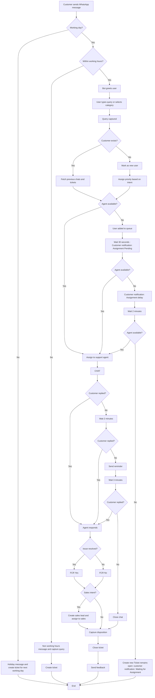

# LSQ Chat workflow - Phase 1

: Vijay Kumar S
Created time: February 10, 2026 11:30 AM
Status: In progress
Last edited: May 22, 2026 2:25 PM

# **WhatsApp Customer Support – End-to-End Chat Process Note**

# **Objective**

The objective of this process is to transform WhatsApp-based customer conversations into a **structured, ticket-driven support system** using LeadSquared as the system of record.

This process aims to ensure that every customer interaction is:

- **Trackable** through ticket creation and lifecycle management
- **Actionable** via proper routing, assignment, and SLA-based handling
- **Contextual** through unified visibility of past interactions and tickets
- **Measurable** using key metrics such as First Response Time (FRT), resolution time, and First Contact Resolution (FCR)
- **Insight-driven** through mandatory disposition capture and outcome tracking
- **Customer-centric** by enabling timely responses and feedback collection (CSAT)

👉 Ultimately, this enables **end-to-end visibility, operational control, and continuous improvement of customer experience and support performance**.

## Problem Statement (Final)

The current WhatsApp-based support system, built on WATI, operates as a **messaging layer rather than a structured support system**, resulting in gaps across **execution, visibility, and performance measurement**.

# 1. Execution Gaps

- Chats are not systematically classified into open, pending, or closed states
- Conversations received during non-working hours and holidays are not reliably captured or prioritized
- Chats are assigned without validating real-time agent availability
- There is no standardized workflow for handling, resolving, and closing chats

Result: Customers experience **delayed responses, missed interactions, and inconsistent support journeys**

| **Holiday Break Up** |  |  |  |  |
| --- | --- | --- | --- | --- |
| **Month** | **N** | **Y** | **Grand Total** | **%** |
| Jan'26 | 5143 | 649 | 5792 | 11.21% |
| Feb'26 | 6809 | 96 | 6905 | 1.39% |
| Mar'26 | 5129 | 1399 | 6528 | 21.43% |
| **Grand Total** | **17081** | **2144** | **19225** | **11.15%** |

### 2. Visibility & Control Gaps

- There is no real-time view of active, unanswered, or overdue conversations
- SLA metrics such as First Response Time (FRT) and resolution time are not consistently tracked or enforced
- Missed chats (no response within SLA) are not identified or monitored

Result: Operations function **reactively**, with limited ability to manage workload or ensure service quality

| **Expired chats Break Up** |  |  |  |
| --- | --- | --- | --- |
| **Month** | **N** | **Grand Total** | **%** |
| Jan'26 | 41 | 5792 | 0.71% |
| Feb'26 | 110 | 6905 | 1.59% |
| Mar'26 | 231 | 6528 | 3.54% |
| **Grand Total** | **382** | **19225** | **1.99%** |

### 3. Data & Learning Gaps

- Chats are closed without mandatory disposition capture, resulting in no structured understanding of customer issues
- There is no ability to measure key performance metrics such as:
    - **First Contact Resolution (FCR) → Not measured currently**
    - **Chat-to-ticket conversion ratio → Not measured currently**
- Customer interaction data is fragmented, limiting insight into trends and improvement opportunities

Result: The system lacks the ability to **analyse, learn, and continuously improve customer experience**

## In Scope

- Chat-to-ticket mapping for every incoming conversation
- Ticket lifecycle management (Open, Pending, Overdue, Resolved, Closed)
- SLA tracking (First Response Time, Resolution Time, Overdue)
- Automatic ticket creation for non-working hours and holidays
- Assignment of chats only to available agents
- Agent visibility into past chats and existing tickets
- Mandatory disposition capture for every closed chat
- FCR tracking (resolved vs follow-up required)
- Basic reporting (open, closed, overdue, missed chats)

## Out of Scope

- AI chatbot or automated conversational intelligence
- Advanced routing (skill-based or priority-based assignment)
- Cross-team automation (e.g., sales call triggers or ticket reassignment)
- Bot redesign or enhancement
- Workforce planning or capacity optimization

# Solution:

## Overview:

We will migrate chat support from WATI to LeadSquared and implement a **ticket-first support system**, where every conversation is tracked, measured, and managed through tickets.

## Key Changes

### Entry Point Migration

- Replace existing WhatsApp number with **8105574747** across website, app, and templates
- Ensures all new chats are routed to LeadSquared

### Bot & Intake Handling (LeadSquared)

- Bot handles:
    - Working / non-working hours / holidays
    - Customer identification (new vs existing)
- Automatically **creates a ticket for every missed incoming chat**

### Ticket Lifecycle Management

- Standardize states:
    - Open → Overdue → Resolved → Closed
- Enables full visibility of chat status

### Agent Experience

- Agents can view:
    - Previous chats
    - Open and closed tickets
- Chats are **linked to relevant tickets** to avoid duplicate handling

### SLA Tracking

- Track:
    - First Response Time (FRT)
    - Overdue tickets (FRT > 2 min)
    - Resolution time

### Disposition & FCR Tracking

- Mandatory capture of:
    - Query type
    - Outcome
    - FCR (resolved in chat vs follow-up required)

## Outcome

- All chats become **trackable via tickets**
- Full visibility into **open, closed, and overdue workload**
- Ability to measure **FCR, SLA, and resolution performance**
- Improved **agent efficiency and customer experience**

## Competitive Benchmarking

Based on analysis of Swiggy, Zomato, Zepto, and Blinkit, Swiss and Ownly

| Metric | Swiggy | Zomato | Swiss | Zepto | Blinkit | Ownly |
| --- | --- | --- | --- | --- | --- | --- |
| Bot Response Time (sec) | 2 sec | 2 sec | 3 sec | 2 sec | 2 sec | 2 sec |
| Total Bot interaction before agent | 4 | 5 | 6 | 4 | 6 | 3 |
| Bot → Agent Assignment (sec) | 1 min 30 sec | 1min 15 sec | 30sec | 18 sec | 1min 22 sec | 43 sec |
| First Message Response agent (sec) | 36.8 sec | 40.1 sec | 1min 34 sec | 46 sec | 52 sec | **32 sec** |
| Final Resolution message time (min) | 44.7 sec | 53.8 sec | 1 min 47sec | 2 minutes | 2 minutes | 3 min 13 sec |
| Reminder Strategy | 2 | 0 | 0 | 2 | 2 | 0 |
| Closure Time for inactivity | 5 min | 1 min | 5 min | 2 min | 6 min | 2 min |
| Call back when inactivity | No | No | No | Yes | No | No |
| Total Chat Durations | 9 minutes | 24 minutes | 14 minutes | 9 minutes | 18 minutes | 7 minutes |

## Key Insights

### 1. Assignment Speed is the Biggest Driver of CX

- Best: **<30 sec (Zepto, Swiss)**
- Worst: **>1 min (Swiggy, Zomato, Blinkit)**

 Insight: Users perceive systems as “fast” only when they are **connected to an agent quickly**

### 2. Faster Systems Minimize Bot Friction

- Ownly: **3 steps → best duration (7 min)**
- Swiss/Blinkit: **6 steps → longer chats**

Insight: More bot steps = higher friction = slower resolution

### 3. Resolution Speed Defines System Type

- **Fast systems (Zepto, Blinkit, Ownly):**
    - Resolution: **2–3 min**
    - Total duration: **7–9 min**
- **Slow systems (Swiggy, Zomato):**
    - Resolution: **45–50 min**
    - Total duration: **9–24 min**

Insight: There are two models:

- Chat-first (fast resolution)
- Ticket-heavy (slow resolution)

### 4. Chat Duration is the Best Outcome Metric

- Best: **Ownly (7 min)**
- Worst: **Zomato (24 min)**

Insight: End-to-end chat duration reflects:

- System efficiency
- Agent productivity
- CX quality

### 5. Reminder + Closure Strategy Improves Efficiency

- Systems with reminders + short closure (2–5 min):
    - Better throughput
    - Faster resolution

### 6. Callback is an Untapped Opportunity

- Only Zepto offers callback

Insight: Can improve:

- Recovery of dropped users
- High-intent conversion

## Key Takeaways

- **Speed (assignment + resolution) is the biggest CX lever**
- **Reducing bot friction improves completion rate**
- **Short lifecycle + closure improves efficiency**
- **Chat duration is the best proxy for system performance**

## Design Implications

Our system should:

- Minimize bot steps before agent
- Ensure fast assignment and response tracking (via tickets)
- Enable short resolution cycles
- Enforce structured closure
- Capture FCR and disposition



```mermaid
A[Customer sends WhatsApp message] --> B{Working day?} B -- No --> B1["Send message: Today is a holiday. Our support team will assist you on the next working day."] B1 --> END B -- Yes --> C{Within working hours?} C -- No --> C1["Send message: Our support hours are 9:30 AM to 6:30 PM. Please leave your query and we will assist you when support hours begin."] C1 --> END %% ================= BOT GREETING ================= C -- Yes --> D["Bot Welcome Message: Hello 👋 Welcome to Volt Money Support."] %% ================= QUERY CATEGORY ================= D --> E["Send message: Please select a query category below or type your issue directly."] E --> G["Query Category Options: • Product Information • Loan Application Issue • Loan Account / Post Loan Issue • Repayment Issue • Other"] %% ================= CUSTOMER ACTION ================= G --> F{Customer Action} %% OPTION SELECTED F -- Select Category --> H[Capture selected category] H --> I[Ask customer to explain issue] %% CUSTOMER TYPES ISSUE F -- Type Issue Directly --> J[Capture customer message] %% NO RESPONSE F -- No Response --> WAITB1[Wait 2 minutes] WAITB1 --> CHECKB1{Customer replied?} CHECKB1 -- Yes --> J CHECKB1 -- No --> REMB1["Send message: Please select an option or type your query so we can assist you."] REMB1 --> WAITB2[Wait 2 minutes] WAITB2 --> CHECKB2{Customer replied?} CHECKB2 -- Yes --> J CHECKB2 -- No --> AGENTCHECK %% STORE QUERY CONTEXT I --> STORE[Store category and message for agent] J --> STORE STORE --> AGENTCHECK %% ================= AGENT AVAILABILITY ================= AGENTCHECK{Agent available?} %% AGENT AVAILABLE AGENTCHECK -- Yes --> ASSIGN[Assign chat to agent] ASSIGN --> MSG1["Send message: You are now connected with our support specialist."] MSG1 --> CHAT %% ================= QUEUE HANDLING ================= AGENTCHECK -- No --> Q1["Send message: All our agents are currently assisting other customers. Your request has been added to the queue."] Q1 --> WAIT1[Wait 2 minutes] WAIT1 --> QCHECK1{Agent available?} QCHECK1 -- Yes --> ASSIGN QCHECK1 -- No --> Q2["Send message: We are still trying to connect you with an agent. Thank you for your patience."] Q2 --> WAIT2[Wait 5 minutes] WAIT2 --> QCHECK2{Agent available?} QCHECK2 -- Yes --> ASSIGN %% QUEUE OVERFLOW QCHECK2 -- No --> Q3["Send message: We are currently experiencing longer wait times. Your request has been recorded and our support team will respond shortly."] Q3 --> AUTO_TICKET[Create support ticket automatically] AUTO_TICKET --> END %% ================= ACTIVE CHAT ================= CHAT --> RESP{Customer replied?} RESP -- Yes --> AGENTRESP[Agent responds] AGENTRESP --> TICKETCHECK{Does issue require a ticket?} %% ================= TICKET FLOW ================= TICKETCHECK -- Yes --> T1{Open ticket exists?} T1 -- Yes --> T2[Associate chat with open ticket] T1 -- No --> T3{Related closed ticket?} T3 -- Yes --> T4[Reopen closed ticket] T3 -- No --> T5[Create new support ticket] T2 --> WORK T4 --> WORK T5 --> WORK WORK --> RES{Issue resolved?} RES -- No --> WORK RES -- Yes --> DISP %% ================= NO TICKET REQUIRED ================= TICKETCHECK -- No --> DISP %% ================= CUSTOMER INACTIVITY ================= RESP -- No --> WAITC1[Wait 15 minutes] WAITC1 --> CHECKC1{Customer replied?} CHECKC1 -- Yes --> AGENTRESP CHECKC1 -- No --> REM1["Send message: Hi there, we're waiting for your reply."] REM1 --> WAITC2[Wait 30 minutes] WAITC2 --> CHECKC2{Customer replied?} CHECKC2 -- Yes --> AGENTRESP CHECKC2 -- No --> REM2["Send message: We are still waiting for your response."] REM2 --> WAITC3[Wait 1 hour] WAITC3 --> CHECKC3{Customer replied?} CHECKC3 -- Yes --> AGENTRESP CHECKC3 -- No --> REM3["Send message: As we haven't received a response, we will close the chat for now."] REM3 --> DISP %% ================= CHAT CLOSURE ================= DISP[Agent submits mandatory disposition] --> CSAT CSAT["Send message: Thank you for contacting Volt Money Support. Please rate your experience."] CSAT --> END[Chat closed]
```

| **Event** | **Message** |
| --- | --- |
| Agent Assigned | You're now connected with {{Agent Name}}. Let me help you with this |
| Assignment Pending
(2 min) | We’re getting the right person to help you. Thanks for your patience |
| Waiting for Assignment
(4 min) | All our agents are busy right now — we’ll connect you as soon as one is free. You can also connect to us via call: 08071174410 |
| Assignment Delay
(10 min) | All our agents are currently assisting others. We’ll connect you shortly. If urgent, you can call us at 08071174410 |
| Chat Ended | Thanks for chatting with us! If you need anything else, just message here anytime |
| No Customer Reply 
(2min) | Hey, just checking in — we’re here whenever you're ready |
| No Customer Reply 
(5 min) | Since we haven’t heard back, we’ll close this chat for now. You can message us anytime and we’ll be happy to help |
| Agent Not Replying | Apologies for the wait — we’re checking this and will respond shortly. |

# **Entry Point**

The process begins when a **customer sends a message to the Volt Money WhatsApp Support number** integrated with LeadSquared Converse.

Before the chat is routed to agents, the system validates:

- Working day
- Working hours

# **3. Entry Message Framework**

Different automated messages are triggered based on the time of the customer message.

## **3.1 Holiday Message**

If the message is received on a holiday:

Customer message:

Thank you for contacting Volt Money Support.

Today is a holiday and our support team is currently unavailable.

We will assist you on the next working day.

The chat is **parked until the next working day**.

## **3.2 Non-Working Hours Message**

If the message is received outside support hours:

Customer message:

Thank you for contacting Volt Money Support.

Our support hours are **9:30 AM to 6:30 PM (Monday to Friday)**.

Please leave your message and our team will assist you once support hours begin.

The chat remains **parked until support hours begin**.

## **3.3 Working Hours Message**

If the message is received during working hours:

Customer message:

Hello 👋

Welcome to Volt Money Support.

Our support team will assist you shortly.

Please briefly describe your query so we can help you faster.

The chat is then **added to the support queue**.

# **4. Chat Routing & Assignment Logic**

All incoming WhatsApp chats are routed to the **WhatsApp Support Service Group**.

Configuration:

| **Parameter** | **Configuration** |
| --- | --- |
| Service Group | WhatsApp Support |
| Agents | 3 |
| Routing Type | Round-robin / System assignment |

## **Assignment Logic**

When a chat enters the queue:

1. System checks **agent availability**
2. If an agent is available → chat is assigned immediately
3. If all agents are busy → chat waits in the queue

Chats are distributed using a **round-robin assignment** to balance agent workload.

## **5. Agent Views & Chat Interface**

Agents access chats through the **LeadSquared Converse interface**.

Agents will have the following views:

| **View** | **Purpose** |
| --- | --- |
| My New Chats | Chats newly assigned to the agent |
| My Open Chats | Chats currently being handled |
| My Closed Chats | Chats resolved and closed |
| My Group Open Chats | Chats assigned within the team |
| Total Chats | Overall chat volume visibility |

These views help agents:

- Prioritize chats
- Track their active workload
- Monitor unresolved conversations

## **6. Agent Chat Experience**

When an agent opens a chat, they can see the c**ustomer information**, including:

- Customer mobile number
- Email (if available)
- Lead Stage
- Lead Owner
- Previous chat conversations
- Existing open tickets
- Closed tickets

This provides immediate context before responding to the customer.

## **7. Agent views:**

- My Inbox:
    - Open
    - Overdue
    - Closed
- All Chats
    - Open
    - Overdue
    - Closed

## **8. Active Chat Handling**

Once assigned, the agent interacts with the customer to understand the issue.

Agents can perform the following actions during the chat:

- Send responses to customer messages
- Use predefined quick replies
- Upload documents or files
- View customer profile and ticket history
- Associate chats with existing tickets
- Create new support tickets

## **9. Customer Inactivity Handling**

If the customer does not respond after the **agent sends a message**, the system triggers inactivity reminders.

The timer starts **from the last agent message**.

## **Reminder Logic**

| **Trigger** | **Action** |
| --- | --- |
| 2 minutes from the agent message | First reminder |
| 5 minutes after the first reminder | Second reminder |

### **First Reminder**

Hi there 👋

We are waiting for your response so we can continue assisting you.

### **Second Reminder**

Just checking in — we are still waiting for your response.

Please share the required information so we can continue assisting you.

### **Closure message**

As we have not received a response from your side, this chat will now be closed.

Please feel free to message us again if you need assistance.

If the customer still does not respond, the chat will be closed.

## **10. Ticket Creation & Association Logic**

During the conversation, the agent determines whether the issue requires a support ticket.

### **Scenario 1 – Existing Open Ticket**

If the issue relates to an **existing open ticket**:

- The agent selects the ticket
- Chat is linked to that ticket

### **Scenario 2 – Closed Ticket Found**

If the issue relates to a **previously closed ticket**:

- The ticket is reopened
- The chat is associated with that ticket

### **Scenario 3 – New Issue**

If the issue is new:

- The agent creates a **new support ticket**
- Chat transcript is automatically attached to the ticket

### **Scenario 4 – Informational Query**

If the issue is resolved immediately and does not require tracking:

- No ticket is created
- Chat can be closed with a disposition

## **11. Issue Resolution**

Agents work with the customer until the issue is resolved.

If backend actions are required, the ticket remains open until resolution.

## **12. Chat Disposition Framework**

Before ending the conversation, the agent must submit a **mandatory chat disposition form**.

## **Query Category**

- Customer Information Related
- Product Information – LAMF
- Application / Case Status
- Service / Support Issue

## **Chat Outcome**

- Resolved in Chat
- Ticket Raised
- Linked to Existing Ticket
- Escalated
- Duplicate / Repeat Query
- Customer Dropped / No Response
- Invalid / No Action Required

Once the disposition is submitted:

- Chat status changes to **Closed**

## **13. Chat Closure Rules**

Chats may be closed under the following conditions:

| **Scenario** | **Action** |
| --- | --- |
| Issue resolved | Close chat with disposition |
| Ticket created | Chat closed after ticket association |
| Customer inactive | Chat closed after inactivity reminders |
| Invalid query | Close chat with appropriate disposition |

## **14. CSAT Collection**

After the chat is closed, the system sends a **Customer Satisfaction Survey**.

**Customer message:**

Thank you for contacting Volt Money Support.

Please rate your experience with our support today.

Customer responses are stored for **quality monitoring and reporting**.

## **15. SLA Framework**

The following SLAs apply to WhatsApp support.

| **SLA** | **Target** |
| --- | --- |
| First Response Time | 30 minutes |
| Resolution SLA | 2 hours |
| WhatsApp Response Window | 24 hours |

If the **24-hour WhatsApp response window expires**, a **template message** must be used to 15restart the conversation.

## **16. Monitoring & Reporting**

Supervisors monitor the support operations through the following metrics:

**Leading Metrics**

- FRT
- Assignment SLA

**Lagging Metrics**

- FCR
- CSAT
- Chat → Lead Conversion

Other metrics to capture

- Total chats received
- Total Unanswered chats
- Total Unassigned chats
- Average Resolution time
- Tickets created
- Chat closure rate
- Agent productivity

These metrics provide insights into support performance and operational health.

| Stage | Notification Title | Message (Premium Tone) | Trigger Condition | Trigger Source |
| --- | --- | --- | --- | --- |
| **Entry** | Non-Working Hours | Our support team is currently offline. Working hours: **10:00 AM – 7:00 PM**. We will assist you once we are back online. | Customer message received outside working hours but on working day. | System Time Check |
| **Entry** | Holiday / Non-Working Day | Our support team is unavailable today due to a scheduled holiday. We will respond on the next working day. | Customer message received on configured holiday. | Holiday Calendar |
| **Queue** | Waiting for Assignment | All our support executives are currently assisting other customers. We will connect you shortly. | Message received during working hours but no agent available at first assignment check. | Queue Routing Engine |
| **Queue SLA** | Half Time (FRT 50%) | Our team is currently engaged. We are working to connect you with an executive. | 50% of configured First Response Time reached (e.g., 2.5 min if FRT = 5 min) and no agent assigned. | SLA Timer |
| **Queue SLA** | Assignment Delay (FRT Breach) | We apologize for the delay. We are working to connect you as soon as possible. | First Response Time (FRT) breached (5 min) and no agent assigned yet. | SLA Breach Rule |
| **Assignment** | Agent Assigned | You are now connected with our support executive **{{Agent Name}}**. | Chat successfully assigned to agent. | Routing Engine |
| **Agent SLA** | Agent Not Replying | We’re experiencing a brief delay in our response. We will get back to you shortly. | Agent assigned but agent has not responded within internal SLA (3–5 minutes). | Agent Response SLA |
| **Customer Inactivity** | No Customer Reply – 10 min | We’re still connected. Please let us know if you’d like us to continue assisting you. | 10 minutes after last agent message and no response from customer. | Inactivity Timer |
| **Customer Inactivity** | No Customer Reply – 15 min | We haven’t heard back from you. Kindly confirm if you would like to proceed. | 15 minutes after last agent message and no customer response. | Inactivity Timer |
| **Customer Inactivity** | No Customer Reply – 30 min (Final) | As we have not received a response, we will close this chat for now. | 30 minutes after last agent message and no response from customer. | Auto Close Rule |
| **Closure** | Chat Ended | Thank you for chatting with Volt Money. You may start a new conversation anytime. | Agent clicks **End Chat** and disposition is submitted. | Agent Action |
| **Failure Handling** | Assignment Pending (System Failure) | We are currently unable to connect you due to a technical issue. Please try again shortly. | Assignment fails due to system error or queue failure. | System Exception |

**Expected Agent view:**


