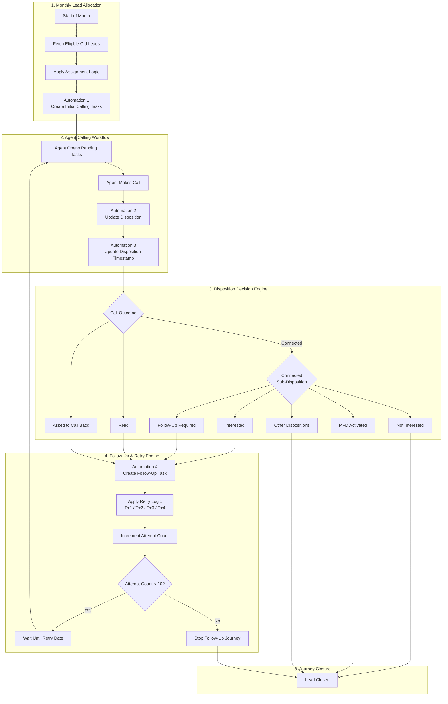

# Lead Follow-Up Mechanism — Old Leads

: Vijay Kumar S
Created time: May 19, 2026 11:51 AM
Status: Not started
Last edited: May 19, 2026 6:08 PM

## Objective

Design a structured follow-up mechanism for old leads to:

- Ensure periodic engagement
- Maximize lead conversion
- Control automation usage
- Avoid excessive calling
- Standardize disposition-driven follow-ups

# 1. Lead Segmentation

## Lead Types

### 1. New Leads

- Real-time lead assignment
- Immediate engagement journey
- Separate automation flow

### 2. Old Leads

- Leads not converted
- Re-engagement campaign
- Monthly task-based follow-up mechanism

# 2. Old Lead Follow-Up Workflow

## Monthly Trigger

### Automation 1

At the beginning of every month:

- Create calling task for all eligible old leads

### Eligibility Conditions

- Lead not converted
- Lead not closed permanently
- Lead not activated
- Lead within retry policy

# 3. Agent Calling Workflow

## Step 1 — Agent Filters Pending Tasks

Agent opens:

- Same-day pending tasks
- Older pending tasks

## Step 2 — Open Task

Agent initiates call.

## Step 3 — Add Disposition

Agent marks call outcome.

# 4. Disposition-Based Follow-Up Logic

| Call Outcome | Sub-Disposition | Action | Next Follow-Up |
| --- | --- | --- | --- |
| Connected | Interested | Create Follow-Up Task | T+4 |
| Connected | Follow-Up Required | Create Follow-Up Task | T+3 |
| Connected | Not Interested | Close Task | No Retry |
| Connected | MFD Activated | Close Task | No Retry |
| Connected | Other Dispositions | Close Task | No Retry |
| RNR | — | Create Retry Task | T+2 |
| Asked to Call Back | — | Create Retry Task | T+1 |

# 5. Calling Attempt Policy

## Monthly Attempt Limits

| Criteria | Count |
| --- | --- |
| Minimum Calls per Lead | 4 |
| Recommended Maximum | 8 |
| Absolute Maximum | 10 |

# 6. Retry Logic

## Retry Rules

- Retry only if:
    - RNR
    - Callback Requested
    - Follow-Up Needed
    - Interested
- Stop retries if:
    - Not Interested
    - Activated
    - Invalid
    - Duplicate
    - DND
    - Converted

# 7. Automation Consumption Model

## A. Initial Monthly Task Creation

| Activity | Automations |
| --- | --- |
| Monthly Task Creation | 1 |

## B. Per Call Attempt

Each call consumes:

| Automation Activity | Count |
| --- | --- |
| Update Disposition | 1 |
| Update Disposition Timestamp | 1 |
| Create Follow-Up Task | 1 |

### Total Per Call = 3 Automations

# 8. Automation Usage Estimation

## Formula

Total Automations=(Leads×1)+(Call Attempts×3)\text{Total Automations} = (\text{Leads} \times 1) + (\text{Call Attempts} \times 3)Total Automations=(Leads×1)+(Call Attempts×3)

## Lead Volume Breakdown

| Task Type | B2C | Activations | B2B2C |
| --- | --- | --- | --- |
| Organic Leads (Auto Task Creation) | 4,000 | 923 | 1,522 |
| Old Leads Assigned (Manual Tasks) | 0 | 4,500 | 6,000 |
| Overall Leads | 4,000 | 5,423 | 7,522 |

# Total Leads Calculation

## Total Monthly Leads

4000+5423+7522=169454000 + 5423 + 7522 = 169454000+5423+7522=16945

## Total Leads = 16,945 Leads

# Initial Task Creation Automations

## Assumption

Each lead requires:

- 1 automation for initial task creation

### Calculation —> 16945×1=1694516945 \times 1 = 1694516945×1=16945

## Initial Task Creation = 16,945 Automations

# Call Attempt Automation Calculation

## Assumption

Average:

- 6 call attempts per lead/month
- 3 automations per call

### Per Call Automations

1. Update disposition
2. Update disposition timestamp
3. Create follow-up task

## Formula

Call Automations=Leads×Call Attempts×3\text{Call Automations} = \text{Leads} \times \text{Call Attempts} \times 3Call Automations=Leads×Call Attempts×3

## Calculation :

16945×6×3=30501016945 \times 6 \times 3 = 30501016945×6×3=305010

## Call Attempt Automations = 3,05,010 Automations

### Calculation

Initial Task Creation:

- 16,945 automations

Call Automations:

16945×6×3=30501016945 \times 6 \times 3 = 30501016945×6×3=305010

- 16,945 × 6 × 3
- = 3,05,010 automations

### Total Monthly Automations

16945+(16945×6×3)=32195516945 + (16945 \times 6 \times 3) = 32195516945+(16945×6×3)=321955

**= 16945 + (16945 × 6 × 3) = 321955**

# Estimated Total = 3.22 Lakh Automations / Month

# Category-Wise Automation Breakdown

| Category | Leads | Initial Task Automations | Call Automations (6×3) | Total |
| --- | --- | --- | --- | --- |
| B2C | 4,000 | 4,000 | 72,000 | 76,000 |
| Activations | 5,423 | 5,423 | 97,614 | 1,03,037 |
| B2B2C | 7,522 | 7,522 | 1,35,396 | 1,42,918 |

# 9. Optimisation Opportunities

## Current Problem

Every retry creates:

- Multiple automation triggers
- High LSQ automation consumption
- Increased operational load

# Recommended Optimisation

## Backend-Driven Follow-Up Engine

Move the logic from automations to the backend:

- Retry date calculation
- Disposition timestamping
- Task generation logic
- Attempt count management

## Tech requirement : Optimised Automation Usage

### Instead of 3 automations per call:

Use:

- 1 webhook/API event
- Backend handles follow-up orchestration

# 10. Recommended Architecture

## Suggested Hybrid Model

### LSQ Handles

- Task visibility
- Disposition capture
- RM dashboard

### Backend Handles

- Retry logic
- Scheduling
- Attempt counting
- Monthly reset
- Follow-up orchestration
- Cadence engine

# 11. Suggested Flowchart Structure

## Main Flow

flowchart TD

# 12. Product Recommendations

## Recommended Guardrails

- Daily calling cap per lead
- Smart retry spacing
- Weekend retry suppression
- DND handling
- Auto-close stale leads
- Priority scoring based on engagement

---

# 13. Suggested Future Enhancements

## Phase 2 Ideas

- AI-based retry timing
- Lead scoring
- Intent prediction
- Auto-prioritized task queue
- WhatsApp/SMS assisted follow-ups
- RM productivity scoring
- Auto-stop logic based on engagement probability