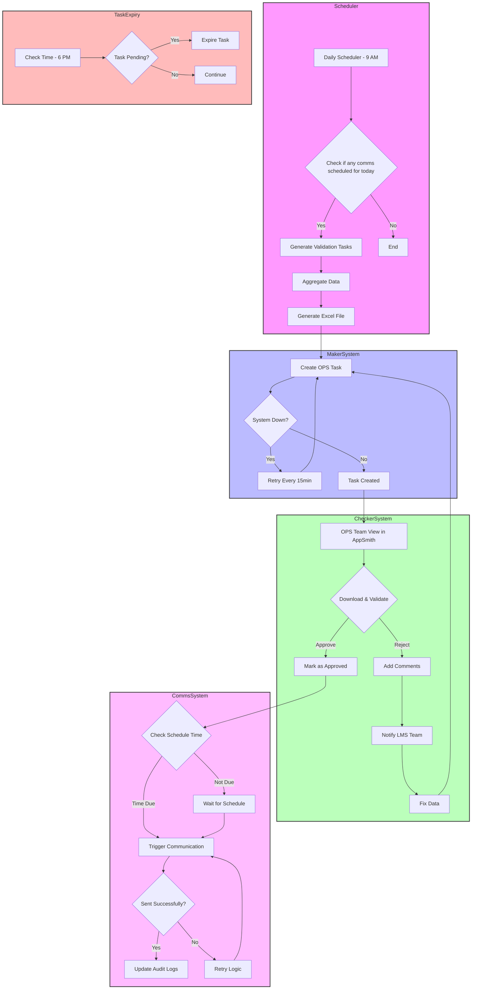
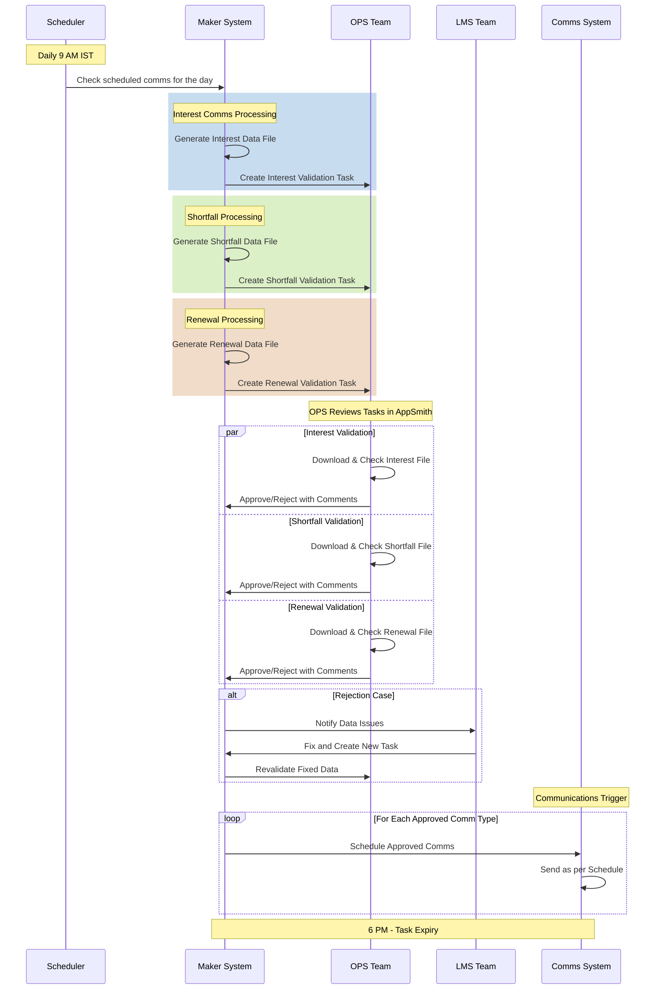

# Maker checker for servicing comms

: Ranjan kumar Singh
Created time: January 17, 2025 8:58 AM
Status: In progress
Last edited: February 19, 2026 7:12 PM
Owner: Lalit Bihani

# **What problem are we solving?**

Our servicing communications system has critical reliability issues, resulting in both inaccurate content delivery and inconsistent communication delivery to customers. This impacts our service quality and customer experience.

### Problems in Detail

- **Data Accuracy Issues**
    - Inaccurate communications due to stale or incorrect database information
    - **Example:** A customer who has already paid their interest still receives payment reminders.
    - Root causes:
        - API failures leading to data synchronization gaps
        - System downtime causing data inconsistencies
        - Delays in lender data updates [Manual]
        - No real-time data validation checks
- **Control Issues**
    - Errors in communication delivery due to incorrect app configurations
        - Example: Incorrect template ID added
    - No way to preview messages before triggering bulk comms
    - No visibility into what messages are being sent
    - Delay in sending servicing comms from volt end
    - Contributing factors:
        - No validation framework for comms config changes on AWS console
        - No approval or reviewing of bulk comms
        - Understanding config in JSON is tricky and Editing JSON file and pushing to prod without any validation causes issue
        - Lender delayed sending the data
- **Communication Monitoring Gaps**
    - Limited visibility into system-generated communications
    - Missing capabilities:
        - No centralized tracking system for all channels(Email, SMS, WA) which enable or provide visibility to cross functional team.
    
    Other challenges with existing system:
    
    - New communications requires code changes
    - Comms schedule modifications need code deployment
    - Enabling comms based on the channel or platform are complex or sometime requires additional development.
        - Enabling /disabling comms based in channel is complex
    - No way to quickly stop sending wrong messages to minimize impact

**Impact:**

- Reduced customer trust due to incorrect communications
- Increased customer complaints and support tickets
- Compliance risks
- Higher operational overhead

---

# **How do we measure success?**

- ~99% accuracy in data sent through servicing communications
- Zero incidents of incorrect data in servicing communications
- SLA adherence for servicing communication delivery
- Reduction in customer complaints related to incorrect communications

---

# **How are others solving this problem?**

---

# **What is the solution?**

## Requirements overview

### Manual safety controls

Objective: Implement a robust validation system to prevent incorrect or delayed communications through manual checks and controls.

1. Daily Communications schedule dashboard

```mermaid
A. Visibility Panel
- Today's scheduled communications
- Communication types & timing
- Target customer segments
- Channel distribution

Example Dashboard View:
Today's Schedule (15 Feb 2024)
├── 9:00 AM: Interest Reminders
│   ├── Total Users: 1,000
│   ├── Comms Channels: WhatsApp, SMS
│   └── Customer channel: B2C
├── 2:00 PM: Shortfall Alerts
│   └── [Similar breakdown]
└── 5:00 PM: Renewal
    └── [Similar breakdown]
```

2. Safety Check Framework

Pre-Communication Checklist

1. Data Validation
    - Validate DB data on daily basis, this is to ensure data is correct and upto date to send the comms.
    - Any deviation flagged will help us act on time and send comms to right user with right data and right time.
2. Content Verification
    - Enable ops team to send test comms before triggering comms to all users
        - Variable mapping validation
        - Customer channel-specific content review
        - Comms channel-specific content review

 

1. Monitoring Dashboard
    
    A. Communication Analytics Dashboard
    
    - Required to track delivery status of all servicing communications
    - Critical for compliance requirements (interest and shortfall notifications)
    - Enables monitoring of mandatory customer communications
    
    B. Operational Use
    
    - OPS team will monitor failed communications
    - Follow up with customers where message delivery failed across channels
    - Ensure 100% communication coverage for compliance-critical messages
    
    ```mermaid
    Today's Communications (15 Feb 2024)
    
    1. Interest Reminders (9:00 AM)
       └── Total: 1,000
           ├── Sent: 980
           ├── Failed: 20
           └── Status: In Progress
       
    2. Shortfall Alerts (2:00 PM)
       └── Total: 500
           ├── Pending: 500
           └── Status: Scheduled
    
    3. Error Summary
       └── Data Errors: 15
           ├── Amount mismatch: 8
           ├── Missing data: 5
           └── Invalid format: 2
    ```
    

### Automated safety controls system

Objective: Build an automated validation engine (safety evaluator) to perform systematic checks before sending communication.

- Identify and flag any deviation before sending any comms.
    
    ```mermaid
    Validation Rules Example:
    1. Interest Amount:
       - Must be > 0
       - Month must be current month -1
       - Cannot exceed credit limit
       
    2. Due Date:
       - Must be future date
       - Must align with billing cycle
       - If lender are BFL and the due date must be 7th of the month
    ```
    

## User stories / User flow



# Detailed Workflow Story (Phase 1)

## 1. Morning Schedule Initialization (9 AM)

### System Check

- Scheduler runs at 9 AM IST
- Identifies all communications scheduled for the day:
    - Interest reminders (e.g., scheduled for 1 PM)
    - Shortfall notifications (e.g., scheduled for 2 PM)
    - Renewal reminders (e.g., scheduled for 3 PM)

### Task Creation

1. **Interest Communication Task**
    - System aggregates interest data from all sources
    - Creates Excel with user details, credit info, and interest specifics
    - Generates task ID: INT_20240120_001
2. **Shortfall Communication Task**
    - Compiles shortfall information
    - Creates separate Excel with shortfall-specific data
    - Generates task ID: SHF_20240120_001
3. **Renewal Communication Task**
    - Aggregates renewal data
    - Creates Excel with renewal information
    - Generates task ID: RNW_20240120_001

**Important note:** 

1. Operations team should be able to regenerate validation files on-demand to ensure latest database information is captured.

    
    Use Case: When lender data arrives late, ops team can:
    
    1. Regenerate validation file after uploading data, EX: Shortfall data
    2. Get updated data instantly and proceed with verification process

## 2. OPS Team Workflow (9 AM - 6 PM)

### Task Dashboard View

- OPS team sees three tasks in AppSmith:
    
    ```
    1. Interest Validation (Due: 12 PM)
    2. Shortfall Validation (Due: 10 AM)
    3. Renewal Validation (Due: 2 PM)
    
    ```
    

### Parallel Validation Process

1. **Interest Data Validation**
    - OPS downloads interest files
    - Validates against lender data
2. **Shortfall Data Validation**
    - Different OPS member can simultaneously validate
    - Cross-checks with risk system data
    - High priority due to 11 AM schedule
3. **Renewal Data Validation**
    - Third OPS member handles renewal data
    - Validates against credit system

### Successful Case

1. OPS approves Interest data at 12 PM
    - System queues all interest communications
    - Both customer and MFD communications prepared
2. OPS approves Shortfall at 10 AM
    - System prepares shortfall notifications
    - Ready for 11 AM trigger
3. OPS approves Renewal at 2 PM
    - System queues renewal reminders
    - Set for 3 PM delivery

### Rejection Case

1. OPS rejects Interest data at 12 PM
    - Adds comment: "Mismatch in interest amounts"
    - System notifies LMS team
    - LMS team fixes data by 1:30 PM
    - New validation task created: INT_20240120_002
    - OPS revalidates and approves by 2 PM

## 3. Communication Trigger Flow

### For Approved Tasks

1. **Interest Communications (1 PM)**
    - System checks approval status
    - Triggers customer SMS/emails
    - Sends MFD notifications
    - Updates audit logs
2. **Shortfall Communications (11 AM)**
    - Executes approved shortfall notifications
3. **Renewal Communications (3 PM)**
    - Processes approved renewal reminders

### For Pending/Rejected Tasks

- System sends reminder at schedule time + 10 min
- Example: If shortfall not approved by 10:10 AM
    - Reminder sent to OPS team
    - Escalation to team lead

## 4. End of Day Process (6 PM)

### Task Closure

- System checks all pending tasks
- Expires unapproved tasks
- Generates daily report:
    
    ```
    - Total Tasks: 3
    - Approved: 2
    - Rejected & Fixed: 1
    - Expired: 0
    
    ```
    

### Audit Updates

- Records actions taken against the task
- Stores validation files or link for future reference



## Requirements

### 1. Scope

### 1.1 In Scope Communications

1. Interest Reminders
2. Shortfall Reminders
3. Loan Renewal Reminders

### 1.2 Comms type for which requires maker checker

1. Direct Customers (All channels)
2. MFD customers on Volt platform
3. MFD customers on B2B partner platform

### 1.3 Feature overview

1. Communications Configuration
    - Form-based setup with validations
    - Audit logging
    - Version control
2. Operations Dashboard
    - Daily schedule view
    - Approval workflow
    - Status tracking
3. Reporting & Analytics
    - Delivery status tracking
    - Success/failure metrics
4. Handling for adhoc comms requirement [Phase 2]
    - UI interface to create event based comms
    - Should be able to define trigger logic
    - Map template variables with Credit/users attributes
    - Business channel level config
    - Comms medium channel wise config

### 2. System Architecture

### 2.1 Maker System (Automated)

### 2.1.1 Daily Operations

- **Scheduling Time**: 9:00 AM IST daily
- **Task Creation**: System generates comms data validation tasks for ops team
- **Data Compilation**: Aggregates required data from various sources/tables
- **File Generation**: Creates validation files in excel format

### 2.1.2 Retry Mechanism

- System downtime handling: Retry every 15 minutes for up to 2 hours
- Failed task creation alerts to LMS team
- Manual override capability for failed schedule

### 2.2 Checker System (Operations Team)

### 2.2.1 Validation Interface

- Web-based interface in servicing tool(appSmith)
- Show task based on the comms type which are scheduled for today

### 2.2.2 Data Validation Process

- Download capability for validation files
- If Interest data is validated by ops team, then all comms scheduled for that day will be triggered without any approval
    - Example: If interest comms is scheduled to send to customer and MFD on 2nd of Feb and ops team has validated the interest data on 2nd feb, then no separate task will be created to validate data for sending MFD comms
- Comments field for rejections

### 3. Detailed Requirements

### 3.1 Task Lifecycle

1. **Creation**
    - System creates tasks at 9 AM
    - Each task includes all required data points
    - Unique identifier assigned to each task
2. **Validation Window**
    - Tasks valid until 06:00 PM IST
        - Product to ensure, no servicing comms are scheduled post 7 PM
    - Reminder notifications at communication schedule time + 10 minutes
        - OPS, ops head and product team
    - Auto-expiry of unactioned tasks
        - OPS should be able to see expiry time on UI for each task
    - If data is not validated before the expiry, comms trigger will be cancelled for that day
    - OPS team will be available on holidays for validation
3. **Approval Process**
    - Single-click approval for verified data
    - Rejection requires mandatory comments
4. **Post-Approval**
    - Immediate queuing of approved communications
    - Notification to relevant teams
    - Update of audit logs
5. **Post-Rejection**
    - LMS or on-call team to rectify the issue
    - Re-create task for re-validation

### 3.2 Data Requirements

| User details | Credit details | Attribution details | Interest specific | Shortfall | Renewals |
| --- | --- | --- | --- | --- | --- |
| - Name
- Phone Number
- PAN
- Email
- Bank details | - Credit id
- Account id
- Lender name
- Credit status
- Lender loan account number
- Renewal date | - Channel
- Platform name
- Partner account type
- Partner name
- Partner Phone | - Interest created at
- Mandate registration status
- Interest Amount
- Charges
- Total amount
- Due date
- Collection status
- Remarks | - Shortfall created at
- Shortfall amount
- Due on
- Aging | - POS
- Due date |

Comms specific data

- Enum
- Template id
- Trigger date time
- Variables

### Validation criteria

Interest - Customer comms

| Validation fields | Validation criteria | Data type | Manual validation | Remarks |
| --- | --- | --- | --- | --- |
| Credit id | count of Credit id in generated file and input file should match  | string |  |  |
| Due amount | Interest amount, Charges amount and total due in both file should match | Number | Amount discrepancy after 1st of month can be seen for TATA and DSP in case of partial repayment | Decimal handling
Round logic
Validation of decimal |
| Mandate registration status | Mandate registration status in both file should match | Boolean |  |  |
| Due date |  |  |  |  |
| Interest status | Interest status validation based on the date and lender:

**Lender = TATA**
- If file is uploaded b/w 1 to 2 and lender is TATA then interest status should be DUE for both mandate registered and non registered case

- If file is uploaded on 3rd and lender is TATA then interest status should be DUE for non mandate registered and ‘AWATING_MANDATE_STATUS’   for mandate registered case

- If file is uploaded b/w 4th to 7th and lender is TATA then interest status should be ‘AWATING_MANDATE_STATUS’ for mandate registered case and “OVERDUE” for mandate not registered

- If file is uploaded on and after 8th and lender is TATA then interest status should be ‘OVERDUE’ for both mandate registered and non registered case

**Lender = BAJAJ/DSP**

- If file is uploaded b/w 1 to 6 and lender is BAJAJ and DSP then interest status should be DUE for mandate registered and non registered case

- If file is uploaded on 7th and lender is BAJAJ and DSP then interest status should be DUE for mandate non registered case and ‘AWATINING_MANDATE_STATUS’ for mandate registered case

- If file is uploaded b/w 8th to 13th and lender is BAJAJ then interest status should be “OVERDUE” for mandate non registered case and ‘AWATINING_MANDATE_STATUS’ for mandate registered case

- If file is uploaded  on and after 8th and lender is DSP then interest status should be “OVERDUE” for mandate non registered case and  mandate registered case

-  If file is uploaded on and post 14th and lender is BAJAJ and DSP then interest status should be “OVERDUE” for both mandate non registered case and  mandate registered case

 | string | OPS to validate interest status based on the date and lender type, template id based on the interest status, lender and platform |  |
| Month | Billing month on generated file and input file should match | String |  |  |
| Year | Billing year on generated file and input file should match | String |  |  |
| Platform name | Platform name on generated file and input file should match |  |  |  |

Interest - Customer MFDs

| Validation fields | Validation criteria | Data type | Manual validation |
| --- | --- | --- | --- |
| Total client with interest due/overdue | Count of interest client should match on the generated file and input file | NA |  |
| Total client with mandate registered | No Validation | NA |  |
| Total client with mandate non registered | No validation | NA |  |
| Partner id |  |  |  |
| Platform | Platform on the generated file and input file should match |  | OPS to verify the template id used based on the platform |

Shortfall - customer

| Validation fields | Validation criteria | Data type | Manual validation |
| --- | --- | --- | --- |
| Shortfall amount | Shortfall amount on generated file and input file should match against the credit id |  |  |
| Shortfall aging | Shortfall aging on generated file and input file should match against the credit id |  |  |
| Template id |  |  | Ops team should validate template id based on the aging |

Shortfall MFD

| Validation fields | Validation criteria | Data type | Manual validation |
| --- | --- | --- | --- |
| Total client in shortfall due+overdue | Count of customer in shortfall based on the partner id should match | NA |  |
| Partner id |  |  |  |
| Platform | Platform on the generated file and input file should match | NA | OPS to verify the template id used based on the platform |

Sample input file:

[Shortfall - Mar 2025 - Sheet262 (1).csv](Maker%20checker%20for%20servicing%20comms/Shortfall_-_Mar_2025_-_Sheet262_(1).csv)

Loan renewals - Customer

| Validation fields | Validation criteria | Data type | Manual validation |
| --- | --- | --- | --- |
| Loan maturity date | Loan maturity date on generated file and input file should match | Date |  |
| Days left for expiry | Days left on the generated file and input file should match |  |  |
| Outstanding due | Net outstanding on the generated file and input file should match |  |  |
| Platform |  |  | OPS to verify the template id used based on the platform |

Loan renewals - MFD

- No input file will be provided
- OPS to validate the generated file and approve the comms

---

# **Design**

---

# **Analytics**

---

# **Timeline/Release Planning**

---

# **Go to market**

Timelines

| **Comms type** | **User type** | **Timelines - Dev start date** | **Dev end date** | **Go-live date** | Current status |
| --- | --- | --- | --- | --- | --- |
| Shortfall comms | Customer | 2025-02-25 | 2025-03-17 | 18 Mar | Training with OPS team & prod testing is completed |
|  | MFD | Sprint Mar B | Sprint Mar B | Sprint Mar B |  |
| Interest comms | Customer | Sprint Mar B | Sprint Mar B | APR first week |  |
|  | MFD | Sprint APR A | Sprint APR A | APR second week |  |
| Loan renewal comms | Customer | Sprint Mar B | Sprint Mar B | APR first week |  |
|  | MFD | Sprint APR A | Sprint APR A | APR second week |  |

## Marketing

## Ops & Sales training

## Frequently asked questions (FAQs)

---

# **Action items / checklist**

[](data:image/png;base64,iVBORw0KGgoAAAANSUhEUgAAAEgAAABICAYAAABV7bNHAAAA1ElEQVR4Ae3bMQ4BURSFYY2xBuwQ7BIkTGxFRj9Oo9RdkXn5TvL3L19u+2ZmZmZmZhVbpH26pFcaJ9IrndMudb/CWadHGiden1bll9MIzqd79SUd0thY20qga4NA50qgoUGgoRJo/NL/V/N+QIAAAQIECBAgQIAAAQIECBAgQIAAAQIECBAgQIAAAQIECBAgQIAAAQIECBAgQIAAAQIEyFeEZyXQpUGgUyXQrkGgTSVQl/qGcG5pnkq3Sn0jOMv0k3Vpm05pmNjfsGPalFyOmZmZmdkbSS9cKbtzhxMAAAAASUVORK5CYII=)

- [ ]  Product
    - [ ]  OPS SOP
    - [ ]  Web hook
- [ ]  Business
    - [ ]  -
- [ ]  Design
    - [ ]  -

---

[](data:image/png;base64,iVBORw0KGgoAAAANSUhEUgAAAEgAAABICAYAAABV7bNHAAAA1ElEQVR4Ae3bMQ4BURSFYY2xBuwQ7BIkTGxFRj9Oo9RdkXn5TvL3L19u+2ZmZmZmZhVbpH26pFcaJ9IrndMudb/CWadHGiden1bll9MIzqd79SUd0thY20qga4NA50qgoUGgoRJo/NL/V/N+QIAAAQIECBAgQIAAAQIECBAgQIAAAQIECBAgQIAAAQIECBAgQIAAAQIECBAgQIAAAQIEyFeEZyXQpUGgUyXQrkGgTSVQl/qGcG5pnkq3Sn0jOMv0k3Vpm05pmNjfsGPalFyOmZmZmdkbSS9cKbtzhxMAAAAASUVORK5CYII=)

[](data:image/png;base64,iVBORw0KGgoAAAANSUhEUgAAAEgAAABICAYAAABV7bNHAAAA1ElEQVR4Ae3bMQ4BURSFYY2xBuwQ7BIkTGxFRj9Oo9RdkXn5TvL3L19u+2ZmZmZmZhVbpH26pFcaJ9IrndMudb/CWadHGiden1bll9MIzqd79SUd0thY20qga4NA50qgoUGgoRJo/NL/V/N+QIAAAQIECBAgQIAAAQIECBAgQIAAAQIECBAgQIAAAQIECBAgQIAAAQIECBAgQIAAAQIEyFeEZyXQpUGgUyXQrkGgTSVQl/qGcG5pnkq3Sn0jOMv0k3Vpm05pmNjfsGPalFyOmZmZmdkbSS9cKbtzhxMAAAAASUVORK5CYII=)

[](data:image/png;base64,iVBORw0KGgoAAAANSUhEUgAAAEgAAABICAYAAABV7bNHAAAA1ElEQVR4Ae3bMQ4BURSFYY2xBuwQ7BIkTGxFRj9Oo9RdkXn5TvL3L19u+2ZmZmZmZhVbpH26pFcaJ9IrndMudb/CWadHGiden1bll9MIzqd79SUd0thY20qga4NA50qgoUGgoRJo/NL/V/N+QIAAAQIECBAgQIAAAQIECBAgQIAAAQIECBAgQIAAAQIECBAgQIAAAQIECBAgQIAAAQIEyFeEZyXQpUGgUyXQrkGgTSVQl/qGcG5pnkq3Sn0jOMv0k3Vpm05pmNjfsGPalFyOmZmZmdkbSS9cKbtzhxMAAAAASUVORK5CYII=)

[](data:image/png;base64,iVBORw0KGgoAAAANSUhEUgAAAEgAAABICAYAAABV7bNHAAAA1ElEQVR4Ae3bMQ4BURSFYY2xBuwQ7BIkTGxFRj9Oo9RdkXn5TvL3L19u+2ZmZmZmZhVbpH26pFcaJ9IrndMudb/CWadHGiden1bll9MIzqd79SUd0thY20qga4NA50qgoUGgoRJo/NL/V/N+QIAAAQIECBAgQIAAAQIECBAgQIAAAQIECBAgQIAAAQIECBAgQIAAAQIECBAgQIAAAQIEyFeEZyXQpUGgUyXQrkGgTSVQl/qGcG5pnkq3Sn0jOMv0k3Vpm05pmNjfsGPalFyOmZmZmdkbSS9cKbtzhxMAAAAASUVORK5CYII=)

[](data:image/png;base64,iVBORw0KGgoAAAANSUhEUgAAAEgAAABICAYAAABV7bNHAAAA1ElEQVR4Ae3bMQ4BURSFYY2xBuwQ7BIkTGxFRj9Oo9RdkXn5TvL3L19u+2ZmZmZmZhVbpH26pFcaJ9IrndMudb/CWadHGiden1bll9MIzqd79SUd0thY20qga4NA50qgoUGgoRJo/NL/V/N+QIAAAQIECBAgQIAAAQIECBAgQIAAAQIECBAgQIAAAQIECBAgQIAAAQIECBAgQIAAAQIEyFeEZyXQpUGgUyXQrkGgTSVQl/qGcG5pnkq3Sn0jOMv0k3Vpm05pmNjfsGPalFyOmZmZmdkbSS9cKbtzhxMAAAAASUVORK5CYII=)

# **Feedback**

---

# **Learnings & Next steps**

---

# **Appendix**

## Meeting notes

- Run a cron as per the pre-defined schedule > Show enum, template id, number of customers, variables to checker > checker should be able to send test comms > checker should be able to update the list of customers by refreshing the customer list
- Create a list of all the comms and it trigger > Admin should be able to define the trigger time
- If we created a list to send the comms at 9 AM and user paid the interest and interest got settled then how we will update the list so that we should avoid sending comms to such user
    - option to refresh the list of customers
- Admin should be able to schedule the comms by selecting the enum by category
    - category: Interest, shortfall, renewals etc
    - User story: lets say we send overdue comms till 15th of the month and ops team want to send comms on 16, then they should be able to select option send overdue interest comms > fetch overdue comms config > fetch overdue customer list and hit button to trigger comms. > they should be able to select channels where they want to send the comms like WA, EMAIL, SMS

Type of comms:

Interest:

- Interest status: DUE, OVERDUE, AWAITING_MANDATE_STATUS
- Mandate status

Shortfall:

- BFL: powered by sheet and admin action

Sell-off:

- Won’t be able to power from DB
- File upload

Renewals:

- Due
- Overdue
- Sell-off: Not sending but start store the sell-off status

Meeting with Nishant:

- All comms has to be DB powered
- Ops will serve as a checker - they will check DB Data with lender data
- Visibilty for the sales and support on the servining comms
- How do we power the DB?
- How to handle mandate non registetion case after 7th - sop to create to update mandate status: comms needs to send to customer that mandate is not registered, lets evelute this first
- Mandate  reregisteration  - depriortised

Interest status visibilty on daily baisis - lender wise

1. Please mention that the task for ops is data validation irrespective of whether there are comms scheduled.Following data validation tasks are expected by ops (irrespective of whether comms are scheduled)
    1. Interest data
    2. Shortfall data
    3. Renewal data
2. Ops will be checking the lender data only. As of now, credit details and user details are single source information. And need not be checked by ops daily as there is no reference source.
3. Renewal date should be part of the renewal data. I understand it is part of the credits table, but we should be able to isolate it within the renewal data.
4. For shortfall, ops can only validate ageing. Due on to be calculated by tech / product based on the market calendar.
5. Interest data should have both the due date and sell off date to be validated. (Only the due date is available).
6. Shortfall comms is a higher priority than interest. Let's keep following deadlines (Will align with comms team to start the day 1 hour early to enable this - [@Nikhil Vibhuti](mailto:nikhil.vibhuti@voltmoney.in) please align with team here)
    1. 10 AM for shortfall validation - 11 AM delivery
    2. 12 PM interest validation - 1 PM delivery
    3. 2 PM renewal validation - 3 PM delivery
    4. Comms closure at 5 PM
7. Can you also mention what is the source of all the data Lender x data type?