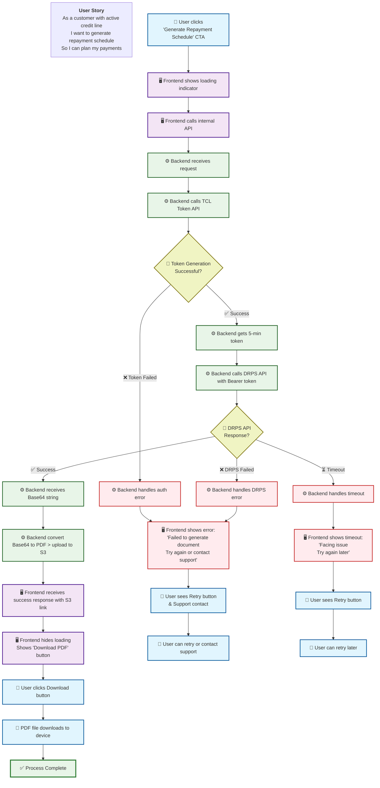

# TCL Dynamic repayment schedule

: Ranjan kumar Singh
Created time: June 25, 2025 12:07 PM
Status: Not started
Last edited: February 19, 2026 7:12 PM
Owner: Lalit Bihani

# **What problem are we solving?**

To meet compliance requirements, we need to introduce a new functionality that enables TCL customers to download their repayment schedule directly from the app.

---

# **How do we measure success?**

NA

---

# **How are others solving this problem?**

NA

---

# **What is the solution?**

We will implement a dynamic repayment schedule generation and download feature that integrates with TCL's API to provide customers with up-to-date repayment schedules.

**Implementation Strategy:**

- **Phase 1**: Direct UI download with real-time API integration
- **Phase 2**: Email delivery option based on API performance analysis

## Requirements overview

- We need to provide dynamic repayment schedule document download options on Volt App for TCL customers.
- To get the repayment schedule we need to call the TCL API
- In response, we will get schedule in PDF and JSON format
    - Pass “pdf” in API request to get data in PFD format, we will get result in Base64
    - Pass “data” in API request to get data in JSON format.
- Repayment schedule document will be stored in S3 and URL will be passed to frontend
    - File name format: repayment_schedule_{{LoanAccountNumber}}.pdf
- PDF download option will be given on UI.
    - Show file name and generated on UI
- Account status for which we need to allow repayment schedule document :
    - Active
    - Approved not disbursed

## User stories / User flow

## Requirements

API details [UAT]

[Mile-RPS-Api-doc (1).docx](TCL%20Dynamic%20repayment%20schedule/Mile-RPS-Api-doc_(1).docx)

---

---

API details [PROD]:

**URL** - [https://milesoauth-prod-apicast.apps.prdservices.tatacapital.com/rest/v1.0/miles/RepaymentSchedule](https://milesoauth-prod-apicast.apps.prdservices.tatacapital.com/rest/v1.0/miles/RepaymentSchedule)

**Oauth Key**

Voltmoney - Basic ZjcwMzNlM2I6NjBhMTRiNjAxOTQyYWNlZGY3NDFiMTFmMWJmMGY0ODc=

**Curl to generate access token**

curl --location '[https://keycloak.apps.prdservices.tatacapital.com/realms/3scale-sso/protocol/openid-connect/token](https://keycloak.apps.prdservices.tatacapital.com/realms/3scale-sso/protocol/openid-connect/token)' \

- -header 'Authorization: <Oauth key>' \
- -header 'Content-Type: application/x-www-form-urlencoded' \
- -data-urlencode 'grant_type=client_credentials'

Test case scenario:

| S.No | Scenario | Expected Output | Actual Output | Remarks |
| --- | --- | --- | --- | --- |
| 1 | DRPS triggered after Account is created - No Disbursement Taken | The RPS to be calculated based on Loan Amount = Sanction Amount |  |  |
| 2 | DRPS triggered after Disbursement is Done | RPS is calculated based on Loan Amount = Outstanding. Disbursement Entry is reflected in RPS. |  |  |
| 3 | DRPS is triggered after Repayment is done | RPS is calculated based on Loan Amount = Outstanding. Repayment Entry is reflected in RPS. |  |  |
| 4 | DRPS triggered after backdated Repayment | RPS is calculated based on Loan Amount = Outstanding. Repayment Entry is reflected in RPS. |  |  |
| 5 | ROI Change | ROI Change is reflected in RPS |  |  |
| 6 | Charges Reversal | Loan Limit is updated as per charges reversed |  |  |
| 7 | DRPS API PDF and JSON | Document is received in Base 64 format in Response |  |  |
| 8 | DRPS triggered after DP Change (Pledge/Depledge) | RPS is Calculated based on Updated Loan Amount |  |  |

API details [PROD]:

- Pending on TCL

---

# **Design**

[https://www.figma.com/design/P6LkjMfxq3UFY2l3JHOIUW/Profile-section?node-id=1437-9001&p=f&t=qIZnBE7fLFcRMVut-0](https://www.figma.com/design/P6LkjMfxq3UFY2l3JHOIUW/Profile-section?node-id=1437-9001&p=f&t=qIZnBE7fLFcRMVut-0)

---

# **Analytics**

---

# **Timeline/Release Planning**

---

# **Go to market**

## Marketing

## Ops & Sales training

## Frequently asked questions (FAQs)

---

# **Action items / checklist**

- [ ]  Product
    - [ ]  -
- [ ]  Business
    - [ ]  -
- [ ]  Design
    - [ ]  -

---

# **Feedback**

---

# **Learnings & Next steps**

---

# **Appendix**

## Meeting notes