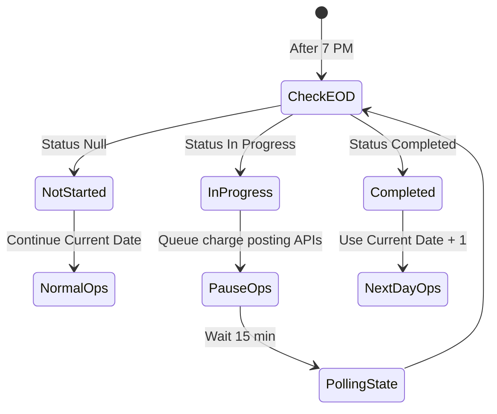

# TCL EOD Status Check Integration

: Ayush Kumar
Created time: November 28, 2024 4:30 PM
Status: In progress
Last edited: February 4, 2025 2:21 PM

## 1. Overview

Integration of TCL's EOD status check API to prevent transaction processing during EOD window and avoid backdated transactions posting.

Sample Adhoc charge posting API and request:

```json
https://miles-prod-apicast.apps.prdservices.tatacapital.com/rest/v1.0/miles/adhocCharges with body [
{
    "Amount": "200",
    "ChargesSID": "5",
    "Date": "2025-01-28",
    "LoanAccountName": "Avinash Goutam",
    "LoanContractNo": "41211",
    "Narration": "Stamping Charges",
    "Type": "charges",
    "UniqueRecordID": "1881575495221406782",
    "UserName": "adminiaf"
}
,
{
    "Amount": "799",
    "ChargesSID": "3",
    "Date": "2025-01-28",
    "LoanAccountName": "Avinash Goutam",
    "LoanContractNo": "41211",
    "Narration": "Processing Fee",
    "Type": "charges",
    "UniqueRecordID": "2630159110274265629",
    "UserName": "adminiaf"
}
]
```

## 2. API Details

[https://docs.google.com/spreadsheets/d/18RGjvVKQBvT9UHgKA_Vagjy_1b14LA9f8b3dBwAK5Uk/edit?usp=sharing](https://docs.google.com/spreadsheets/d/18RGjvVKQBvT9UHgKA_Vagjy_1b14LA9f8b3dBwAK5Uk/edit?usp=sharing)

### 2.1 Base Information

- **API Purpose**: Check EOD process status in TCL LMS
- **Endpoint**: `/miles/EodStatus`
- **Base URL**: `https://miles-uat-apicast.apps.tclprdservices.tatacapital.com:443/rest/v1.0`
- **Method**: POST

### 2.2 Request Parameters

```json
{
    "SOURCE_NAME": "Miles"  // Mandatory, String(10)
}

```

### 2.3 Response States

1. EOD Not Started

```json
{
    "retStatus": "SUCCESS",
    "response": [],
    "sysErrorMessage": "",
    "errorMessage": "",
    "sysErrorCode": ""
}

```

1. EOD In Progress

```json
{
    "retStatus": "SUCCESS",
    "response": [{
        "EODDate": "2024-10-19 00:00:00",
        "Remarks": "EOD is in Progress"
    }]
}

```

## 3. Business Rules

### 3.1 API Execution Rules

- Start checking EOD status after 7:00 PM daily
- Implement polling mechanism with intervals:
    - Every 15 min till 11:00 PM

### 3.2 Status-based Actions

| Status | System Behavior | Next Action | Impact |
| --- | --- | --- | --- |
| Null/Not Started | Continue normal operations | Use current system date | No impact |
| In Progress | Pause charge posting API calls and queue the request | Poll status at defined intervals | Credit opening TAT |
| Completed | Resume all operations | Use current date + 1 when posting adhoc charge | No impact |
| 400/500 or any other error | Pause charge posting API calls and queue the request | Queue the request and process when we get completed status and if we do not get completed status till 11 PM, then process queued request after 12 AM with current date | Credit opening TAT |

### 3.3 State Machine



## 4. Technical Requirements

### 4.1 Error Handling

- Implement retry mechanism for API failures
- Log all status changes
- Alert on prolonged "In Progress" state

### 4.2 Monitoring Requirements

- Track EOD completion time
- Monitor API response times
- Alert on polling failures

## 5. Testing Requirements

### 5.1 Test Scenarios

1. Status transitions
    - Not Started → In Progress → Completed
    - Handle missing status
    - Handle API failures
2. Time-based scenarios
    - Before 7 PM behavior
    - After 7 PM behavior
    - Midnight transition handling
3. Transaction processing
    - Verify date handling
    - Verify transaction pause/resume

---

# **Design**

---

# **Analytics**

---

# **Timeline/Release Planning**

---

# **Go to market**

## Marketing

## Ops & Sales training

## Frequently asked questions (FAQs)

---

# **Action items / checklist**

[](data:image/png;base64,iVBORw0KGgoAAAANSUhEUgAAAEgAAABICAYAAABV7bNHAAAA1ElEQVR4Ae3bMQ4BURSFYY2xBuwQ7BIkTGxFRj9Oo9RdkXn5TvL3L19u+2ZmZmZmZhVbpH26pFcaJ9IrndMudb/CWadHGiden1bll9MIzqd79SUd0thY20qga4NA50qgoUGgoRJo/NL/V/N+QIAAAQIECBAgQIAAAQIECBAgQIAAAQIECBAgQIAAAQIECBAgQIAAAQIECBAgQIAAAQIEyFeEZyXQpUGgUyXQrkGgTSVQl/qGcG5pnkq3Sn0jOMv0k3Vpm05pmNjfsGPalFyOmZmZmdkbSS9cKbtzhxMAAAAASUVORK5CYII=)

- [ ]  Product
    - [ ]  -
- [ ]  Business
    - [ ]  -
- [ ]  Design
    - [ ]  -

---

[](data:image/png;base64,iVBORw0KGgoAAAANSUhEUgAAAEgAAABICAYAAABV7bNHAAAA1ElEQVR4Ae3bMQ4BURSFYY2xBuwQ7BIkTGxFRj9Oo9RdkXn5TvL3L19u+2ZmZmZmZhVbpH26pFcaJ9IrndMudb/CWadHGiden1bll9MIzqd79SUd0thY20qga4NA50qgoUGgoRJo/NL/V/N+QIAAAQIECBAgQIAAAQIECBAgQIAAAQIECBAgQIAAAQIECBAgQIAAAQIECBAgQIAAAQIEyFeEZyXQpUGgUyXQrkGgTSVQl/qGcG5pnkq3Sn0jOMv0k3Vpm05pmNjfsGPalFyOmZmZmdkbSS9cKbtzhxMAAAAASUVORK5CYII=)

[](data:image/png;base64,iVBORw0KGgoAAAANSUhEUgAAAEgAAABICAYAAABV7bNHAAAA1ElEQVR4Ae3bMQ4BURSFYY2xBuwQ7BIkTGxFRj9Oo9RdkXn5TvL3L19u+2ZmZmZmZhVbpH26pFcaJ9IrndMudb/CWadHGiden1bll9MIzqd79SUd0thY20qga4NA50qgoUGgoRJo/NL/V/N+QIAAAQIECBAgQIAAAQIECBAgQIAAAQIECBAgQIAAAQIECBAgQIAAAQIECBAgQIAAAQIEyFeEZyXQpUGgUyXQrkGgTSVQl/qGcG5pnkq3Sn0jOMv0k3Vpm05pmNjfsGPalFyOmZmZmdkbSS9cKbtzhxMAAAAASUVORK5CYII=)

[](data:image/png;base64,iVBORw0KGgoAAAANSUhEUgAAAEgAAABICAYAAABV7bNHAAAA1ElEQVR4Ae3bMQ4BURSFYY2xBuwQ7BIkTGxFRj9Oo9RdkXn5TvL3L19u+2ZmZmZmZhVbpH26pFcaJ9IrndMudb/CWadHGiden1bll9MIzqd79SUd0thY20qga4NA50qgoUGgoRJo/NL/V/N+QIAAAQIECBAgQIAAAQIECBAgQIAAAQIECBAgQIAAAQIECBAgQIAAAQIECBAgQIAAAQIEyFeEZyXQpUGgUyXQrkGgTSVQl/qGcG5pnkq3Sn0jOMv0k3Vpm05pmNjfsGPalFyOmZmZmdkbSS9cKbtzhxMAAAAASUVORK5CYII=)

[](data:image/png;base64,iVBORw0KGgoAAAANSUhEUgAAAEgAAABICAYAAABV7bNHAAAA1ElEQVR4Ae3bMQ4BURSFYY2xBuwQ7BIkTGxFRj9Oo9RdkXn5TvL3L19u+2ZmZmZmZhVbpH26pFcaJ9IrndMudb/CWadHGiden1bll9MIzqd79SUd0thY20qga4NA50qgoUGgoRJo/NL/V/N+QIAAAQIECBAgQIAAAQIECBAgQIAAAQIECBAgQIAAAQIECBAgQIAAAQIECBAgQIAAAQIEyFeEZyXQpUGgUyXQrkGgTSVQl/qGcG5pnkq3Sn0jOMv0k3Vpm05pmNjfsGPalFyOmZmZmdkbSS9cKbtzhxMAAAAASUVORK5CYII=)

[](data:image/png;base64,iVBORw0KGgoAAAANSUhEUgAAAEgAAABICAYAAABV7bNHAAAA1ElEQVR4Ae3bMQ4BURSFYY2xBuwQ7BIkTGxFRj9Oo9RdkXn5TvL3L19u+2ZmZmZmZhVbpH26pFcaJ9IrndMudb/CWadHGiden1bll9MIzqd79SUd0thY20qga4NA50qgoUGgoRJo/NL/V/N+QIAAAQIECBAgQIAAAQIECBAgQIAAAQIECBAgQIAAAQIECBAgQIAAAQIECBAgQIAAAQIEyFeEZyXQpUGgUyXQrkGgTSVQl/qGcG5pnkq3Sn0jOMv0k3Vpm05pmNjfsGPalFyOmZmZmdkbSS9cKbtzhxMAAAAASUVORK5CYII=)

# **Feedback**

---

# **Learnings & Next steps**

---

# **Appendix**

## Meeting notes