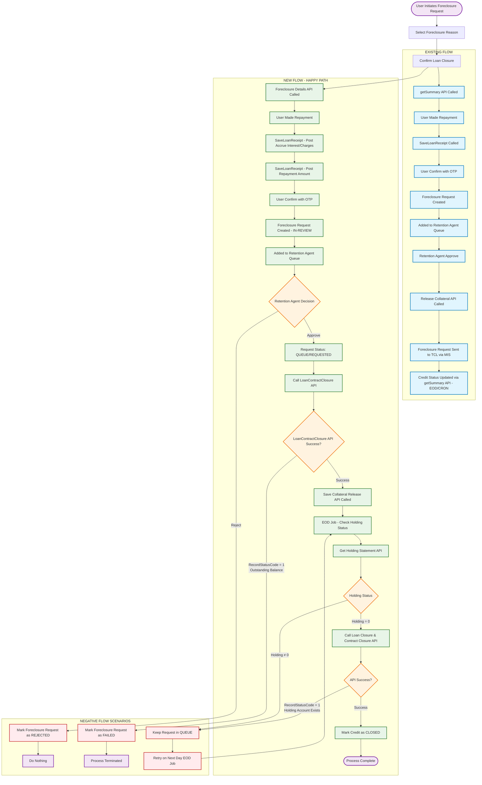
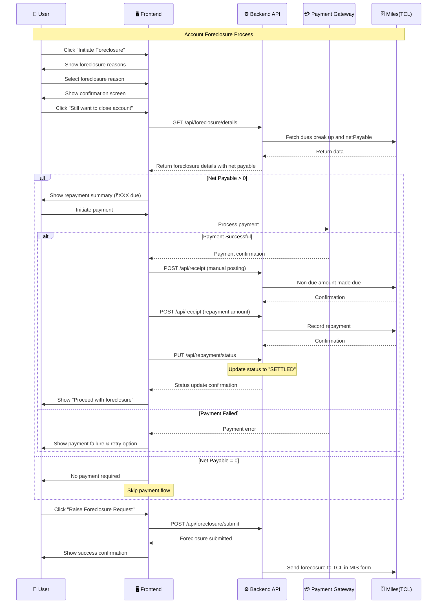

# TCL foreclosure API integration

: Ranjan kumar Singh
Created time: June 30, 2025 10:11 AM
Status: In progress
Last edited: February 19, 2026 7:12 PM
Owner: Lalit Bihani

# **What problem are we solving?**

We are currently using the `getSummary` API to fetch foreclosure details for TCL loans. However, this approach is resulting in multiple issues that are affecting both user experience and operational efficiency.

### **Problems with the `getSummary` API:**

1. **Handling of loan expiry experience** 
    - Once a loan **expires**, the `getSummary` API do not return scheduleDetails which is being used to calculate the net payable.
    - As a result:
        - We cannot retrieve the **net payable amount**.
        - The UI is not handled for post loan expiry properly due to this limitation. and we are not able to show exact net payable amount.
        - **Reminder notifications** to the user cannot be triggered as the net payable data is unavailable and hence leading to the portfolio sell-off without informing the user.
2. **Handling of foreclosure drop-off cases**
    - If the user **drops off after making a repayment**, the net due amount is not refreshed.
        - Accrue interest still show as non 0, and excess amount value is also not coming in the getSummary API and hence we can’t calculate the correct Net payable.
3. **latency**
    - The getSummary API is **heavy** as it returns **all loan-related data**, including collateral details.
    - This increases **latency**, impacting EOD and the user experience on the foreclosure screen.

# **How do we measure success?**

After the integration of foreclosure API

1. User should be able to proceed to foreclosure the loan if dropped off after completing the repayment
2. **Reduction in inbound complaints** related to inability to foreclose due to stale or incorrect dues data.

---

# **How are others solving this problem?**

### **Bajaj Finance (BFL):**

- Uses a dedicated **foreclosure API** to fetch due amount.
- After repayment, loan closure is manually processed.
- No separate API exists to post accrued (non-due) amounts. BFL OPS team settle the balance manually.

### **DSP:**

- Previously refunded excess repayment paid for accrued interest.
- Post enhancement:
    - Accepts repayments marked as **foreclosure-type**.
    - Excess amount is no longer refunded but used in foreclosure settlement.

---

# **What is the solution?**

<aside>
💡

The scope of this PRD is to first solve the foreclosure flow and then address the loan expiry experience.

Phase 2 will be picked up separately 

</aside>

To address the limitations of the current `getSummary` API, the following solutions have been implemented by TCL:

1. **Dedicated Foreclosure API**
    - TCL has developed a **new Foreclosure API** specifically to fetch foreclosure-related details.
    - This API will returns only the necessary data which are required to raise the foreclosure.
    - This API will also work for Expired loans.
2. **Enhancement to Receipt Posting**
    - Changes have been made to the **Receipt Post API** to allow manually posting of payments which **are not yet due**.
3. **Accurate Net Payable Calculation**
    - Once the not-due amount is marked as **due**, the repayment can be posted, allowing the **net payable** to correctly update to **₹0**.
    - This ensures users can successfully complete foreclosure requests without errors or stale due amounts even when they drop-off after making the repayment.

## Requirements overview (optional)

Phase 1:

- Integrate the **TCL Foreclosure API** in place of `getSummary` in TCL foreclosure flow.
- Use the new API for accurate dues breakup and net payable.
- Enhance the **receipt posting logic** to:
    - Post **non-due amounts** manually.
    - Followed by actual repayment posting.

Phase 2: 

- We need to integrate the loan closure and contract closure API to eliminate the need to foreclosing loan via MIS
- Below is the existing and new foreclosure flow:
    - **Existing:** User initiate foreclosure request → select foreclosure reason → Confirm loan closure → getSummary API called to get the foreclosure details → User made repayment → SaveloanReceipt is called to post repayment  → User confirm foreclosure with OTP → Foreclosure request is created → Foreclosure request added to Retention agent queue → Retention agent approve the request → Release collateral API is called → Foreclosure request sent to TCL in form of MIS → Credit status is updated using getSummary API [EOD or foreclosure status update CRON]
    - **Updated/New:**
        - **Happy flow:** User initiate foreclosure request → select foreclosure reason → Confirm loan closure → Foreclosure details API called to get the foreclosure details → User made repayment → SaveLoanReceipt is called to post accrue interest/charges →  SaveLoanReceipt is called to post repayment amount →   User confirm foreclosure with OTP → Foreclosure request is created [IN-REVIEW] → Foreclosure request added to Retention agent queue → Retention agent approve the request [QUEUE/REQUESTED] → Call LoanContractClosure API → Save collateral release API is called → Check holding status using get holding statement API for foreclosure raised account via EOD Job → Holding is 0 → Call loan closure and contract closure API to close the loan account → If success → Mark the credit as CLOSED
        - Negative flow:
            - If Request is rejected by Retention agent or customer → Mark the foreclosure request as REJECTED and do nothing
            - If LoanContractClosure API returns “RecordStatusCode” as 1 and RespRemarks as “The loan Contract has Outstanding balance, cannot be closed” → User again has to initiate the foreclosure request
            - If LoanAccountClosure returns “RecordStatusCode” as 1 and RespRemarks as “Existing LoanAccountNo has some holding account cannot be closed”. then keep the foreclosure request in QUEUE and retry checking holding on Next day EOD JOB

Flow diagram: 



## User stories / User flow

- There will be **no changes to the UI**. The foreclosure flow for the user will remain as per the current implementation.
- The **frontend will continue using the existing foreclosure wrapper API**.
- **Backend changes are required**:
    - Replace the current use of the `getSummary` API with the new **TCL Foreclosure API**.
    - The new API should return the **dues breakup and net payable amount** to the frontend via the existing foreclosure wrapper API.



## Requirements

API document:

[FSD_TCL_CMS_364780_Loan Contract Foreclose and Account close_v1.1 (1) (2).docx](TCL%20foreclosure%20API%20integration/FSD_TCL_CMS_364780_Loan_Contract_Foreclose_and_Account_close_v1.1_(1)_(2).docx)

1. Get Foreclosure details API:

| API name | LoanClosure/LoanClosure  |
| --- | --- |
| URL  | [http://xxxx/XXXX/VantageWebAPI/api/LoanClosure/LoanClosure](http://xxxx/XXXX/VantageWebAPI/api/LoanClosure/LoanClosure)  |
| Method | POST |

Sample Request:

```json
Request:
curl --location 'https://milesoauth-uat-apicast.apps.tclnprdservices.tatacapital.com:443/rest/v1.0/miles/LoanClosure' \
--header 'UserID: MilesAPI' \
--header 'Content-Type: application/json' \
--header 'SourceName: Voltmoney' \
--header 'ConversationID: 345345353456789' \
--header 'Cookie: ffad1daebc22319e341563a87651355b=7024ff2a1adff13a7ce2085adefd5539' \
--data '{
      "LoanNo" : "11085", // loan contract number || Required field
      "Format":"2",
      "FromDate":"2025-12-01", // Contract creation date || Required field
      "ToDate":"2025-04-29", // Today's system date
       || Required field
      "ReportType":"data" // pass 'data' to get response in JSON
}
```

Sample response:

```json
{
    "retStatus": "SUCCESS",
    "response": {
        "LoanClosureData": [
            {
                "LoanContractNo": "11085",
                "OutstandingInterest": "1519.98",
                "TotalDue": "171659.30",
                "TDSReceivable": "0.00",
                "ExcessMargin": "0.00",
                "OutstandingCharges": "0.00",
                "Address": "S/O: Binod Kumar Agarwal,22/A,ASHUTOSH BOSE, LANE,Haora (M.Corp),Howrah,West, Bengal,711102, Howrah, 711102",
                "LoanAccountName": "Client8916",
                "PayableForNext7Days": [
                    {
                        "Day4ClosureDate": "11-May-2025",
                        "Day7ClosureDate": "14-May-2025",
                        "Day3ClosureDate": "10-May-2025",
                        "Day1ClosureDate": "08-May-2025",
                        "Day1ClosureAmount": "171705.74",
                        "Day4ClosureAmount": "171845.06",
                        "Day3ClosureAmount": "171798.62",
                        "Day5ClosureDate": "12-May-2025",
                        "Day2ClosureAmount": "171752.18",
                        "Day5ClosureAmount": "171891.50",
                        "Day6ClosureDate": "13-May-2025",
                        "Day7ClosureAmount": "171984.38",
                        "Day2ClosureDate": "09-May-2025",
                        "Day6ClosureAmount": "171937.94"
                    }
                ],
                "InterestOnClosureDate": "0.00",
                "AsOnForeclosureDate": "7th May 2025",
                "NetPayable": "171659.30", 
                "LoanAccNo": "8916",
                "PenalInterestOnClosureDate": "0.00",
                "OutstandingPrincipal": "170000.00",
                "InterestAccruedNotDue": "139.32",
                "PenalChargeAccrNotDue": "0.00",
                "TotalCredit": "0.00"
            }
        ],
        "status": {
            "Status": "Success",
            "Remarks": "",
            "Code": "01"
        }
    },
    "sysErrorMessage": "",
    "errorMessage": "",
    "sysErrorCode": ""
}

Calculation of net payable and breakup to show on UI:
Case 1 : If Net payable of >=0
1. Net payable = NetPayable in API response
User has to repay the total dues amount(netPayable)

Case 2: If Excess amount is <0
1. Refundable (withdrawable) amount = ExcessMargin
Withdrwal request will be placed from BE, once withdrawal is settled, foreclosure will be placed

Break up to Show on UI:
1. OutstandingInterest
2. TDSReceivable
3. OutstandingCharges (includes PF, penal charges which are posted)
4. OutstandingPrincipal
5. InterestAccruedNotDue
6. PenalChargeAccrNotDue

Validation: Repayment amount should >= netPaybale
```

1. Loan Receipt API Existing Enhancement
    1. For manual posting of the accrue not due amount.
        
        
        | API name | LoanReceipt/SaveLoanReceipt  |
        | --- | --- |
        | URL  | [http://xxxx/XXXX/VantageWebAPI/api/LoanReceipt/SaveLoanReceipt](http://xxxx/XXXX/VantageWebAPI/api/LoanReceipt/SaveLoanReceipt) |
        | Method | POST |
        
        Request:
        
        ```json
        [
            {
           "TransactionType ": "ManualPosting", // Pass 'ManualPosting' to post the accrue not due amount and 'Receipt' to post the repayment amount
            "LoanScheduleNo": "114455",
            "NBFCBankAccountName": "HDFC BANK - BILLDESK CONTROL ACCOUNT - 164051",
            "NBFCBankAccountNo": "164051",
            "ReceiptAmount": "", // ReceiptAmount will be empty in case of manual posting
            "ReceiptDate": "2024-07-08",
            "ReceiptMode": "R",
            "ReceiptValueDate": "2024-07-08",
            "RefNo": "870662499131539",
            "UniqueRecordID": "551627211"
        }
        ]
        ```
        

Response: 

```json
 "SaveReceiptData": [
        {
            "LoanAmount": "0.00",
            "InterestAmount": "0.00",
            "RecordStatusCode": "1",
            "ExcessAmount": "0.00",
            "PenalInterestAmount": "0.00",
            "UniqueRecordID": "2994820",
            "Remarks": "        ",
            "ChargesAmount": "0.00"
        }
    ],
    "status": {
        "Status": "Success",
        "Remarks": "",
        "Code": "01"
    }
}
```

b. Receipt posting of the repayment amount (total amount paid by customer).

| API name | LoanReceipt/SaveLoanReceipt  |
| --- | --- |
| URL  | [http://xxxx/XXXX/VantageWebAPI/api/LoanReceipt/SaveLoanReceipt](http://xxxx/XXXX/VantageWebAPI/api/LoanReceipt/SaveLoanReceipt) |
| Method | POST |

Request:

```json
[
    {
   "TransactionType ": "Receipt Posting", 
    "LoanScheduleNo": "114455",
    "NBFCBankAccountName": "HDFC BANK - BILLDESK CONTROL ACCOUNT - 164051",
    "NBFCBankAccountNo": "164051",
    "ReceiptAmount": "2000", 
    "ReceiptDate": "2024-07-08",
    "ReceiptMode": "R",
    "ReceiptValueDate": "2024-07-08",
    "RefNo": "870662499131539",
    "UniqueRecordID": "551627211"
}
]
```

UAT Testing result document:

[Foreclosure Testing Mutual Funds.docx](TCL%20foreclosure%20API%20integration/Foreclosure_Testing_Mutual_Funds.docx)

---

# **Design**

NO change in UI

---

# **Analytics**

---

# **Timeline/Release Planning**

---

# **Go to market**

## Marketing

## Ops & Sales training

## Frequently asked questions (FAQs)

---

# **Action items / checklist**

[](data:image/png;base64,iVBORw0KGgoAAAANSUhEUgAAAEgAAABICAYAAABV7bNHAAAA1ElEQVR4Ae3bMQ4BURSFYY2xBuwQ7BIkTGxFRj9Oo9RdkXn5TvL3L19u+2ZmZmZmZhVbpH26pFcaJ9IrndMudb/CWadHGiden1bll9MIzqd79SUd0thY20qga4NA50qgoUGgoRJo/NL/V/N+QIAAAQIECBAgQIAAAQIECBAgQIAAAQIECBAgQIAAAQIECBAgQIAAAQIECBAgQIAAAQIEyFeEZyXQpUGgUyXQrkGgTSVQl/qGcG5pnkq3Sn0jOMv0k3Vpm05pmNjfsGPalFyOmZmZmdkbSS9cKbtzhxMAAAAASUVORK5CYII=)

- [ ]  Product
    - [ ]  -
- [ ]  Business
    - [ ]  -
- [ ]  Design
    - [ ]  -

---

[](data:image/png;base64,iVBORw0KGgoAAAANSUhEUgAAAEgAAABICAYAAABV7bNHAAAA1ElEQVR4Ae3bMQ4BURSFYY2xBuwQ7BIkTGxFRj9Oo9RdkXn5TvL3L19u+2ZmZmZmZhVbpH26pFcaJ9IrndMudb/CWadHGiden1bll9MIzqd79SUd0thY20qga4NA50qgoUGgoRJo/NL/V/N+QIAAAQIECBAgQIAAAQIECBAgQIAAAQIECBAgQIAAAQIECBAgQIAAAQIECBAgQIAAAQIEyFeEZyXQpUGgUyXQrkGgTSVQl/qGcG5pnkq3Sn0jOMv0k3Vpm05pmNjfsGPalFyOmZmZmdkbSS9cKbtzhxMAAAAASUVORK5CYII=)

[](data:image/png;base64,iVBORw0KGgoAAAANSUhEUgAAAEgAAABICAYAAABV7bNHAAAA1ElEQVR4Ae3bMQ4BURSFYY2xBuwQ7BIkTGxFRj9Oo9RdkXn5TvL3L19u+2ZmZmZmZhVbpH26pFcaJ9IrndMudb/CWadHGiden1bll9MIzqd79SUd0thY20qga4NA50qgoUGgoRJo/NL/V/N+QIAAAQIECBAgQIAAAQIECBAgQIAAAQIECBAgQIAAAQIECBAgQIAAAQIECBAgQIAAAQIEyFeEZyXQpUGgUyXQrkGgTSVQl/qGcG5pnkq3Sn0jOMv0k3Vpm05pmNjfsGPalFyOmZmZmdkbSS9cKbtzhxMAAAAASUVORK5CYII=)

[](data:image/png;base64,iVBORw0KGgoAAAANSUhEUgAAAEgAAABICAYAAABV7bNHAAAA1ElEQVR4Ae3bMQ4BURSFYY2xBuwQ7BIkTGxFRj9Oo9RdkXn5TvL3L19u+2ZmZmZmZhVbpH26pFcaJ9IrndMudb/CWadHGiden1bll9MIzqd79SUd0thY20qga4NA50qgoUGgoRJo/NL/V/N+QIAAAQIECBAgQIAAAQIECBAgQIAAAQIECBAgQIAAAQIECBAgQIAAAQIECBAgQIAAAQIEyFeEZyXQpUGgUyXQrkGgTSVQl/qGcG5pnkq3Sn0jOMv0k3Vpm05pmNjfsGPalFyOmZmZmdkbSS9cKbtzhxMAAAAASUVORK5CYII=)

[](data:image/png;base64,iVBORw0KGgoAAAANSUhEUgAAAEgAAABICAYAAABV7bNHAAAA1ElEQVR4Ae3bMQ4BURSFYY2xBuwQ7BIkTGxFRj9Oo9RdkXn5TvL3L19u+2ZmZmZmZhVbpH26pFcaJ9IrndMudb/CWadHGiden1bll9MIzqd79SUd0thY20qga4NA50qgoUGgoRJo/NL/V/N+QIAAAQIECBAgQIAAAQIECBAgQIAAAQIECBAgQIAAAQIECBAgQIAAAQIECBAgQIAAAQIEyFeEZyXQpUGgUyXQrkGgTSVQl/qGcG5pnkq3Sn0jOMv0k3Vpm05pmNjfsGPalFyOmZmZmdkbSS9cKbtzhxMAAAAASUVORK5CYII=)

[](data:image/png;base64,iVBORw0KGgoAAAANSUhEUgAAAEgAAABICAYAAABV7bNHAAAA1ElEQVR4Ae3bMQ4BURSFYY2xBuwQ7BIkTGxFRj9Oo9RdkXn5TvL3L19u+2ZmZmZmZhVbpH26pFcaJ9IrndMudb/CWadHGiden1bll9MIzqd79SUd0thY20qga4NA50qgoUGgoRJo/NL/V/N+QIAAAQIECBAgQIAAAQIECBAgQIAAAQIECBAgQIAAAQIECBAgQIAAAQIECBAgQIAAAQIEyFeEZyXQpUGgUyXQrkGgTSVQl/qGcG5pnkq3Sn0jOMv0k3Vpm05pmNjfsGPalFyOmZmZmdkbSS9cKbtzhxMAAAAASUVORK5CYII=)

# **Feedback**

---

# **Learnings & Next steps**

---

# **Appendix**

## Meeting notes