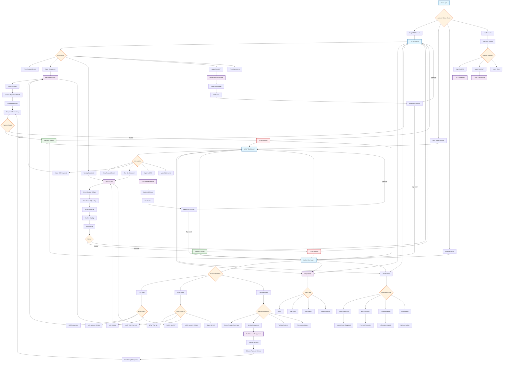
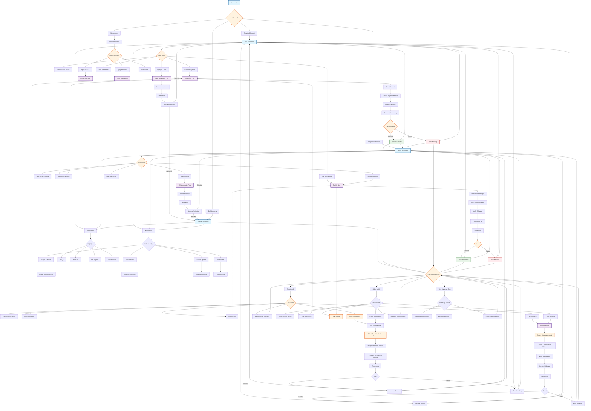
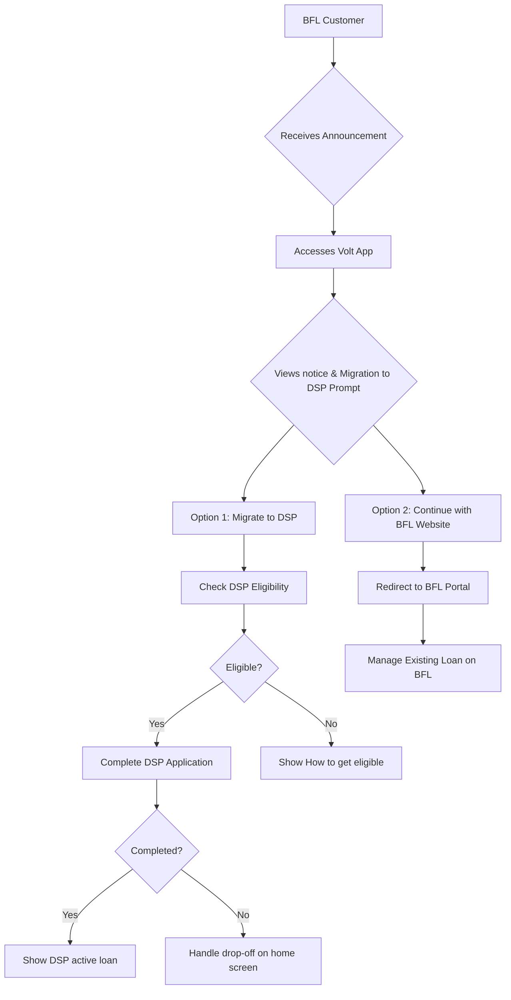

# Untitled

: Ranjan kumar Singh
Created time: September 25, 2025 3:18 PM
Status: Not started
Last edited: February 19, 2026 7:12 PM
Owner: Lalit Bihani

```mermaid
flowchart TD
    A[User Login] --> B{Account Status Check}
    
    B --> C[Only LAS Account]
    B --> D[Only LAMF Account]
    B --> E[Both Accounts]
    B --> F[No Accounts]
    
    %% Only LAS Flow
    C --> C1[LAS Dashboard]
    C1 --> C2{User Action}
    C2 --> C3[View Account Details]
    C2 --> C4[Make Repayment]
    C2 --> C5[Top Up Collateral]
    C2 --> C6[Apply for LAMF]
    C2 --> C7[View Statements]
    
    C6 --> G[LAMF Application Flow]
    G --> G1[Document Upload]
    G1 --> G2[Verification]
    G2 --> G3[Approval/Rejection]
    G3 --> |Approved| H[Dual Account User]
    G3 --> |Rejected| C1
    
    %% Only LAMF Flow
    D --> D1[LAMF Dashboard]
    D1 --> D2{User Action}
    D2 --> D3[View Account Details]
    D2 --> D4[Make EMI Payment]
    D2 --> D5[Top Up Collateral]
    D2 --> D6[Apply for LAS]
    D2 --> D7[View Statements]
    
    D6 --> I[LAS Application Flow]
    I --> I1[Collateral Setup]
    I1 --> I2[Verification]
    I2 --> I3[Approval/Rejection]
    I3 --> |Approved| H
    I3 --> |Rejected| D1
    
    %% Both Accounts Flow
    E --> H[Unified Dashboard]
    H --> H1{Account Selection}
    H1 --> H2[LAS View]
    H1 --> H3[LAMF View]
    H1 --> H4[Combined View]
    
    H2 --> H5{LAS Actions}
    H5 --> H6[LAS Account Details]
    H5 --> H7[LAS Repayment]
    H5 --> H8[LAS Top Up]
    H5 --> H9[Switch to LAMF]
    
    H3 --> H10{LAMF Actions}
    H10 --> H11[LAMF Account Details]
    H10 --> H12[LAMF EMI Payment]
    H10 --> H13[LAMF Top Up]
    H10 --> H14[Switch to LAS]
    
    H4 --> H15{Combined Actions}
    H15 --> H16[Cross-Account Summary]
    H15 --> H17[Unified Repayment]
    H15 --> H18[Portfolio Analysis]
    H15 --> H19[Recommendations]
    
    %% No Accounts Flow
    F --> F1[Welcome Screen]
    F1 --> F2{Product Selection}
    F2 --> F3[Apply for LAS]
    F2 --> F4[Apply for LAMF]
    F2 --> F5[Learn More]
    
    F3 --> J[LAS Onboarding]
    F4 --> K[LAMF Onboarding]
    
    %% Common Flows
    C4 --> L[Repayment Flow]
    D4 --> L
    H7 --> L
    H12 --> L
    H17 --> M[Multi-Account Repayment]
    
    L --> L1[Select Amount]
    L1 --> L2[Choose Payment Method]
    L2 --> L3[Confirm Payment]
    L3 --> L4[Payment Processing]
    L4 --> L5{Payment Result}
    L5 --> |Success| L6[Success Screen]
    L5 --> |Failed| L7[Error Handling]
    
    M --> M1[Allocate Amount]
    M1 --> M2[Choose Payment Method]
    M2 --> M3[Confirm Split Payment]
    M3 --> L4
    
    C5 --> N[Top Up Flow]
    D5 --> N
    H8 --> N
    H13 --> N
    
    N --> N1[Select Collateral Type]
    N1 --> N2[Enter Amount/Quantity]
    N2 --> N3[Verify Collateral]
    N3 --> N4[Confirm Top Up]
    N4 --> N5[Processing]
    N5 --> N6{Result}
    N6 --> |Success| N7[Success Screen]
    N6 --> |Failed| N8[Error Handling]
    
    %% Support & Help
    C1 --> O[Help Center]
    D1 --> O
    H --> O
    
    O --> O1{Help Type}
    O1 --> O2[FAQs]
    O1 --> O3[Live Chat]
    O1 --> O4[Call Support]
    O1 --> O5[Tutorial Videos]
    
    %% Notification Handling
    C1 --> P[Notifications]
    D1 --> P
    H --> P
    
    P --> P1{Notification Type}
    P1 --> P2[Margin Call Alert]
    P1 --> P3[EMI Reminder]
    P1 --> P4[Account Update]
    P1 --> P5[Promotional]
    
    P2 --> P6[Urgent Action Required]
    P3 --> P7[Payment Reminder]
    P4 --> P8[Information Update]
    P5 --> P9[Optional Action]
    
    %% Return paths
    L6 --> C1
    L6 --> D1
    L6 --> H
    L7 --> C1
    L7 --> D1
    L7 --> H
    
    N7 --> C1
    N7 --> D1
    N7 --> H
    N8 --> C1
    N8 --> D1
    N8 --> H
    
    %% Styling
    classDef primaryFlow fill:#e1f5fe,stroke:#01579b,stroke-width:2px
    classDef decisionNode fill:#fff3e0,stroke:#e65100,stroke-width:2px
    classDef actionNode fill:#f3e5f5,stroke:#4a148c,stroke-width:2px
    classDef errorNode fill:#ffebee,stroke:#c62828,stroke-width:2px
    classDef successNode fill:#e8f5e8,stroke:#2e7d32,stroke-width:2px
    
    class A,C1,D1,H primaryFlow
    class B,C2,D2,H1,H5,H10,H15,F2,L5,N6,O1,P1 decisionNode
    class G,I,J,K,L,M,N,O actionNode
    class L7,N8 errorNode
    class L6,N7 successNode
```

```mermaid
flowchart TD
    A[User Login] --> B{Account Status Check}
    
    B --> C[Only LAS Account]
    B --> D[Only LAMF Account]
    B --> E[Both Accounts]
    B --> F[No Accounts]
    
    %% Only LAS Flow
    C --> C1[LAS Dashboard]
    C1 --> C2{User Action}
    C2 --> C3[View Account Details]
    C2 --> C4[Make Repayment]
    C2 --> C5[Top Up Collateral]
    C2 --> C6[Apply for LAMF]
    C2 --> C7[View Statements]
    
    C6 --> G[LAMF Application Flow]
    G --> G1[Document Upload]
    G1 --> G2[Verification]
    G2 --> G3[Approval/Rejection]
    G3 --> |Approved| H[Dual Account User]
    G3 --> |Rejected| C1
    
    %% Only LAMF Flow
    D --> D1[LAMF Dashboard]
    D1 --> D2{User Action}
    D2 --> D3[View Account Details]
    D2 --> D4[Make EMI Payment]
    D2 --> D5[Top Up Collateral]
    D2 --> D6[Apply for LAS]
    D2 --> D7[View Statements]
    
    D6 --> I[LAS Application Flow]
    I --> I1[Collateral Setup]
    I1 --> I2[Verification]
    I2 --> I3[Approval/Rejection]
    I3 --> |Approved| H
    I3 --> |Rejected| D1
    
    %% Both Accounts Flow
    E --> H[Unified Dashboard]
    H --> H1{Loan Type Selection}
    H1 --> H2[Select LAS]
    H1 --> H3[Select LAMF]
    H1 --> H4[View Summary Only]
    
    H2 --> H5{LAS Actions}
    H5 --> H6[LAS Account Details]
    H5 --> H7[LAS Repayment]
    H5 --> H8[LAS Top Up]
    H5 --> H9[LAS Disbursal]
    H5 --> H10[LAS Lien Removal]
    H5 --> H11[Return to Loan Selection]
    
    H3 --> H12{LAMF Actions}
    H12 --> H13[LAMF Account Details]
    H12 --> H14[LAMF Repayment]
    H12 --> H15[LAMF Top Up]
    H12 --> H16[LAMF Disbursal]
    H12 --> H17[LAMF Lien Removal]
    H12 --> H18[Return to Loan Selection]
    
    H4 --> H19{Summary Actions}
    H19 --> H20[Combined Portfolio View]
    H19 --> H21[Recommendations]
    H19 --> H22[Select Loan for Actions]
    
    %% No Accounts Flow
    F --> F1[Welcome Screen]
    F1 --> F2{Product Selection}
    F2 --> F3[Apply for LAS]
    F2 --> F4[Apply for LAMF]
    F2 --> F5[Learn More]
    
    F3 --> J[LAS Onboarding]
    F4 --> K[LAMF Onboarding]
    
    %% Common Flows
    C4 --> L[Repayment Flow]
    D4 --> L
    H7 --> L
    H14 --> L
    
    L --> L1[Select Amount]
    L1 --> L2[Choose Payment Method]
    L2 --> L3[Confirm Payment]
    L3 --> L4[Payment Processing]
    L4 --> L5{Payment Result}
    L5 --> |Success| L6[Success Screen]
    L5 --> |Failed| L7[Error Handling]
    
    C5 --> N[Top Up Flow]
    D5 --> N
    H8 --> N
    H15 --> N
    
    H9 --> O[Disbursal Flow]
    H16 --> O
    
    H10 --> P[Lien Removal Flow]
    H17 --> P
    
    N --> N1[Select Collateral Type]
    N1 --> N2[Enter Amount/Quantity]
    N2 --> N3[Verify Collateral]
    N3 --> N4[Confirm Top Up]
    N4 --> N5[Processing]
    N5 --> N6{Result}
    N6 --> |Success| N7[Success Screen]
    N6 --> |Failed| N8[Error Handling]
    
    O --> O1[Select Disbursal Amount]
    O1 --> O2[Choose Disbursement Method]
    O2 --> O3[Verify Bank Details]
    O3 --> O4[Confirm Disbursal]
    O4 --> O5[Processing]
    O5 --> O6{Result}
    O6 --> |Success| O7[Success Screen]
    O6 --> |Failed| O8[Error Handling]
    
    P --> P1[Select Securities for Lien Removal]
    P1 --> P2[Verify Outstanding Amount]
    P2 --> P3[Confirm Lien Removal Request]
    P3 --> P4[Processing]
    P4 --> P5{Result}
    P5 --> |Success| P6[Success Screen]
    P5 --> |Failed| P7[Error Handling]
    
    %% Support & Help
    C1 --> Q[Help Center]
    D1 --> Q
    H --> Q
    
    Q --> Q1{Help Type}
    Q1 --> Q2[FAQs]
    Q1 --> Q3[Live Chat]
    Q1 --> Q4[Call Support]
    Q1 --> Q5[Tutorial Videos]
    
    %% Notification Handling
    C1 --> R[Notifications]
    D1 --> R
    H --> R
    
    R --> R1{Notification Type}
    R1 --> R2[Margin Call Alert]
    R1 --> R3[EMI Reminder]
    R1 --> R4[Account Update]
    R1 --> R5[Promotional]
    
    R2 --> R6[Urgent Action Required]
    R3 --> R7[Payment Reminder]
    R4 --> R8[Information Update]
    R5 --> R9[Optional Action]
    
    %% Return paths
    L6 --> C1
    L6 --> D1
    L6 --> H1
    L7 --> C1
    L7 --> D1
    L7 --> H1
    
    N7 --> C1
    N7 --> D1
    N7 --> H1
    N8 --> C1
    N8 --> D1
    N8 --> H1
    
    O7 --> C1
    O7 --> D1
    O7 --> H1
    O8 --> C1
    O8 --> D1
    O8 --> H1
    
    P7 --> C1
    P7 --> D1
    P7 --> H1
    P6 --> C1
    P6 --> D1
    P6 --> H1
    
    H11 --> H1
    H18 --> H1
    H22 --> H1
    
    %% Styling
    classDef primaryFlow fill:#e1f5fe,stroke:#01579b,stroke-width:2px
    classDef decisionNode fill:#fff3e0,stroke:#e65100,stroke-width:2px
    classDef actionNode fill:#f3e5f5,stroke:#4a148c,stroke-width:2px
    classDef errorNode fill:#ffebee,stroke:#c62828,stroke-width:2px
    classDef successNode fill:#e8f5e8,stroke:#2e7d32,stroke-width:2px
    
    class A,C1,D1,H primaryFlow
    class B,C2,D2,H1,H5,H10,H15,F2,L5,N6,O1,P1 decisionNode
    class G,I,J,K,L,M,N,O actionNode
    class L7,N8 errorNode
    class L6,N7 successNode
```

```mermaid
flowchart TD
    A[User Login] --> B[Both Accounts Detected]
    B --> C[Unified Dashboard]
    
    C --> D{Dashboard Actions}
    D --> E[View Combined Summary]
    D --> F[Select LAS Account]
    D --> G[Select LAMF Account]
    D --> H[Notifications Center]
    D --> I[Help & Support]
    D --> J[Account Settings]
    
    %% Combined Summary View
    E --> E1[Portfolio Overview]
    E1 --> E2[Total Outstanding Amount]
    E1 --> E3[Combined Available Limits]
    E1 --> E4[Collateral Distribution]
    E1 --> E5[Upcoming Payments]
    E1 --> E6[Performance Analytics]
    E6 --> E7{Summary Actions}
    E7 --> E8[Switch to LAS]
    E7 --> E9[Switch to LAMF]
    E7 --> E10[View Detailed Reports]
    E8 --> F
    E9 --> G
    E10 --> C
    
    %% LAS Account Section
    F --> F1[LAS Account Dashboard]
    F1 --> F2{LAS Actions}
    F2 --> F3[View LAS Details]
    F2 --> F4[LAS Repayment]
    F2 --> F5[LAS Top Up Collateral]
    F2 --> F6[LAS Disbursal]
    F2 --> F7[LAS Lien Removal]
    F2 --> F8[LAS Statements]
    F2 --> F9[Return to Main Dashboard]
    
    %% LAS Detailed Flows
    F3 --> F31[LAS Outstanding Amount]
    F31 --> F32[Available Credit Limit]
    F32 --> F33[Equity Collateral Details]
    F33 --> F34[Interest Rate & Charges]
    F34 --> F1
    
    F4 --> F41[Select LAS Repayment Amount]
    F41 --> F42[Choose Payment Method]
    F42 --> F43[Confirm LAS Payment]
    F43 --> F44[LAS Payment Processing]
    F44 --> F45{LAS Payment Result}
    F45 --> |Success| F46[LAS Payment Success]
    F45 --> |Failed| F47[LAS Payment Failed]
    F46 --> F48[Updated LAS Summary]
    F47 --> F49[Retry LAS Payment]
    F48 --> F1
    F49 --> F41
    
    F5 --> F51[Select Equity for LAS]
    F51 --> F52[Enter Share Details]
    F52 --> F53[Verify Equity Collateral]
    F53 --> F54[Confirm LAS Top Up]
    F54 --> F55[LAS Top Up Processing]
    F55 --> F56{LAS Top Up Result}
    F56 --> |Success| F57[LAS Collateral Added]
    F56 --> |Failed| F58[LAS Top Up Failed]
    F57 --> F59[Updated LAS Limit]
    F58 --> F60[LAS Top Up Error]
    F59 --> F1
    F60 --> F51
    
    F6 --> F61[Check LAS Available Limit]
    F61 --> F62[Enter LAS Disbursal Amount]
    F62 --> F63[Select Bank for LAS]
    F63 --> F64[Confirm LAS Disbursal]
    F64 --> F65[LAS Disbursal Processing]
    F65 --> F66{LAS Disbursal Result}
    F66 --> |Success| F67[LAS Disbursal Success]
    F66 --> |Failed| F68[LAS Disbursal Failed]
    F67 --> F69[Updated LAS Outstanding]
    F68 --> F70[LAS Disbursal Error]
    F69 --> F1
    F70 --> F61
    
    F7 --> F71[View LAS Pledged Securities]
    F71 --> F72[Select Shares for Release]
    F72 --> F73[Verify LAS Eligibility]
    F73 --> F74[Confirm LAS Lien Removal]
    F74 --> F75[LAS Lien Processing]
    F75 --> F76{LAS Lien Result}
    F76 --> |Success| F77[LAS Lien Removed]
    F76 --> |Failed| F78[LAS Lien Failed]
    F77 --> F79[Updated LAS Collateral]
    F78 --> F80[LAS Lien Error]
    F79 --> F1
    F80 --> F71
    
    F8 --> F81[Select LAS Statement Type]
    F81 --> F82[Generate LAS Statement]
    F82 --> F83[Download LAS Statement]
    F83 --> F1
    
    F9 --> C
    
    %% LAMF Account Section
    G --> G1[LAMF Account Dashboard]
    G1 --> G2{LAMF Actions}
    G2 --> G3[View LAMF Details]
    G2 --> G4[LAMF EMI Payment]
    G2 --> G5[LAMF Top Up Collateral]
    G2 --> G6[LAMF Disbursal]
    G2 --> G7[LAMF Lien Removal]
    G2 --> G8[LAMF Statements]
    G2 --> G9[Return to Main Dashboard]
    
    %% LAMF Detailed Flows
    G3 --> G31[LAMF Outstanding Principal]
    G31 --> G32[EMI Schedule & Due Date]
    G32 --> G33[MF Collateral Portfolio]
    G33 --> G34[Available LAMF Limit]
    G34 --> G1
    
    G4 --> G41[View LAMF EMI Details]
    G41 --> G42[Select EMI Payment Type]
    G42 --> G43[Choose Payment Method]
    G43 --> G44[Confirm LAMF Payment]
    G44 --> G45[LAMF Payment Processing]
    G45 --> G46{LAMF Payment Result}
    G46 --> |Success| G47[LAMF Payment Success]
    G46 --> |Failed| G48[LAMF Payment Failed]
    G47 --> G49[Updated LAMF Schedule]
    G48 --> G50[Retry LAMF Payment]
    G49 --> G1
    G50 --> G42
    
    G5 --> G51[View Current MF Holdings]
    G51 --> G52[Select MF for Addition]
    G52 --> G53[Enter MF Units/Amount]
    G53 --> G54[Verify MF Collateral]
    G54 --> G55[Confirm LAMF Top Up]
    G55 --> G56[LAMF Top Up Processing]
    G56 --> G57{LAMF Top Up Result}
    G57 --> |Success| G58[LAMF Collateral Added]
    G57 --> |Failed| G59[LAMF Top Up Failed]
    G58 --> G60[Updated LAMF Limit]
    G59 --> G61[LAMF Top Up Error]
    G60 --> G1
    G61 --> G52
    
    G6 --> G62[Check LAMF Available Limit]
    G62 --> G63[Enter LAMF Disbursal Amount]
    G63 --> G64[Review EMI Impact]
    G64 --> G65[Select Bank for LAMF]
    G65 --> G66[Confirm LAMF Disbursal]
    G66 --> G67[LAMF Disbursal Processing]
    G67 --> G68{LAMF Disbursal Result}
    G68 --> |Success| G69[LAMF Disbursal Success]
    G68 --> |Failed| G70[LAMF Disbursal Failed]
    G69 --> G71[Updated LAMF EMI Schedule]
    G70 --> G72[LAMF Disbursal Error]
    G71 --> G1
    G72 --> G62
    
    G7 --> G73[View LAMF Pledged MF Units]
    G73 --> G74[Select MF Units for Release]
    G74 --> G75[Check LAMF Impact]
    G75 --> G76[Confirm LAMF Lien Removal]
    G76 --> G77[LAMF Lien Processing]
    G77 --> G78{LAMF Lien Result}
    G78 --> |Success| G79[LAMF Lien Removed]
    G78 --> |Failed| G80[LAMF Lien Failed]
    G79 --> G81[Updated LAMF Portfolio]
    G80 --> G82[LAMF Lien Error]
    G81 --> G1
    G82 --> G73
    
    G8 --> G83[Select LAMF Statement Type]
    G83 --> G84[Generate LAMF Statement]
    G84 --> G85[Download LAMF Statement]
    G85 --> G1
    
    G9 --> C
    
    %% Unified Notifications Center
    H --> H1{Notification Categories}
    H1 --> H2[LAS Notifications]
    H1 --> H3[LAMF Notifications]
    H1 --> H4[Combined Alerts]
    H1 --> H5[System Updates]
    
    H2 --> H21[LAS Margin Calls]
    H2 --> H22[LAS Payment Reminders]
    H3 --> H31[LAMF EMI Reminders]
    H3 --> H32[LAMF Margin Calls]
    H4 --> H41[Portfolio Rebalancing]
    H4 --> H42[Rate Change Notifications]
    H5 --> H51[System Maintenance]
    H5 --> H52[Feature Updates]
    
    H21 --> F5
    H22 --> F4
    H31 --> G4
    H32 --> G5
    H41 --> E1
    H42 --> E1
    H51 --> C
    H52 --> C
    
    %% Help & Support
    I --> I1{Support Categories}
    I1 --> I2[LAS Support]
    I1 --> I3[LAMF Support]
    I1 --> I4[General FAQs]
    I1 --> I5[Live Support]
    
    I2 --> I21[LAS Specific Help]
    I3 --> I31[LAMF Specific Help]
    I4 --> I41[Common Questions]
    I5 --> I51[Chat/Call Support]
    
    I21 --> C
    I31 --> C
    I41 --> C
    I51 --> C
    
    %% Account Settings
    J --> J1[Profile Settings]
    J1 --> J2[Notification Preferences]
    J2 --> J3[Security Settings]
    J3 --> J4[Communication Preferences]
    J4 --> C
    
    %% Styling
    classDef primaryFlow fill:#e1f5fe,stroke:#01579b,stroke-width:2px
    classDef decisionNode fill:#fff3e0,stroke:#e65100,stroke-width:2px
    classDef actionNode fill:#f3e5f5,stroke:#4a148c,stroke-width:2px
    classDef errorNode fill:#ffebee,stroke:#c62828,stroke-width:2px
    classDef successNode fill:#e8f5e8,stroke:#2e7d32,stroke-width:2px
    classDef lasFlow fill:#e3f2fd,stroke:#0277bd,stroke-width:2px
    classDef lamfFlow fill:#f1f8e9,stroke:#33691e,stroke-width:2px
    
    class A,B,C primaryFlow
    class D,E7,F2,F45,F56,F66,F76,G2,G46,G57,G68,G78,H1,I1 decisionNode
    class E,F,G,H,I,J actionNode
    class F47,F58,F68,F78,G48,G59,G70,G80 errorNode
    class F46,F57,F67,F77,G47,G58,G69,G79 successNode
    class F1,F3,F4,F5,F6,F7,F8 lasFlow
    class G1,G3,G4,G5,G6,G7,G8 lamfFlow
```

```mermaid
graph TD
    A[BFL Customer] --> B{Receives Announcement}
    B --> C[Accesses Volt App]
    C --> D{Views notice & Migration to DSP Prompt}
    D --> E[Option 1: Migrate to DSP]
    D --> F[Option 2: Continue with BFL Website]

    
    E --> H[Check DSP Eligibility]
    H --> I{Eligible?}
    I -->|Yes| J[Complete DSP Application]
    I -->|No| K[Show How to get eligible]
 
    J --> M{Completed?}
    M -->|Yes| P[Show DSP active loan]
    M -->|No| Q[Handle drop-off on home screen]
    
    F --> N[Redirect to BFL Portal]
    N --> O[Manage Existing Loan on BFL]
```