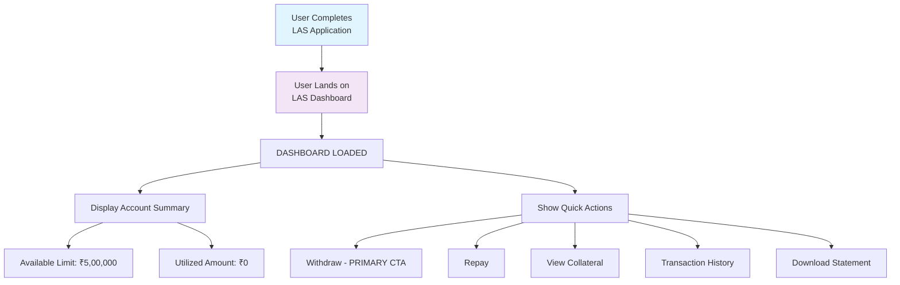
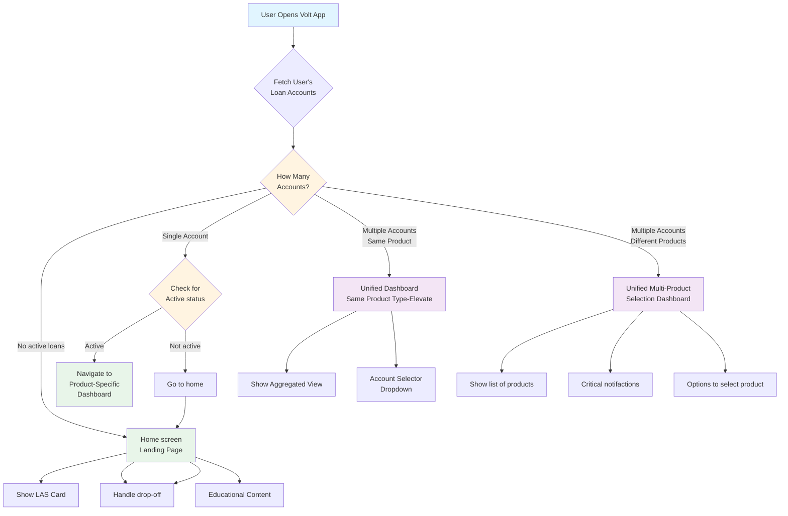

# Volt Apps & Web Multiple Loan Handling - Launching LAS

: Ranjan kumar Singh
Created time: October 14, 2025 12:38 PM
Status: In progress
Last edited: February 19, 2026 7:12 PM
Owner: Lalit Bihani

# **What problem are we solving?**

DSP Finance is launching **LAS (Loan Against Shares) for B2B2C customers**. 

To enable customers to seamlessly manage their LAS loan accounts, we need to build a **scalable, modular, and user-friendly loan servicing experience** within the Volt platform.

The servicing module must support:

1. **LAS loan management** — for customers availing loan against shares
2. **LAMF loan management** — for existing customers availing loan against mutual funds
3. **Unified product** — for users holding **both LAS and LAMF**, offering an intuitive, consistent experience across products 

The key goal is to **solve for customer experience and ease of tracking for different products and multiple lender within the products**, build **cross-product discoverability**, and ensure that **existing LAMF experiences remain unaffected/improve** by the LAS launch.

### Customer pain points (Hypotheses)

**Validate this post LAS launch and plan the UI/UX based on learnings

| **Problem Hypothesis** | **Expected Impact** | **Linked Success Metrics** |
| --- | --- | --- |
| **Fragmented Multi-Product Servicing**: Users managing both LAS and LAMF may experience confusion due to separate dashboards, workflows, or unclear account context. | Poor UX may lead to lower engagement, or errors in account actions. | - Cross-Product Adoption (Early & Mature)  - Retention & Repeat Usage  - Reduction in LAS/LAMF support tickets |
| **Low Discoverability of LAS**: Existing LAMF customers may not notice LAS as a new product offering within Volt. [Applicable when we will launch for B2C/B2B channel] | Missed cross-sell opportunity and slower LAS adoption. | - Adoption (Discovery)  - LAS Loan Activation Rate |
| **Confusing Communication Across Products**: Notifications and reminders for LAS and LAMF may overlap or lack clear product/account distinction. | Users may miss critical events (interest due, margin calls, renewals) or misinterpret which account a notification is for. | - CSAT / NPS  - Reduction in Customer Complaint Volume  - Event-based Communication Success |

### Users

**Primary User Segments:**

1. **LAS-Only Customers (B2B2C)**: New users with diversified securities portfolios seeking liquidity
2. **LAMF-Only Customers (B2B2C)**: Existing LAMF account holders who should experience no disruption
3. **Multi Product Users (LAS + LAMF)**: Customers managing multiple loan products, potentially with multiple lenders (e.g., Elevate), requiring unified management
4. **LAMF Users Ineligible for Top-Up**: Existing LAMF customers who've reached their limit and need additional credit via LAS (cross-sell target) - Not in scope

**Other stakeholders:**

1. **Volt Operations Team**
    
    Requires **operational enablement** for LAS servicing workflows (account management, disbursal tracking, collateral changes, closure, etc.) through dashboards and tools aligned with existing LAMF operations.
    
2. **Volt Sales & Support Teams**
    
    Need **training and enablement** to handle LAS product queries, onboarding guidance, and post-loan servicing support across multiple channels (email, WhatsApp, call, in-app chat).
    
3. **Partners / MFDs (Mutual Fund Distributors)**
    
    External partners using the Volt platform for client acquisition and servicing should have **clear visibility into LAS workflows**, including onboarding, eligibility, and client servicing dashboards for their customers.
    

---

# **How do we measure success?**

**Leading / Success Metrics:**

| **Category** | **Metric** | **Definition / Measurement** | **Target / Insight** |
| --- | --- | --- | --- |
| **Activation** | % of users completing first LAS transaction (withdrawal) | (# of users completing 1st LAS withdrawal ÷ total LAS account holders) × 100 | Indicates onboarding success and initial value realization |
| **Operational Efficiency** | Reduction in LAS servicing-related support tickets | Baseline comparison pre- vs. post-launch | Shows intuitiveness and self-serve capability of the servicing module |
| **System Reliability** | API success rate & uptime | % of successful LAS API calls | Ensures backend reliability and readiness for scale |
| **Servicing Efficiency** | Avg. time for key servicing actions (repayment / withdrawal / lien removal) | Mean TAT | Reflects process optimization and system responsiveness |

**Lagging / Trailing Metrics:**

| **Category** | **Metric** | **Definition / Measurement** | **Target / Insight** |
| --- | --- | --- | --- |
| **Cross-Product Retention (Mature)** | % of users retaining both LAS & LAMF relationships over 90+ days | (# of users active in both after 3 months ÷ total LAS users) × 100 | Measures stickiness and ecosystem-level engagement |
| **LAS Loan Activation Rate** | % of users completing disbursal after account opening | (# of disbursed LAS users ÷ # of account openings) × 100 | Indicates funnel conversion and process success |
| **LAS Monthly Active Users (MAU)** | Unique users accessing LAS servicing per month | System-tracked | Measures sustained usage and engagement |
| **NPS / CSAT (LAS Users)** | Customer satisfaction score from post-servicing survey | Survey data | Gauges quality of servicing experience and brand perception |
| **Business Impact** | LAS loan book serviced via Volt | Total LAS portfolio serviced value | Measures scale and portfolio contribution |

**Guardrail Metrics:**

| **Metric** | **Definition / Measurement** | **Purpose / Guardrail Intent** | **Target / Threshold** |
| --- | --- | --- | --- |
| **LAMF Servicing Stability** | Core LAMF modules (Dashboard, Disbursal, Repayment, Foreclosure, Service Requests, etc.) remain unaffected | Prevents regression or negative impact on existing flows |  |
| **App Crash Rate / Performance** | Latency or crash rate on shared LAMF + LAS screens | Ensures smooth, stable user experience | ≤ 1% variance from baseline |
| **Customer Complaint Volume** | Count of LAS-related support tickets | Monitors usability and system robustness | ≤ 5% increase from baseline |
| **Communication Stability** | Validates LAMF notifications and event-based comms remain unaffected | Prevents servicing disruption for existing users | 100% success for event-based comms |

---

# **How are others solving this problem?**

[https://www.figma.com/design/7jG6NbNx7iwRRZ6MDqJkvW/UI-UX-benchmarking?node-id=1282-3818&t=c5ZGJWCS65saNFIt-11](https://www.figma.com/design/7jG6NbNx7iwRRZ6MDqJkvW/UI-UX-benchmarking?node-id=1282-3818&t=c5ZGJWCS65saNFIt-11)

---

# **What is the solution?**

Volt will provide a **modular loan account management system** that supports:

1. **LAS-only servicing**
2. **LAMF-only servicing**
3. **Hybrid servicing (both LAS + LAMF[Multi-lender])**
    1. Support of multiple loan type(OD, TL) under the umbrella of different product type (LAMF, LAS)
4. **Cohesive communication and notification design for both products**
    1. **Messages are clearly distinguished yet work seamlessly together, preventing confusion for users managing multiple loan products⁠**

## Requirements overview (optional)

## User Stories & Acceptance Criteria

*User: MFD in behalf of clients or B2B2C customers*

**1. Multiple Account Management (LAS / LAMF / Both)**

| **User Story** | **Acceptance Criteria** |
| --- | --- |
| As a user, I should see **all my active loan accounts (LAS and LAMF)** in a single view | The dashboard lists all active accounts with type labels (LAS / LAMF) and high-level summary cards |
| As a user, I should be able to **switch between different accounts** without losing context or navigation state | Switching between accounts should not cause data loss |
| As a user, I should be able to view **account-level details** (limit, outstanding, loan details, Interest, Shortfall, collateral details) for each LAS / LAMF account | Correct details fetched via respective account-level APIs |
| As a user, I should be able to **perform actions** (repayment, withdrawal, lien removal, add collateral) **within the selected account** only | CTAs trigger correct backend requests tied to selected account ID |
| As a user, I should be able to **see transaction history per account(selected account)** |  |
| As a user holding both LAS and LAMF, I should see **clear visual distinction** between account types | LAS and LAMF marked by product tags, colors, or icons |
| As a user, I should receive **account-specific notifications** (interest due, margin call, etc.) tied to the correct loan on the product listing page and on the product specific dashboard page, so that i can start the journey where i left |  |
| As a user holding both LAS and LAMF, should get the drop-off notification on the product listing page and the product specific dashboard  |  |
| As a user, if I close one LAS or LAMF account, I should still be able to access others seamlessly | System gracefully handles closed-account state; dashboard auto-refreshes |

**2. Account Opening & Status**

| **User Story** | **Acceptance Criteria** |
| --- | --- |
| As a MFD, I should be able to open a LAS account through the Partner dashboard → PLJ | User can initiate LAS account; account opening and lodgement APIs are successful |
| As a user, I should be able to view my LAS account status (active, pending, rejected, closed) | Status shown correctly; updated via backend webhook; Should be able to place disbursal - validation handled based on account status |

**3. Loan Account Dashboard**

| **User Story** | **Acceptance Criteria** |
| --- | --- |
| As a user, I should see my available limit, current balance, and actionable CTAs (Withdraw, Repay, Add Collateral) | Data fetched via LAS summary API |
| As a dual-account holder, I should see both LAS and LAMF in one consolidated view, option to select the product and switch to another product | Tabs or sections visible within unified dashboard |
| As a user, I should receive proactive alerts (margin call, interest due) | Notification of UI is shown correctly based on priority order and state is managed properly |
| As a user, I should be manage LAMF account with 2 different lenders(elevate) and also LAS account |  |
| As a user, i should see the status of the servicing request like disbursal request, repayment, etc | Request status progress is shown correctly on priority order on dashboard |

**4. Disbursal**

| **User Story** | **Acceptance Criteria** |
| --- | --- |
| As a user, I should be able to withdraw funds up to my eligible limit | Withdraw CTA visible and functional, |
| As a user, if i am not able to placed disbursal request then i should get the clear reason. | Validation based on business logic is working properly |
| As a user, i should be able to see Disbursal amount, Net amount i will receive in my bank account, any fee if deducting from the amount, TAT along with delay reason, EMI details | Data points on disbursal summary page is shown correctly |
| Disbursal status updates should be reflected in the dashboard and via notification | Backend webhook updates sync in real-time |

**5. Principal Repayment**

| **User Story** | **Acceptance Criteria** |
| --- | --- |
| As a user, I should be able to make partial or full repayment | API to initiate repayment works end-to-end |
| Post repayment, available limit updates accurately | Repayment acknowledgment visible instantly |

**6. Collateral Management**

| **User Story** | **Acceptance Criteria** |
| --- | --- |
| As a user, I should be able to add new shares as collateral |  |
| As a user, i should be able to see the list of pledged collateral with near real time value |  |
| As a user, I should be able to remove eligible collateral | Status updates and limit recalculated accurately |

**7. Account Closure**

| **User Story** | **Acceptance Criteria** |
| --- | --- |
| As a user, I should be able to request loan closure post reason selection |  |
| As a user, i should be able to see the net payable amount and its break up and make payment to proceed for loan closure |  |
| As a user, i should be able to see loan account summary, confirm closure with OTP and once request is placed i should be able see the status of the loan account closure |  |
| System should automatically trigger lien removal post-closure confirmation | Backend status = Closed; lien removed |
| As a dual account holder, i should have option to switch between my active loan account and closure in progress account |  |
| As a dual account holder, if my one of account is closed, i should not get Product switch option and i should see my active account by-default |  |

**8. Communication Layer**

| **User Story** | **Acceptance Criteria** |
| --- | --- |
| As a user, I should get real-time updates for all LAS lifecycle events | All event comms delivered (SMS, Email, WA) |
| As a user, I want to receive all servicing reminders (e.g., interest due, margin shortfall, renewal, etc.) with a clear distinction of product type (LAS or LAMF) and corresponding loan account,
so that I can easily identify which reminders are applicable to which loan and take timely actions without confusion. | The system should send servicing reminders (via SMS, email, WhatsApp) **tagged with the product type** — e.g., “Loan Against Shares (LAS)” or “Loan Against Mutual Funds (LAMF) |
| LAMF notifications should not overlap with LAS messages | Each product uses independent templates, config and event triggers |

**9. Routing & Navigation**

| **User Story** | **Acceptance Criteria** |
| --- | --- |
| As a user, I should be routed correctly between LAS and LAMF modules | Navigation deep links configured |
| As a user, if i am interacting with my LAMF account or LAS account, i should have option to switch or go back on product listing page to select other product  |  |
| LAS CTAs should be visible contextually for LAMF users (cross-sell) | Cross-sell module visible to ineligible LAMF users |
| LAMF CTAs should be visible contextually for LAS users (cross-sell) | Cross-sell module visible to ineligible LAS users |

## High level product flow:

## User flow:

1. LAS user journey:

1. App Launch & Product Detection Flow

## Requirements

<aside>
💡

Currently we are only solving for Volt MFD → B2B2C customers

</aside>

### **1. Volt App (Loan Servicing / LMS)**

### **1.1 LAS Loan Account Setup and Status Management**

- Enable end-to-end LAS loan account lifecycle:
    - **Account Opening → Lodgement → Loan Account Status Management**
- Ensure backend and UI support for **real-time loan status updates** (Active, Pending approval, Pending lodgement, Closed, etc.).
- Send communications to notify customers once their account is opened and ready to use.

### **1.2 Multi-Product Type Configuration**

- Volt servicing module must support **multiple product types (LAMF, LAS, etc.)** and **multiple loan accounts** under the same or different products (e.g., Elevate).
- Configuration requirements:
    1. Ability to **differentiate and fetch details** at product level:
        - Loan Account Number (LAN)
        - Lender Name
        - Credit Limit
        - Available Limit
        - Outstanding Amount
    2. Support fetching **lifecycle data** for:
        - Interest and its accrual/settlement lifecycle
        - Margin Shortfall and its resolution lifecycle
        - Service Request lifecycle (Disbursal, Repayment etc)

### **1.3 Product-Level FAQs**

- Support **FAQ management at both**:
    - Product type level (LAMF, LAS)
    - Loan type level (Overdraft, Term Loan)

### **1.4 Dashboard Configuration & APIs for LAS**

- **Dynamic dashboard configuration** based on selected *product type* and *loan type*:
    - Display accurate credit details (credit limit, available balance, outstanding, interest due, etc.)
- **Context retention**:
    - Maintain selected product and loan context across modules:
        - Disbursal
        - Repayment
        - Collateral Management
        - Foreclosure
        - Support / Service Requests
        - Loan Details View
        - State management
- **Interest and Shortfall Handling**:
    - Reflect real-time interest and margin shortfall data on the dashboard based on selected product and loan type.

<aside>
💡

In case of only one product(LAMF or LAS), there will be no change in existing user experience.

</aside>

### **2. Partner Dashboard (Loan Servicing)**

1. Display **list of completed customers** with product type = LAS.
    - Add CTA on completed LAMF customer table → **“Check Eligibility for LAS”**
2. Provide **lists segmented by servicing needs**:
    - Customers with shortfall, interest due/overdue
    - Customers with renewal due / loan expired
3. Handle **customers with multiple loan accounts**:
    - Separate row entry per product and loan type
    - On Action → Open PLJ → Redirect to respective product + loan type dashboard view

### **3. LeadSquared – Sales CRM (WIP)**

1. **Opportunity creation for LAS loan account** to be covered under the LOS PRD.
2. **LMS Scope** includes:
    1. Opportunity creation for **foreclosure requests**
    2. Opportunity creation for **line enhancement (limit increase)**

### **4. LeadSquared – Service CRM (TBD)**

1. Service workflows and ticket handling for LAS servicing to be finalized post-launch readiness review.
2. To include **LAS-tagged tickets**, customer identification, and product-type routing.

### **5. AppSmith (Internal Servicing Tool)**

1. **Customer Search API** should return data across multiple product types and loan types.
2. **Get Application & Credit APIs** should return multi-product, multi-loan-level details.
3. **AppSmith UI updates (TBD)**:
    - Unified servicing view for LAMF and LAS customers
    - Product-type selector for detailed loan-level visibility

### **6. Communication (Transactional & Event-Based)**

1. Separate **communication templates and workflows** for LAS servicing and event-based triggers (interest reminder, shortfall, repayment, etc.).
    - Tech teams to implement **appConfig and communication dependency handling** to ensure distinction between LAMF and LAS comms.
2. Evaluate **maker-checker implementation** for LAS-related communications before enabling live customer messaging.

### **7. Operations Enablement**

1. **Maker-Checker Access:**
    
    Enable the Operations team to approve and trigger LAS-specific communications.
    
2. **Operational SOPs:**
    
    Define end-to-end standard operating procedures for LAS servicing queries and escalation handling.
    
    - To be finalized post-discussion with **Nishant** and **Ops stakeholders**.

 

---

# **Design**

UX problem to solve:

- How two product type will be handled
- If user selected one product → How they will switch back to another product
- If user selected one product and started some service request like top up and refreshed the page or dropped → Then what will happen, what will be user experience
- Do user always has to select product type when ever they open App?
- How we going to handle some critical and urgent attention items for user like Shortfall and interest reminder when user are on product selection page
- How deep-link will work [Send interest comms for LAMF → Customer open app using link → Do user need to select the product type manually to check the interest details?]

Scope for phase 1: 

- Solve for Entry points, critical notifications for user having two products
- In case of only one product(LAS or LAMF), there will no change in existing UI/UX and flow

---

# **Analytics**

TBD

---

# **Timeline/Release Planning**

---

# **Go to market**

## Marketing

## Ops & Sales training

**PRD for Internal sales, support enablement & Operational Readiness for LAS Launch is not in scope of this document.**

To ensure that **Sales, Customer Support, and Operations teams** are fully enabled to manage LAS accounts post-launch, without disruption to LAMF processes, and can handle **cross-product interactions** (LAS + LAMF) efficiently.

## Frequently asked questions (FAQs)

Open items:

- What will the frequency of collateral details sync and also credit limit/DP
- What will the TAT for lodgement post account opening
- In what scenario disbursal may fail after user place the request
- BRE for disbursal TAT

---

# **Action items / checklist**

- [ ]  Product
    - [ ]  -
- [ ]  Business
    - [ ]  -
- [ ]  Design
    - [ ]  -

---

# **Feedback**

---

# **Learnings & Next steps**

---

# **Appendix**

## Meeting notes

- Share link → Web journey not APP
- Write edge cases scenario